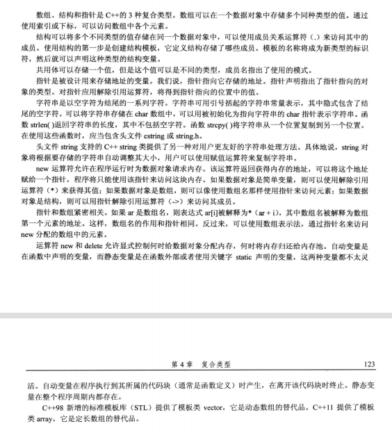
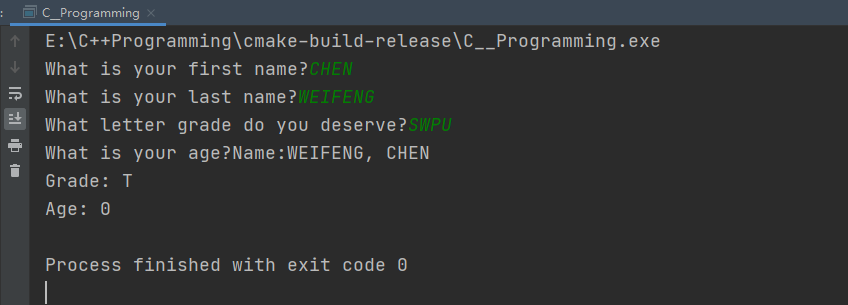
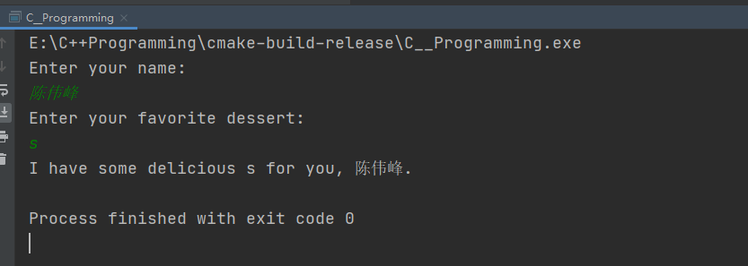
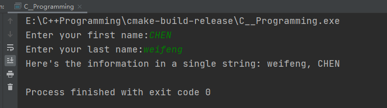

- 编程练习

  ### 4.13 

  ```c++
  #include <iostream>
  using namespace std;
  
  const int MAX_LENGTH = 20;
  
  int main() {
      char first_name[MAX_LENGTH], last_name[MAX_LENGTH];
      char grade;
      int age;
  
      cout << "What is your first name?";
      cin.getline(first_name, MAX_LENGTH);
      cout << "What is your last name?";
      cin.getline(last_name, MAX_LENGTH);
      cout << "What letter grade do you deserve?";
      cin >> grade;
      cout << "What is your age?";
      cin >> age;
  
      cout << "Name:" << last_name << ", " << first_name << endl;
      cout << "Grade: " << char(grade + 1) << endl;
      cout << "Age: " << age << endl;
  
      return 0;
  }



### 4.14

```c++
#include <iostream>
#include <string>
using namespace std;

int main() {
    string name, dessert;

    cout << "Enter your name:\n";
    getline(cin, name);
    cout << "Enter your favorite dessert:\n";
    getline(cin, dessert);
    cout << "I have some delicious " << dessert;
    cout << " for you, " << name << ".\n";
    return 0;
}
```



### 4.15

```c++
#include <iostream>
using namespace std;

const int LEN = 20;
const int MAX_LENGTH = 40;
int main() {
    char  FirstName[LEN];
    char  LastName[LEN];
    char  *name = new char [MAX_LENGTH];
    cout << "Enter your first name:";
    cin.getline(FirstName, LEN);
    cout << "Enter your last name:";
    cin.getline(LastName, LEN);

    strcpy(name, LastName);
    strcat(name, ", ");
    strcat(name, FirstName);


    cout << "Here's the information in a single string: " << name << endl;
    return 0;
}

```



### 4.16

```c++
#include <iostream>
#include <string>
using namespace std;

int main() {
    string FirstName;
    string LastName;
    string  name;
    cout << "Enter your first name:";
    getline(cin, FirstName);
    cout << "Enter your last name:";
    getline(cin,LastName);
    name = FirstName+", "+LastName;
    cout << "Here's the information in a single string: " << name << endl;
    return 0;
}


```

### 4.17

```c++
#include <iostream>
#include <string>
using namespace std;
// William Wingate从事比萨饼分析服务。对于每个披萨饼，他都需要记录下列信息：

//披萨饼公司的名称，可以有多个单词组成
//        披萨饼的直径
//披萨饼的重量
//        请设计一个能够存储这些信息的结构，并编写一个使用这种结构变量的程序。程序将请求用户输入上述信息，然后显示这些信息。请使用cin（或它的方法）和cout。
struct Candy{
    string grand;
    float weight;
    int hot_value;
};

int main() {
    Candy candy[3] {
        "time",
        5.0,
        2
    };
    for (int i = 0; i < 3; ++i) {
        cout << "=====CandyBar Info=====" << endl;
        cout << "Brand: "<< candy[i].grand<< endl;
        cout << "Weight: " << candy[i].weight << endl;
        cout << "Calorie: " << candy[i].hot_value << endl;
    }
    return 0;
}

```


### 4.18

```c++
#include <iostream>
#include <string>
using namespace std;
// William Wingate从事比萨饼分析服务。对于每个披萨饼，他都需要记录下列信息：

//披萨饼公司的名称，可以有多个单词组成
//        披萨饼的直径
//披萨饼的重量
//        请设计一个能够存储这些信息的结构，并编写一个使用这种结构变量的程序。程序将请求用户输入上述信息，然后显示这些信息。请使用cin（或它的方法）和cout。
struct Candy{
    char name[20];
    float length;
    float weight;
};

int main() {
    Candy pizza = {};
    cout << "Please input the Pizza's information:" << endl;
    cout << "Pizza's Company:";
    cin.getline(pizza.name, 40);
    cout << "Pizza's diameter(inches):";
    cin >> pizza.length;
    cout << "Pizza's weight(pounds):";
    cin >> pizza.weight;

    cout << "\n=====The Pizza's Information=====" << endl;
    cout << "Pizza's Company Name: " << pizza.name << endl;
    cout << "Pizza's Diameter: " << pizza.length << endl;
    cout << "Pizza's Weight: " << pizza.weight << endl;
    return 0;
    return 0;
}

```

### 4.19

```c++
#include <iostream>
#include <string>
using namespace std;
// William Wingate从事比萨饼分析服务。对于每个披萨饼，他都需要记录下列信息：

//披萨饼公司的名称，可以有多个单词组成
//        披萨饼的直径
//披萨饼的重量
//        请设计一个能够存储这些信息的结构，并编写一个使用这种结构变量的程序。程序将请求用户输入上述信息，然后显示这些信息。请使用cin（或它的方法）和cout。
struct Candy{
    char name[20];
    float length;
    float weight;
};

int main() {
    auto *pizza = new Candy;
    cout << "Please input the Pizza's information:" << endl;
    cout << "Pizza's Company:";
    cin.getline(pizza->name, 40);
    cout << "Pizza's diameter(inches):";
    cin >> pizza->length;
    cout << "Pizza's weight(pounds):";
    cin >> pizza->weight;

    cout << "\n=====The Pizza's Information=====" << endl;
    cout << "Pizza's Company Name: " << pizza->name << endl;
    cout << "Pizza's Diameter: " << pizza->length << endl;
    cout << "Pizza's Weight: " << pizza->weight << endl;
    return 0;
}

```

### 4.20

```c++
#include <iostream>
#include <string>
using namespace std;
// William Wingate从事比萨饼分析服务。对于每个披萨饼，他都需要记录下列信息：

//披萨饼公司的名称，可以有多个单词组成
//        披萨饼的直径
//披萨饼的重量
//        请设计一个能够存储这些信息的结构，并编写一个使用这种结构变量的程序。程序将请求用户输入上述信息，然后显示这些信息。请使用cin（或它的方法）和cout。
struct Candy{
    string grand;
    float weight;
    int hot_value;
};

int main() {
    auto *caddy = new Candy[3] ;
    for (int i = 0; i < 3; ++i) {
        caddy[i] = {
                "time",
                5.0,
                2
        };
    }

    for (int i = 0; i < 3; ++i) {
        cout << "=====CandyBar Info=====" << endl;
        cout << "Brand: "<< caddy[i].grand<< endl;
        cout << "Weight: " << caddy[i].weight << endl;
        cout << "Calorie: " << caddy[i].hot_value << endl;
    }
    return 0;
}


```

### 4-21

```c++

#include <iostream>
#include <array>

using namespace std;

void avg(array<float, 3> scores, double &score);

void avg(array<float, 3> scores, double &score) {
    double sum=0;
    for (float score : scores) {
        sum+=score;
    }
    score = sum/scores.size();
};


int main() {
    array<float, 3> scores = {0, 0, 0};
    double avg_Score;
    cout << "Please input three record of 40 miles.\n";
    cout << "First record(second):";
    cin >> scores[0];
    cout << "Second record(second):";
    cin >> scores[1];
    cout << "Third record(second):";
    cin >> scores[2];
    avg(scores,avg_Score);

    cout<<"the ave value is "<<avg_Score<<endl;


}

```

