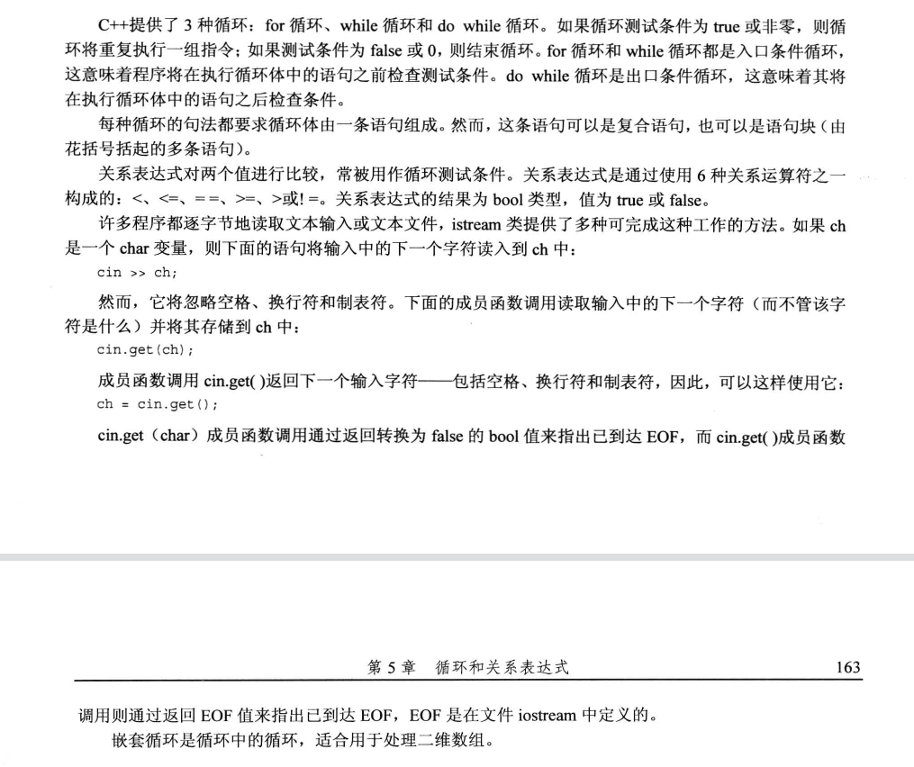

- 编程练习

1. 编写一个要求用户输入两个整数的程序。该程序将计算并输出这两个整数之间（包括这两个整数）所有整数的和。这里假设先输入较小的整数。例如，如果用户输入的是2和9，则程序将指出2~9之间所有整数的和为44。

```c++
#include <iostream>
using namespace std;
int main() {
    int number1,number2;
    int tempMax,tempMin;
    int sum=0;
    cout<<"请输入第一个整数:"<<endl;
    cin>>number1;
    cout<<"请输入第二个整数:"<<endl;
    cin>>number2;
    tempMax = number1>number2?number1:number2;
    tempMin = number1<number2?number1:number2;
    for (int i = tempMin; i <=tempMax ; ++i) {
        sum+=i;
    }
    cout<<"和为:"<<sum<<endl;

    return 0;
}
```


2. 使用`array`对象（而不是数组）和`long double`（而不是`long long`）重新编写程序清单5.4，并计算100!的值。

```c++
#include <iostream>
#include <array>
using namespace std;
#define MAX_SIZE 101
int main() {

    array<long double, MAX_SIZE> fun = {};
    fun[0] = fun[1] = 1;

    for (int i = 1; i <= fun.size(); ++i) {
        fun[i] = i*fun[i-1];
        cout<<i-1<<"!"<<"="<<i*fun[i-1]<<endl;
    }


    for (int i = 0; i <fun.size() ; ++i) {
        cout<<fun[i]<<endl;
    }
    return 0;
}
```


3.  编写一个要求用户输入数字的程序。每次输入后，程序都将报告到目前为止，所有输入的累计和。当用户输入0时，程序结束。

```c++
#include <iostream>
using namespace std;

int main() {
    double number, sum;
    sum = 0;

    cout << "Please input a number:";
    while (cin >> number && number != 0) {
        sum += number;
        cout << "Please input next number:";
    }
    cout << "The sum is " << sum << endl;
    return 0;
}

```


4. Daphne 以 $10 \%$ 的单利投资了 100 美元。也就是说，每一年的利润都是投资额的 $10 \%$ ，即每年 10 美元:
   																$利息 =0.10 \times 原始存款$
   而 cleo 以5%的复利投资了100美元。也就是说，利息是当前存款 (包括获得的利息) 的 $5 \%$ :

$$
利息 =0.05 \times 当前存款
$$

Cleo 在第一年投资 100 美元的盈利是 $5 \%$ 一得到了 105 美元。下一年的盈利是 105 美元的 $5 \%$ 一 -即 $5.25$ 美元，依此类推。请编写一个程序，计算多少年后， Cleo 的投资价值才能超过 Daphne 的投次价值，并显示此时两个人的投资价值。

```c++
//
// Created by SWPUCWF on 2022/2/2.
//

#include <iostream>

using namespace std;

const float DAPHNE_RATE = 0.1;
const float CLEO_RATE = 0.05;
const int DEPOSIT_BASE = 100;

int main() {
	float daphne = DEPOSIT_BASE;
	float cleo = DEPOSIT_BASE;

	int years = 0;

	cout << "=====Daphne And Cleo's Deposit=====" << endl;
	while (cleo <= daphne) {
		cout << years++ << " years: Daphne = " << daphne;
		cout << "\tCleo = " << cleo << endl;

		daphne += DAPHNE_RATE * DEPOSIT_BASE;
		cleo += CLEO_RATE * cleo;
	}

	cout << "Investment values after " << years << " years:" << endl;
	cout << "Daphne = " << daphne << endl;
	cout << "Cleo = " << cleo << endl;
	return 0;
}

```


 假设要销售`C++ For Fools`一书。请编写一个程序，输入全年中每个月的销售量（图书数量，而不是销售额）。程序通过循环，使用初始化为月份字符串的`char *`数组（或`string`对象数组）逐月进行提示，并将输入的数据存储在一个`int`数组中。然后，程序计算数组中各元素的总数，并报告这一年的销售情况。

```c++
#include <iostream>
#include <string>
using namespace std;

const int MONTHS = 12;

int main() {
    const string Month[] = {"JAN", "FEB", "MAR", "APR", "MAY", "JUN", "JUL", "AUG", "SEP", "OCT", "NOV", "DEC"};
    int sale_amount[MONTHS];
    long sum = 0;

    for (int i = 0; i < MONTHS; i++) {
        cout << "Please input the sale amount of " << Month[i] << ":";
        cin >> sale_amount[i];
    }

    cout << "=====The Sale Amount of This Year=====" << endl;
    for (int i = 0; i < MONTHS; i++) {
        cout << Month[i] << " 's sale amount is " << sale_amount[i] << endl;
        sum += sale_amount[i];
    }

    cout << "Total sale of this year is " << sum << "." << endl;
    return 0;
}
```


```c++
#include <iostream>

using namespace std;

const int MONTHS = 12;
const int YEARS = 3;

int main() {
    const string Month[] = {"JAN", "FEB", "MAR", "APR", "MAY", "JUN", "JUL", "AUG", "SEP", "OCT", "NOV", "DEC"};
    int sale_amount[YEARS][MONTHS];
    long total = 0;

    for (int i = 0; i < YEARS; i++) {
        for (int j = 0; j < MONTHS; j++) {
            cout << "Please input " << (i + 1) << " year sale amount of " << Month[j] << ":";
            cin >> sale_amount[i][j];
        }
    }

    for (int i = 0; i < YEARS; i++) {
        int sum = 0;
        for (int j = 0; j < MONTHS; j++) {
            sum += sale_amount[i][j];
        }
        total += sum;
        cout << "The sale amount of " << (i + 1) << " year is " << sum << "." << endl;
    }

    cout << "The Total sale amount is " << total << endl;
    return 0;
}
```

6. 设计一个名为`car`的结构，用它存储下述有关汽车的信息：生产商（存储在字符数组或`string`对象中的字符串）、生产年份（整数）。编写一个程序，向用户询问有多少辆汽车。随后，程序使用`new`来创建一个由相应数量的`car`结构组成的动态数组。接下来，程序提示用户输入每辆车的生产商（可能由多个单词组成）和年份信息。请注意，这需要特别小心，因为它将交替读取数值和字符串（参见第4章）。最后，程序将显示每个结构的内容。该程序的运行情况如下：

```c++
#include <iostream>
#include <string>
using namespace std;
struct Car{
    string Boss;
    int year{};
};
int main(){
    int car_num;
    Car *cars;

    cout << "How many cars do you wish to catalog?";
    cin >> car_num;
    cin.get();
    cars = new Car[car_num];
    for (int i = 0; i < car_num; ++i) {
        cout << "Car #" << (i + 1) << endl;
        cout << "Please enter the make:";
        getline(cin, cars[i].Boss);
        cout << "Please enter the year made:";
        cin >> cars[i].year;
        cin.get();
    }
    for (int i = 0; i < car_num; ++i) {
        cout<<"the boss is :"<<cars->Boss<<"and the year is :"<<cars->year<<endl;
    }


    return 0;
}
```


```c++
//
// Created by SWPUCWF on 2022/2/2.
//

#include <cstring>
#include <iostream>

using namespace std;
const int Max_LEN = 20;
const char Exit_WORD[] = "done";

int main() {
	int word_count = 0;
	char words[Max_LEN];

	cout << "Enter words (to stop, type the word done):" << endl;
	while (strcmp(Exit_WORD, words) != 0) {
		word_count++;
		cin >> words;
		cin.get();
	}
	cout << "You entered a total of " << word_count - 1 << " words." << endl;
	return 0;
}

```

```c++
#include <iostream>
#include <string>
using namespace std;
const string Exit_WORD = "done";

int main() {
	int word_count = 0;
	string words;

	cout << "Enter words (to stop, type the word done):" << endl;
	while (Exit_WORD != words) {
		word_count++;
		getline(cin, words);
	}
	cout << "You entered a total of " << word_count - 1 << " words." << endl;
	return 0;
}

```

 

 编写一个使用嵌套循环的程序，要求用户输入一个值，指出要显示多少行。然后，程序将显示相应行数的星号，其中第一行包括一个星号，第二行包括两个星号，以此类推。每一行包含的字符数等于用户指定的行数，在星号不够的情况下，在星号前面加上句点。该程序的运行情况如下：

```c++
#include <iostream>
using namespace std;
int main() {
    int rows;
    cout << "Enter number of rows:";
    cin >> rows;
    for (int i = 0; i < rows; ++i) {
        for (int j = 0; j < rows-i-1; ++j) {
            cout<<".";
        }
        for (int j = 0; j <=i; ++j) {
            cout<<"*";
        }
        cout<<endl;
    }

    return 0;
}

```

