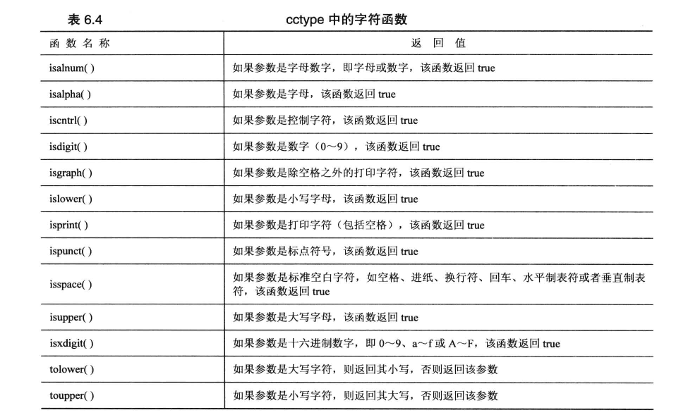
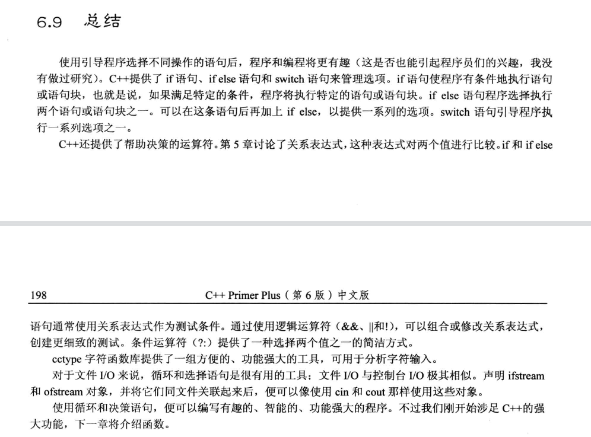

### Ctype库常用记录表



### 总结



### 编程练习

1.   编写一个程序，读取键盘输入，直到遇到`@`符号为止，并回显输入（数字除外），同时将大写字符转换为小写，将小写字符转换为大写（别忘了`cctype`函数系列）。

```c++
#include <iostream>
#include <cctype>
using namespace std;
// 编写一个程序，读取键盘输入，直到遇到`@`符号为止，并回显输入（数字除外），同时将大写字符转换为小写，将小写字符转换为大写（别忘了`cctype`函数系列）。
int main() {
    char input_word;
    cout<<"请输入你的字符："<<endl;
    cin>>input_word;

    while(input_word!='@'){

//        printf("1");
        if(islower(input_word)){
            input_word = toupper(input_word);
        } else if (isupper(input_word))
        {
            input_word = tolower(input_word);
        }
        cout<<input_word<<endl;
        cin>>input_word;
    }
    return 0;
}

```


2.  编写一个程序，最多将10个`donation`值读入到一个`double`数组中（如果您愿意，也可以使用模板类`array`）。程序遇到非数字输入时将结束输入，并报告这些数字的平均值以及数组中有多少个数字大于平均值。


```c++
#include <iostream>
#include <array>
#include <cctype>
using namespace std;
// 编写一个程序，最多将10个donation值读入到一个double数组中（如果您愿意，也可以使用模板类array）。
// 程序遇到非数字输入时将结束输入，并报告这些数字的平均值以及数组中有多少个数字大于平均值。
const int LENGTH= 10 ;
int main() {
    array<double,LENGTH> donation {};
    int count = 0 ;
    char number;
    double sum=0.;
    double avg;
    int new_count = 0;
    cout<<"请输入number的值:";
    cin>>number;
    while (isdigit(number) && count<LENGTH){
        cout<<number ;
        donation[count] = (double)number-48;
        cout<<donation[count]<<endl;
        count++;
        cout<<"请输入number的值:";
        cin>>number;
    }
    for (int i = 0; i < donation.size(); ++i) {
        sum+=donation[i];
    }
    avg = sum/donation.size();

    for (int i = 0; i < donation.size(); ++i) {
        if (donation[i]>avg){
            new_count++;
        }
    }

    cout<<"all:"<<new_count<<" number are gather than "<<avg<<endl;
    return 0;
}

```

3. 编写一个菜单驱动程序的雏形。该程序显示一个提供4个选项的菜单——每个选项用一个字母标记。如果用户使用有效选项之外的字母进行响应，程序将提供用户输入一个有效的字母，直到用户这样做为止。然后，该程序使用一条`switch`语句，根据用户的选择执行一个简单操作。该程序的运行情况如下：

```txt
Please enter one of the following choices:
c) carnivore    p) pianist
t) tree         g) game
f
Please enter a c, p, t or g:q
Please enter a c, p, t or g:t
A maple is a tree
```

```c++
#include <iostream>
using namespace std;
void show_menu();
void show_menu() {
    cout << "Please enter one of the following choices:\n"
            "c) carnivore\tp) pianist\n"
            "t) tree\t\tg) game\n";
}
int main() {
    char choice;
    show_menu();
//# 多个get 吃掉空格
    cin.get(choice).get();
    while (choice != 'c' && choice != 'p' && choice != 't' && choice != 'g') {
        cout << "Please enter a c, p, t or g:";
        cin.get(choice).get();
    }
    switch (choice) {
        case 'c':
            break;
        case 'p':
            break;
        case 't':
            cout << "A maple is a tree";
            break;
        case 'g':
            break;
    }

    return 0;
}

```

4.  加入`Benevolent Order of Programmer`后，在`BOP`大会上，人们便可以通过加入者的真实姓名、头衔或密码`BOP`姓名来了解他（她）。请编写一个程序，可以使用真实姓名、头衔、密码姓名或成员偏好来列出成员。编写该程序时，请使用下面的结构：

```c++
// Benevolent Order of Programmer name structure
struct bop {
    char fullname[strsize]; // real name
    char title[strsize]; // job title
    char bopname[strsize]; // secret BOP name
    int preference; // 0 = fullname, 1 = title, 2 = bopname
};

```

该程序创建一个由上述结构组成的小型数组，并将其初始化为适当的值。另外，该程序使用一个循环，让用户在下面的选项中进行选择：

```c++
a. display by name    b. display by title
c. display by bopname d. display by preference
q. quit
```

```C++

Benevolent Order of Programmers Report
a. display by name              b. display by title
c. display by bopname           d. display by preference
q. quit
Enter your choice:a
Wimp Macho
Raki Rhodes
Celia Laiter
Hoppy Hipman
Pat Hand
Next choice:d
Wimp Macho
Junior Programmer
MIPS
Analyst Trainee
LOOPY
Next choice:q
Bye!

```

```c++
#include <cstring>
#include <iostream>

using namespace std;

const int strsize = 40;
const int USERSIZE = 40;
//Benevolent Order of Programmer name structure

struct bop {
    char fullname[strsize];    // real name
    char title[strsize];       // job title
    char bopname[strsize];     // secret BOP name
    int preference;            // 0 = fullname,1 = title, 2 = bopname
};

const bop bop_programmers[USERSIZE] = {
            {"Wimp Macho",   "Programmer",        "MIPS",  0},
            {"Raki Rhodes",  "Junior Programmer", "",      1},
            {"Celia Laiter", "",                  "MIPS",  2},
            {"Hoppy Hipman", "Analyst Trainee",   "",      1},
            {"Pat Hand",     "",                  "LOOPY", 2}
    };
void show_menu();

void print_by_name(const bop bops[]);

void print_by_title(const bop bops[]);

void print_by_bopname(const bop bops[]);

void print_by_preference(const bop bops[]);

int main() {
    char choice;
    show_menu();
    cout << "Enter your choice:";
    cin.get(choice).get();

    while (choice != 'q') {
        switch (choice) {
            case 'a':
                print_by_name(bop_programmers);
                break;
            case 'b':
                print_by_title(bop_programmers);
                break;
            case 'c':
                print_by_bopname(bop_programmers);
                break;
            case 'd':
                print_by_preference(bop_programmers);
                break;
            default:
                cout << "Please enter character a, b, c, d, or q: ";
        }
        cout << "Next choice:";
        cin.get(choice).get();
    }
    cout << "Bye!" << endl;
    return 0;
}

void print_by_name(const bop bops[]) {
    for (int i = 0; i < USERSIZE; i++) {
        if (strlen(bops[i].fullname) == 0)
            break;
        else
            cout << bops[i].fullname << endl;
    }
}

void print_by_title(const bop bops[]) {
    for (int i = 0; i < USERSIZE; i++) {
        if (strlen(bops[i].title) == 0)
            break;
        else
            cout << bops[i].title << endl;
    }
}

void print_by_bopname(const bop bops[]) {
    for (int i = 0; i < USERSIZE; i++) {
        if (strlen(bops[i].bopname) == 0)
            break;
        else
            cout << bops[i].bopname << endl;
    }
}

void print_by_preference(const bop bops[]) {
    for (int i = 0; i < USERSIZE; i++) {
        if (strlen(bops[i].fullname) == 0)
            break;
        else {
            switch (bops[i].preference) {
                case 0:
                    cout << bops[i].fullname << endl;
                    break;
                case 1:
                    cout << bops[i].title << endl;
                    break;
                case 2:
                    cout << bops[i].bopname << endl;
                    break;
            }
        }
    }
}

void show_menu() {
    cout << "Benevolent Order of Programmers Report\n"
            "a. display by name \t\tb. display by title\n"
            "c. display by bopname\t\td. display by preference\n"
            "q. quit\n";
}

```

5.  在`Neutronia`王国，货币单位是`trarp`，收入所得税的计算方式如下：

```c++
5000 tvarps：不收税
5001~15000 tvarps：10%
15001~35000 tvarps：15%
35000 tvarps 以上：20%
```

 例如，收入为38000 tvarps时，所得税为5000 \times 0.0 + 10000 \times 0.10 + 20000 \times 0.15 + 3000 \times 0.205000×0.0+10000×0.10+20000×0.15+3000×0.20，即4600 tvarps。请编写一个程序，使用循环来要求用户输入收入，并报告所得税。当用户输入负数或非数字时，循环将结束。

```c++
#include <iostream>

using namespace std;

int main() {
    double tax;
    double  salary = 0.0;

    cout << "Please input your salary to calculate tax:";
    cin >> salary;

    while (salary > 0) {
        if (salary <= 5000) {
            tax = 0;
        } else if (salary <= 15000) {
            tax = (salary - 5000) * 0.1;
        } else if (salary <= 35000) {
            tax = 10000 * 0.1 + (salary - 15000) * 0.15;
        } else if (salary > 35000) {
            tax = 10000 * 0.1 + 20000 * 0.15 + (salary - 35000) * 0.2;
        }

        cout << "Your salary is " << salary << " tvarps." << endl;
        cout << "Your tax is " << tax << " tvarps." << endl;

        cout << "Please input your salary to calculate tax:";
        cin >> salary;
    }

    cout << "Bye!" << endl;
    return 0;
}
```

6.  编写一个程序，记录捐助给”维护合法权利团体“的资金。该程序要求用户输入捐献者数目，然后要求用户输入每一个捐赠者的姓名和款项。这些信息被存储在一个动态分配的结构数组中。每个结构有两个成员：用来存储姓名的字符数组（或`string`对象）和用来存储款项的`double`成员。读取所有的数据后，程序将显示所有捐款超过10000的捐款者的姓名及其捐款数额。该列表前应包含一个标题，指出下面的捐款者是重要捐款人（`Grand Patrons`）。然后，程序将列出其他的捐款者，该列表要以`Patrons`开头。如果某种类别没有捐款者，则程序将打印单词`none`。该程序只显示这两种类别，而不进行排序。

```c++
#include <iostream>
#include <string>
using namespace std;

struct patrons {
    string name;
    double fund=0.0;
};

int main() {
    int patrons_count;
    patrons *patrons_array = {};
    bool empty_flag = true;

    cout << "Please input the number of patrons:";
    cin >> patrons_count;
    cin.get();

    patrons_array = new patrons[patrons_count];

    for (int i = 0; i < patrons_count; i++) {
        cout << "Please input the name of patrons:";
        getline(cin, patrons_array[i].name);
        cout << "Please input the fund of " << patrons_array[i].name << ":";
        cin >> patrons_array[i].fund;
        cin.get();
    }

    cout << "=====Grand Patrons=====" << endl;
    for (int i = 0; i < patrons_count; i++) {
        if (patrons_array[i].fund >= 10000) {
            cout << patrons_array[i].name << ": " << patrons_array[i].fund << endl;
            empty_flag = false;
        }
    }

    if (empty_flag) {
        cout << "none" << endl;
    }

    empty_flag = true;
    cout << "=====Other Patrons=====" << endl;
    for (int i = 0; i < patrons_count; i++) {
        if (patrons_array[i].fund < 10000) {
            cout << patrons_array[i].name << ": " << patrons_array[i].fund << endl;
            empty_flag = false;
        }
    }

    if (empty_flag) {
        cout << "none" << endl;
    }

    return 0;
}

```


7.  编写一个程序，它每次读取一个单词，直到用户只输入`q`。然后，该程序指出有多少个单词以元音打头，有多少个单词以辅音打头，还有多少个单词不属于这两类。为此，方法之一是，使用`isalpha()`来区分以字母和其他字符打头的单词，然后对于通过了`isalpha()`测试的单词，使用`if`或`switch`语句来确定哪些以元音打头。该程序的运行情况如下：

```c++
Enter words (q to quit):
The 12 awesome oxen ambled
quietly across 15 meters of lawn. q
5 words beginning with vowels
4 words beginning with consonants
2 others
```

```C++
#include <iostream>
#include <cstring>

using namespace std;

const int LEN = 40;

int main() {
    char words[LEN];
    int vowel_cnt = 0;
    int consonant_cnt = 0;
    int others_cnt = 0;

    cout << "Enter words (q to quit):" << endl;

    while (cin >> words && strcmp(words, "q") != 0) {
        if (!isalpha(words[0])) {
            others_cnt++;
        } else {
//            判断原因
            switch (words[0]) {
                case 'a':
                case 'e':
                case 'i':
                case 'o':
                case 'u':
                    vowel_cnt++;
                    break;
                default:
                    consonant_cnt++;
            }
        }
    }

    cout << vowel_cnt << " words beginning with vowels" << endl;
    cout << consonant_cnt << " words beginning with consonants" << endl;
    cout << others_cnt << " others" << endl;

    return 0;
}

```

8.  编写一个程序，它打开一个文本文件，逐个字符地读取该文件，直到到达文件末尾，然后指出该文件中包含多少个字符。

```c++
// 编写一个程序，它打开一个文本文件，逐个字符地读取该文件，直到到达文件末尾，然后指出该文件中包含多少个字符。
#include <iostream>
#include <fstream>
#include <string>
using namespace std;

int main() {
    string fileName;
    ifstream inFile;
    cout<<"Please input your filename?";
    getline(cin,fileName);

    inFile.open(fileName);

    if (!inFile.is_open()){
        cout<<"打开失败！"<<endl;
        exit(EXIT_FAILURE);
    }

    char ch;
    int char_count=0;
    while(inFile.eof()){
      inFile>>ch;
      char_count++;
    };

    if (char_count==0){
        cout<<"th number of ch is zero!"<<endl;
    } else{
         cout << "The file " << fileName << " contains " << char_count << " characters.\n";
    }

    inFile.close();
    return 0;
}

```

8. 完成编程练习6，但从文件中读取所需的信息。该文件的第一项应为捐款人数，余下的内容应为成对的行。在每一对中，第一行为捐款人姓名，第二行为捐款数额。即该文件类似于下面：

```c++
4
Same Stone
2000
Freida Flass
100500
Tammy Tubbs
5000
Rich Raptor
55000

```

```c++
#include <iostream>
#include <fstream>
#include <string>
using namespace std;

struct patrons {
    string name;
    double fund=0;
};

int main() {
    int patrons_count;
    patrons *patrons_array{};
    bool empty_flag = true;

    string file_name;
    ifstream inFile;
    // input files/patrons.txt
    cout << "Enter the name of patrons file:";
    getline(cin, file_name);
    inFile.open(file_name);

    if (!inFile.is_open()) {
        cout << "Could not open the file " << file_name << endl;
        cout << "Program terminating.\n";
        exit(EXIT_FAILURE);
    }

    inFile >> patrons_count;
    inFile.get();
    if (patrons_count <= 0) {
        cout << "The number of patrons is invalid.\n";
        cout << "Program terminating.\n";
        exit(EXIT_FAILURE);
    }

    patrons_array = new patrons[patrons_count];
    int index = 0;
    while (!inFile.eof() && index < patrons_count) {
        getline(inFile, patrons_array[index].name);
        inFile >> patrons_array[index].fund;
        inFile.get();
        index++;
    }

    inFile.close();

    cout << "=====Grand Patrons=====" << endl;
    for (int i = 0; i < patrons_count; i++) {
        if (patrons_array[i].fund >= 10000) {
            cout << patrons_array[i].name << ": " << patrons_array[i].fund << endl;
            empty_flag = false;
        }
    }

    if (empty_flag) {
        cout << "none" << endl;
    }

    empty_flag = true;
    cout << "=====Other Patrons=====" << endl;
    for (int i = 0; i < patrons_count; i++) {
        if (patrons_array[i].fund < 10000) {
            cout << patrons_array[i].name << ": " << patrons_array[i].fund << endl;
            empty_flag = false;
        }
    }

    if (empty_flag) {
        cout << "none" << endl;
    }

    return 0;
}

```

