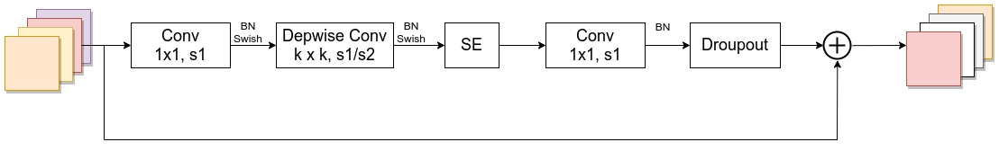
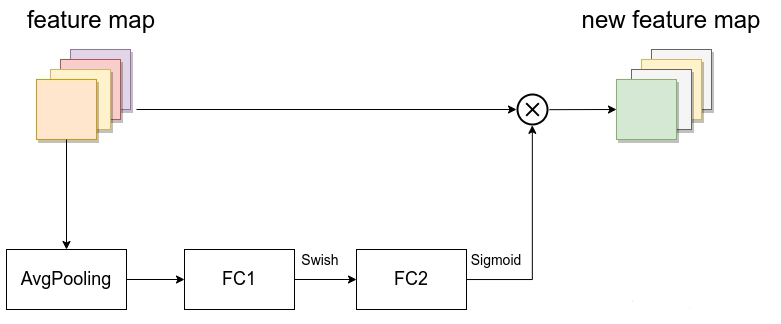
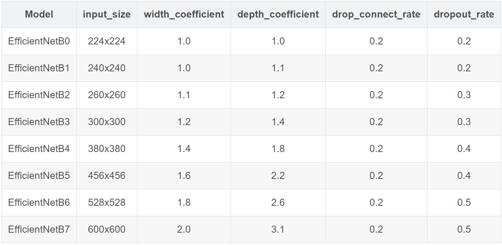
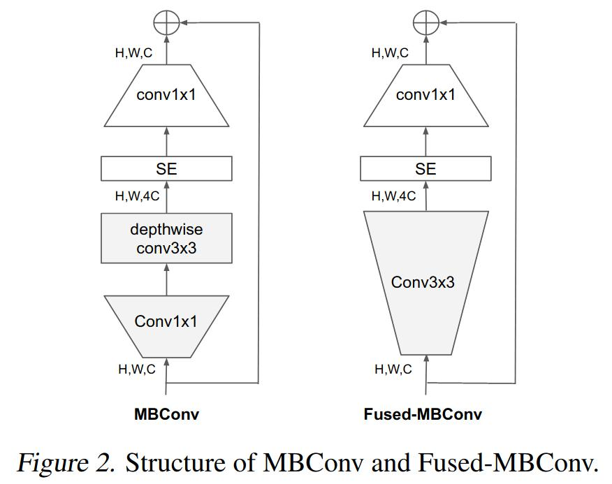

## EfficientNet

### 背景

- 根据以往的经验，增加网络的深度depth能够得到更加丰富、复杂的特征并且能够很好的应用到其它任务中。但网络的深度过深会面临梯度消失，训练困难的问题。
- 增加网络的width能够获得更高细粒度的特征并且也更容易训练，但对于width很大而深度较浅的网络往往很难学习到更深层次的特征。
- 增加输入网络的图像分辨率能够潜在得获得更高细粒度的特征模板，但对于非常高的输入分辨率，准确率的增益也会减小。并且大分辨率图像会增加计算量。

### MBConv



- 第一个升维的1x1卷积层，它的卷积核个数是输入特征矩阵channel的n倍

- 当 n = 1 时，不要第一个升维的1x1卷积层，即Stage2中的MBConv结构都没有第一个升维的1x1卷积层（这和MobileNetV3网络类似）

- 关于shortcut连接，仅当输入MBConv结构的特征矩阵与输出的特征矩阵shape相同时才存在

### SE模块



- 由一个全局平均池化，两个全连接层组成。第一个全连接层的节点个数是输入该MBConv特征矩阵channels的1/4，且使用Swish激活函数。第二个全连接层的节点个数等于Depthwise Conv层输出的特征矩阵channels，且使用Sigmoid激活函数。



- width_coefficient代表channel维度上的倍率因子，比如在 EfficientNetB0中Stage1的3x3卷积层所使用的卷积核个数是32，那么在B6中就是 32 × 1.8 = 57.6接着取整到离它最近的8的整数倍即56，其它Stage同理。
- depth_coefficient代表depth维度上的倍率因子（仅针对Stage2到Stage8），比如在EfficientNetB0中Stage7的 L = 4 ，那么在B6中就是 4 × 2.6 = 10.4，接着向上取整即11.

```python
import math
import copy
from functools import partial
from collections import OrderedDict
from typing import Optional, Callable

import torch
import torch.nn as nn
from torch import Tensor
from torch.nn import functional as F


def _make_divisible(ch, divisor=8, min_ch=None):
    """
    This function is taken from the original tf repo.
    It ensures that all layers have a channel number that is divisible by 8
    It can be seen here:
    https://github.com/tensorflow/models/blob/master/research/slim/nets/mobilenet/mobilenet.py
    """
    if min_ch is None:
        min_ch = divisor
    new_ch = max(min_ch, int(ch + divisor / 2) // divisor * divisor)
    # Make sure that round down does not go down by more than 10%.
    if new_ch < 0.9 * ch:
        new_ch += divisor
    return new_ch


def drop_path(x, drop_prob: float = 0., training: bool = False):
    """
    Drop paths (Stochastic Depth) per sample (when applied in main path of residual blocks).
    "Deep Networks with Stochastic Depth", https://arxiv.org/pdf/1603.09382.pdf

    This function is taken from the rwightman.
    It can be seen here:
    https://github.com/rwightman/pytorch-image-models/blob/master/timm/models/layers/drop.py#L140
    """
    if drop_prob == 0. or not training:
        return x
    keep_prob = 1 - drop_prob
    shape = (x.shape[0],) + (1,) * (x.ndim - 1)  # work with diff dim tensors, not just 2D ConvNets
    random_tensor = keep_prob + torch.rand(shape, dtype=x.dtype, device=x.device)
    random_tensor.floor_()  # binarize
    output = x.div(keep_prob) * random_tensor
    return output


class DropPath(nn.Module):
    """
    Drop paths (Stochastic Depth) per sample  (when applied in main path of residual blocks).
    "Deep Networks with Stochastic Depth", https://arxiv.org/pdf/1603.09382.pdf
    """
    def __init__(self, drop_prob=None):
        super(DropPath, self).__init__()
        self.drop_prob = drop_prob

    def forward(self, x):
        return drop_path(x, self.drop_prob, self.training)


class ConvBNActivation(nn.Sequential):
    def __init__(self,
                 in_planes: int,
                 out_planes: int,
                 kernel_size: int = 3,
                 stride: int = 1,
                 groups: int = 1,
                 norm_layer: Optional[Callable[..., nn.Module]] = None,
                 activation_layer: Optional[Callable[..., nn.Module]] = None):
        padding = (kernel_size - 1) // 2
        if norm_layer is None:
            norm_layer = nn.BatchNorm2d
        if activation_layer is None:
            activation_layer = nn.SiLU  # alias Swish  (torch>=1.7)

        super(ConvBNActivation, self).__init__(nn.Conv2d(in_channels=in_planes,
                                                         out_channels=out_planes,
                                                         kernel_size=kernel_size,
                                                         stride=stride,
                                                         padding=padding,
                                                         groups=groups,
                                                         bias=False),
                                               norm_layer(out_planes),
                                               activation_layer())


class SqueezeExcitation(nn.Module):
    def __init__(self,
                 input_c: int,   # block input channel
                 expand_c: int,  # block expand channel
                 squeeze_factor: int = 4):
        super(SqueezeExcitation, self).__init__()
        squeeze_c = input_c // squeeze_factor
        self.fc1 = nn.Conv2d(expand_c, squeeze_c, 1)
        self.ac1 = nn.SiLU()  # alias Swish
        self.fc2 = nn.Conv2d(squeeze_c, expand_c, 1)
        self.ac2 = nn.Sigmoid()

    def forward(self, x: Tensor) -> Tensor:
        scale = F.adaptive_avg_pool2d(x, output_size=(1, 1))
        scale = self.fc1(scale)
        scale = self.ac1(scale)
        scale = self.fc2(scale)
        scale = self.ac2(scale)
        return scale * x


class InvertedResidualConfig:
    # kernel_size, in_channel, out_channel, exp_ratio, strides, use_SE, drop_connect_rate
    def __init__(self,
                 kernel: int,          # 3 or 5
                 input_c: int,
                 out_c: int,
                 expanded_ratio: int,  # 1 or 6
                 stride: int,          # 1 or 2
                 use_se: bool,         # True
                 drop_rate: float,
                 index: str,           # 1a, 2a, 2b, ...
                 width_coefficient: float):
        self.input_c = self.adjust_channels(input_c, width_coefficient)
        self.kernel = kernel
        self.expanded_c = self.input_c * expanded_ratio
        self.out_c = self.adjust_channels(out_c, width_coefficient)
        self.use_se = use_se
        self.stride = stride
        self.drop_rate = drop_rate
        self.index = index

    @staticmethod
    def adjust_channels(channels: int, width_coefficient: float):
        return _make_divisible(channels * width_coefficient, 8)


class InvertedResidual(nn.Module):
    def __init__(self,
                 cnf: InvertedResidualConfig,
                 norm_layer: Callable[..., nn.Module]):
        super(InvertedResidual, self).__init__()

        if cnf.stride not in [1, 2]:
            raise ValueError("illegal stride value.")

        self.use_res_connect = (cnf.stride == 1 and cnf.input_c == cnf.out_c)

        layers = OrderedDict()
        activation_layer = nn.SiLU  # alias Swish

        # expand
        if cnf.expanded_c != cnf.input_c:
            layers.update({"expand_conv": ConvBNActivation(cnf.input_c,
                                                           cnf.expanded_c,
                                                           kernel_size=1,
                                                           norm_layer=norm_layer,
                                                           activation_layer=activation_layer)})

        # depthwise
        layers.update({"dwconv": ConvBNActivation(cnf.expanded_c,
                                                  cnf.expanded_c,
                                                  kernel_size=cnf.kernel,
                                                  stride=cnf.stride,
                                                  groups=cnf.expanded_c,
                                                  norm_layer=norm_layer,
                                                  activation_layer=activation_layer)})

        if cnf.use_se:
            layers.update({"se": SqueezeExcitation(cnf.input_c,
                                                   cnf.expanded_c)})

        # project
        layers.update({"project_conv": ConvBNActivation(cnf.expanded_c,
                                                        cnf.out_c,
                                                        kernel_size=1,
                                                        norm_layer=norm_layer,
                                                        activation_layer=nn.Identity)})

        self.block = nn.Sequential(layers)
        self.out_channels = cnf.out_c
        self.is_strided = cnf.stride > 1

        # 只有在使用shortcut连接时才使用dropout层
        if self.use_res_connect and cnf.drop_rate > 0:
            self.dropout = DropPath(cnf.drop_rate)
        else:
            self.dropout = nn.Identity()

    def forward(self, x: Tensor) -> Tensor:
        result = self.block(x)
        result = self.dropout(result)
        if self.use_res_connect:
            result += x

        return result


class EfficientNet(nn.Module):
    def __init__(self,
                 width_coefficient: float,
                 depth_coefficient: float,
                 num_classes: int = 1000,
                 dropout_rate: float = 0.2,
                 drop_connect_rate: float = 0.2,
                 block: Optional[Callable[..., nn.Module]] = None,
                 norm_layer: Optional[Callable[..., nn.Module]] = None
                 ):
        super(EfficientNet, self).__init__()

        # kernel_size, in_channel, out_channel, exp_ratio, strides, use_SE, drop_connect_rate, repeats
        default_cnf = [[3, 32, 16, 1, 1, True, drop_connect_rate, 1],
                       [3, 16, 24, 6, 2, True, drop_connect_rate, 2],
                       [5, 24, 40, 6, 2, True, drop_connect_rate, 2],
                       [3, 40, 80, 6, 2, True, drop_connect_rate, 3],
                       [5, 80, 112, 6, 1, True, drop_connect_rate, 3],
                       [5, 112, 192, 6, 2, True, drop_connect_rate, 4],
                       [3, 192, 320, 6, 1, True, drop_connect_rate, 1]]

        def round_repeats(repeats):
            """Round number of repeats based on depth multiplier."""
            return int(math.ceil(depth_coefficient * repeats))

        if block is None:
            block = InvertedResidual

        if norm_layer is None:
            norm_layer = partial(nn.BatchNorm2d, eps=1e-3, momentum=0.1)

        adjust_channels = partial(InvertedResidualConfig.adjust_channels,
                                  width_coefficient=width_coefficient)

        # build inverted_residual_setting
        bneck_conf = partial(InvertedResidualConfig,
                             width_coefficient=width_coefficient)

        b = 0
        num_blocks = float(sum(round_repeats(i[-1]) for i in default_cnf))
        inverted_residual_setting = []
        for stage, args in enumerate(default_cnf):
            cnf = copy.copy(args)
            for i in range(round_repeats(cnf.pop(-1))):
                if i > 0:
                    # strides equal 1 except first cnf
                    cnf[-3] = 1  # strides
                    cnf[1] = cnf[2]  # input_channel equal output_channel

                cnf[-1] = args[-2] * b / num_blocks  # update dropout ratio
                index = str(stage + 1) + chr(i + 97)  # 1a, 2a, 2b, ...
                inverted_residual_setting.append(bneck_conf(*cnf, index))
                b += 1

        # create layers
        layers = OrderedDict()

        # first conv
        layers.update({"stem_conv": ConvBNActivation(in_planes=3,
                                                     out_planes=adjust_channels(32),
                                                     kernel_size=3,
                                                     stride=2,
                                                     norm_layer=norm_layer)})

        # building inverted residual blocks
        for cnf in inverted_residual_setting:
            layers.update({cnf.index: block(cnf, norm_layer)})

        # build top
        last_conv_input_c = inverted_residual_setting[-1].out_c
        last_conv_output_c = adjust_channels(1280)
        layers.update({"top": ConvBNActivation(in_planes=last_conv_input_c,
                                               out_planes=last_conv_output_c,
                                               kernel_size=1,
                                               norm_layer=norm_layer)})

        self.features = nn.Sequential(layers)
        self.avgpool = nn.AdaptiveAvgPool2d(1)

        classifier = []
        if dropout_rate > 0:
            classifier.append(nn.Dropout(p=dropout_rate, inplace=True))
        classifier.append(nn.Linear(last_conv_output_c, num_classes))
        self.classifier = nn.Sequential(*classifier)

        # initial weights
        for m in self.modules():
            if isinstance(m, nn.Conv2d):
                nn.init.kaiming_normal_(m.weight, mode="fan_out")
                if m.bias is not None:
                    nn.init.zeros_(m.bias)
            elif isinstance(m, nn.BatchNorm2d):
                nn.init.ones_(m.weight)
                nn.init.zeros_(m.bias)
            elif isinstance(m, nn.Linear):
                nn.init.normal_(m.weight, 0, 0.01)
                nn.init.zeros_(m.bias)

    def _forward_impl(self, x: Tensor) -> Tensor:
        x = self.features(x)
        x = self.avgpool(x)
        x = torch.flatten(x, 1)
        x = self.classifier(x)

        return x

    def forward(self, x: Tensor) -> Tensor:
        return self._forward_impl(x)


def efficientnet_b0(num_classes=1000):
    # input image size 224x224
    return EfficientNet(width_coefficient=1.0,
                        depth_coefficient=1.0,
                        dropout_rate=0.2,
                        num_classes=num_classes)


def efficientnet_b1(num_classes=1000):
    # input image size 240x240
    return EfficientNet(width_coefficient=1.0,
                        depth_coefficient=1.1,
                        dropout_rate=0.2,
                        num_classes=num_classes)


def efficientnet_b2(num_classes=1000):
    # input image size 260x260
    return EfficientNet(width_coefficient=1.1,
                        depth_coefficient=1.2,
                        dropout_rate=0.3,
                        num_classes=num_classes)


def efficientnet_b3(num_classes=1000):
    # input image size 300x300
    return EfficientNet(width_coefficient=1.2,
                        depth_coefficient=1.4,
                        dropout_rate=0.3,
                        num_classes=num_classes)


def efficientnet_b4(num_classes=1000):
    # input image size 380x380
    return EfficientNet(width_coefficient=1.4,
                        depth_coefficient=1.8,
                        dropout_rate=0.4,
                        num_classes=num_classes)


def efficientnet_b5(num_classes=1000):
    # input image size 456x456
    return EfficientNet(width_coefficient=1.6,
                        depth_coefficient=2.2,
                        dropout_rate=0.4,
                        num_classes=num_classes)


def efficientnet_b6(num_classes=1000):
    # input image size 528x528
    return EfficientNet(width_coefficient=1.8,
                        depth_coefficient=2.6,
                        dropout_rate=0.5,
                        num_classes=num_classes)


def efficientnet_b7(num_classes=1000):
    # input image size 600x600
    return EfficientNet(width_coefficient=2.0,
                        depth_coefficient=3.1,
                        dropout_rate=0.5,
                        num_classes=num_classes)

```


### EfficientNetV2

#### EfficientNetV1存在问题

- 训练图像的尺寸很大时，训练速度非常慢

- 在网络浅层中使用Depthwise convolutions速度会很慢

- 同等的放大每个stage是次优的


#### 训练图像的尺寸很大时，训练速度非常慢

降低训练图像的尺寸

#### Fused-MBConv

在网络浅层中使用Depthwise convolutions速度会很慢。无法充分利用现有的一些加速器（虽然理论上计算量很小，但实际使用起来并没有想象中那么快）。故引入Fused-MBConv结构。



#### 非均匀的缩放策略来缩放模型

同等的放大每个stage是次优的。 在EfficientNetV1中，每个stage的深度和宽度都是同等放大的。但每个stage对网络的训练速度以及参数数量的贡献并不相同，所以直接使用同等缩放的策略并不合理。在这篇文章中，作者采用了非均匀的缩放策略来缩放模型。


#### 优势

引入新的网络(EfficientNetV2)，该网络在训练速度以及参数数量上都优于先前的一些网络。

提出了改进的渐进学习方法，该方法会根据训练图像的尺寸**动态调节正则方法**(提升训练速度、准确率)

通过实验与先前的一些网络相比，**训练速度提升11倍，参数数量减少为1/6.8**

#### 改进

Fused-MBConv模块


- 除了使用MBConv模块，还使用Fused-MBConv模块
- 会使用较小的expansion ratio
- 偏向使用更小的kernel_size(3x3)
- 移除了EfficientNetV1中最后一个步距为1的stage（V1中的stage8）
- 训练早期使用较小的训练尺寸以及较弱的正则方法weak regularization，这样网络能够快速的学习到一些简单的表达能力。接着逐渐提升图像尺寸，同时增强正则方法adding stronger regularization.采用的三种正则化：Dropout、RandAugment以及Mixup。

#### EfficientNetV2实现代码

```python
from collections import OrderedDict
from functools import partial
from typing import Callable, Optional

import torch.nn as nn
import torch
from torch import Tensor


def drop_path(x, drop_prob: float = 0., training: bool = False):
    """
    Drop paths (Stochastic Depth) per sample (when applied in main path of residual blocks).
    "Deep Networks with Stochastic Depth", https://arxiv.org/pdf/1603.09382.pdf

    This function is taken from the rwightman.
    It can be seen here:
    https://github.com/rwightman/pytorch-image-models/blob/master/timm/models/layers/drop.py#L140
    """
    if drop_prob == 0. or not training:
        return x
    keep_prob = 1 - drop_prob
    shape = (x.shape[0],) + (1,) * (x.ndim - 1)  # work with diff dim tensors, not just 2D ConvNets
    random_tensor = keep_prob + torch.rand(shape, dtype=x.dtype, device=x.device)
    random_tensor.floor_()  # binarize
    output = x.div(keep_prob) * random_tensor
    return output


class DropPath(nn.Module):
    """
    Drop paths (Stochastic Depth) per sample  (when applied in main path of residual blocks).
    "Deep Networks with Stochastic Depth", https://arxiv.org/pdf/1603.09382.pdf
    """
    def __init__(self, drop_prob=None):
        super(DropPath, self).__init__()
        self.drop_prob = drop_prob

    def forward(self, x):
        return drop_path(x, self.drop_prob, self.training)


class ConvBNAct(nn.Module):
    def __init__(self,
                 in_planes: int,
                 out_planes: int,
                 kernel_size: int = 3,
                 stride: int = 1,
                 groups: int = 1,
                 norm_layer: Optional[Callable[..., nn.Module]] = None,
                 activation_layer: Optional[Callable[..., nn.Module]] = None):
        super(ConvBNAct, self).__init__()

        padding = (kernel_size - 1) // 2
        if norm_layer is None:
            norm_layer = nn.BatchNorm2d
        if activation_layer is None:
            activation_layer = nn.SiLU  # alias Swish  (torch>=1.7)

        self.conv = nn.Conv2d(in_channels=in_planes,
                              out_channels=out_planes,
                              kernel_size=kernel_size,
                              stride=stride,
                              padding=padding,
                              groups=groups,
                              bias=False)

        self.bn = norm_layer(out_planes)
        self.act = activation_layer()

    def forward(self, x):
        result = self.conv(x)
        result = self.bn(result)
        result = self.act(result)

        return result


class SqueezeExcite(nn.Module):
    def __init__(self,
                 input_c: int,   # block input channel
                 expand_c: int,  # block expand channel
                 se_ratio: float = 0.25):
        super(SqueezeExcite, self).__init__()
        squeeze_c = int(input_c * se_ratio)
        self.conv_reduce = nn.Conv2d(expand_c, squeeze_c, 1)
        self.act1 = nn.SiLU()  # alias Swish
        self.conv_expand = nn.Conv2d(squeeze_c, expand_c, 1)
        self.act2 = nn.Sigmoid()

    def forward(self, x: Tensor) -> Tensor:
        scale = x.mean((2, 3), keepdim=True)
        scale = self.conv_reduce(scale)
        scale = self.act1(scale)
        scale = self.conv_expand(scale)
        scale = self.act2(scale)
        return scale * x


class MBConv(nn.Module):
    def __init__(self,
                 kernel_size: int,
                 input_c: int,
                 out_c: int,
                 expand_ratio: int,
                 stride: int,
                 se_ratio: float,
                 drop_rate: float,
                 norm_layer: Callable[..., nn.Module]):
        super(MBConv, self).__init__()

        if stride not in [1, 2]:
            raise ValueError("illegal stride value.")

        self.has_shortcut = (stride == 1 and input_c == out_c)

        activation_layer = nn.SiLU  # alias Swish
        expanded_c = input_c * expand_ratio

        # 在EfficientNetV2中，MBConv中不存在expansion=1的情况所以conv_pw肯定存在
        assert expand_ratio != 1
        # Point-wise expansion
        self.expand_conv = ConvBNAct(input_c,
                                     expanded_c,
                                     kernel_size=1,
                                     norm_layer=norm_layer,
                                     activation_layer=activation_layer)

        # Depth-wise convolution
        self.dwconv = ConvBNAct(expanded_c,
                                expanded_c,
                                kernel_size=kernel_size,
                                stride=stride,
                                groups=expanded_c,
                                norm_layer=norm_layer,
                                activation_layer=activation_layer)

        self.se = SqueezeExcite(input_c, expanded_c, se_ratio) if se_ratio > 0 else nn.Identity()

        # Point-wise linear projection
        self.project_conv = ConvBNAct(expanded_c,
                                      out_planes=out_c,
                                      kernel_size=1,
                                      norm_layer=norm_layer,
                                      activation_layer=nn.Identity)  # 注意这里没有激活函数，所有传入Identity

        self.out_channels = out_c

        # 只有在使用shortcut连接时才使用dropout层
        self.drop_rate = drop_rate
        if self.has_shortcut and drop_rate > 0:
            self.dropout = DropPath(drop_rate)

    def forward(self, x: Tensor) -> Tensor:
        result = self.expand_conv(x)
        result = self.dwconv(result)
        result = self.se(result)
        result = self.project_conv(result)

        if self.has_shortcut:
            if self.drop_rate > 0:
                result = self.dropout(result)
            result += x

        return result


class FusedMBConv(nn.Module):
    def __init__(self,
                 kernel_size: int,
                 input_c: int,
                 out_c: int,
                 expand_ratio: int,
                 stride: int,
                 se_ratio: float,
                 drop_rate: float,
                 norm_layer: Callable[..., nn.Module]):
        super(FusedMBConv, self).__init__()

        assert stride in [1, 2]
        assert se_ratio == 0

        self.has_shortcut = stride == 1 and input_c == out_c
        self.drop_rate = drop_rate

        self.has_expansion = expand_ratio != 1

        activation_layer = nn.SiLU  # alias Swish
        expanded_c = input_c * expand_ratio

        # 只有当expand ratio不等于1时才有expand conv
        if self.has_expansion:
            # Expansion convolution
            self.expand_conv = ConvBNAct(input_c,
                                         expanded_c,
                                         kernel_size=kernel_size,
                                         stride=stride,
                                         norm_layer=norm_layer,
                                         activation_layer=activation_layer)

            self.project_conv = ConvBNAct(expanded_c,
                                          out_c,
                                          kernel_size=1,
                                          norm_layer=norm_layer,
                                          activation_layer=nn.Identity)  # 注意没有激活函数
        else:
            # 当只有project_conv时的情况
            self.project_conv = ConvBNAct(input_c,
                                          out_c,
                                          kernel_size=kernel_size,
                                          stride=stride,
                                          norm_layer=norm_layer,
                                          activation_layer=activation_layer)  # 注意有激活函数

        self.out_channels = out_c

        # 只有在使用shortcut连接时才使用dropout层
        self.drop_rate = drop_rate
        if self.has_shortcut and drop_rate > 0:
            self.dropout = DropPath(drop_rate)

    def forward(self, x: Tensor) -> Tensor:
        if self.has_expansion:
            result = self.expand_conv(x)
            result = self.project_conv(result)
        else:
            result = self.project_conv(x)

        if self.has_shortcut:
            if self.drop_rate > 0:
                result = self.dropout(result)

            result += x

        return result


class EfficientNetV2(nn.Module):
    def __init__(self,
                 model_cnf: list,
                 num_classes: int = 1000,
                 num_features: int = 1280,
                 dropout_rate: float = 0.2,
                 drop_connect_rate: float = 0.2):
        super(EfficientNetV2, self).__init__()

        for cnf in model_cnf:
            assert len(cnf) == 8

        norm_layer = partial(nn.BatchNorm2d, eps=1e-3, momentum=0.1)

        stem_filter_num = model_cnf[0][4]

        self.stem = ConvBNAct(3,
                              stem_filter_num,
                              kernel_size=3,
                              stride=2,
                              norm_layer=norm_layer)  # 激活函数默认是SiLU

        total_blocks = sum([i[0] for i in model_cnf])
        block_id = 0
        blocks = []
        for cnf in model_cnf:
            repeats = cnf[0]
            op = FusedMBConv if cnf[-2] == 0 else MBConv
            for i in range(repeats):
                blocks.append(op(kernel_size=cnf[1],
                                 input_c=cnf[4] if i == 0 else cnf[5],
                                 out_c=cnf[5],
                                 expand_ratio=cnf[3],
                                 stride=cnf[2] if i == 0 else 1,
                                 se_ratio=cnf[-1],
                                 drop_rate=drop_connect_rate * block_id / total_blocks,
                                 norm_layer=norm_layer))
                block_id += 1
        self.blocks = nn.Sequential(*blocks)

        head_input_c = model_cnf[-1][-3]
        head = OrderedDict()

        head.update({"project_conv": ConvBNAct(head_input_c,
                                               num_features,
                                               kernel_size=1,
                                               norm_layer=norm_layer)})  # 激活函数默认是SiLU

        head.update({"avgpool": nn.AdaptiveAvgPool2d(1)})
        head.update({"flatten": nn.Flatten()})

        if dropout_rate > 0:
            head.update({"dropout": nn.Dropout(p=dropout_rate, inplace=True)})
        head.update({"classifier": nn.Linear(num_features, num_classes)})

        self.head = nn.Sequential(head)

        # initial weights
        for m in self.modules():
            if isinstance(m, nn.Conv2d):
                nn.init.kaiming_normal_(m.weight, mode="fan_out")
                if m.bias is not None:
                    nn.init.zeros_(m.bias)
            elif isinstance(m, nn.BatchNorm2d):
                nn.init.ones_(m.weight)
                nn.init.zeros_(m.bias)
            elif isinstance(m, nn.Linear):
                nn.init.normal_(m.weight, 0, 0.01)
                nn.init.zeros_(m.bias)

    def forward(self, x: Tensor) -> Tensor:
        x = self.stem(x)
        x = self.blocks(x)
        x = self.head(x)

        return x


def efficientnetv2_s(num_classes: int = 1000):
    """
    EfficientNetV2
    https://arxiv.org/abs/2104.00298
    """
    # train_size: 300, eval_size: 384

    # repeat, kernel, stride, expansion, in_c, out_c, operator, se_ratio
    model_config = [[2, 3, 1, 1, 24, 24, 0, 0],
                    [4, 3, 2, 4, 24, 48, 0, 0],
                    [4, 3, 2, 4, 48, 64, 0, 0],
                    [6, 3, 2, 4, 64, 128, 1, 0.25],
                    [9, 3, 1, 6, 128, 160, 1, 0.25],
                    [15, 3, 2, 6, 160, 256, 1, 0.25]]

    model = EfficientNetV2(model_cnf=model_config,
                           num_classes=num_classes,
                           dropout_rate=0.2)
    return model


def efficientnetv2_m(num_classes: int = 1000):
    """
    EfficientNetV2
    https://arxiv.org/abs/2104.00298
    """
    # train_size: 384, eval_size: 480

    # repeat, kernel, stride, expansion, in_c, out_c, operator, se_ratio
    model_config = [[3, 3, 1, 1, 24, 24, 0, 0],
                    [5, 3, 2, 4, 24, 48, 0, 0],
                    [5, 3, 2, 4, 48, 80, 0, 0],
                    [7, 3, 2, 4, 80, 160, 1, 0.25],
                    [14, 3, 1, 6, 160, 176, 1, 0.25],
                    [18, 3, 2, 6, 176, 304, 1, 0.25],
                    [5, 3, 1, 6, 304, 512, 1, 0.25]]

    model = EfficientNetV2(model_cnf=model_config,
                           num_classes=num_classes,
                           dropout_rate=0.3)
    return model


def efficientnetv2_l(num_classes: int = 1000):
    """
    EfficientNetV2
    https://arxiv.org/abs/2104.00298
    """
    # train_size: 384, eval_size: 480

    # repeat, kernel, stride, expansion, in_c, out_c, operator, se_ratio
    model_config = [[4, 3, 1, 1, 32, 32, 0, 0],
                    [7, 3, 2, 4, 32, 64, 0, 0],
                    [7, 3, 2, 4, 64, 96, 0, 0],
                    [10, 3, 2, 4, 96, 192, 1, 0.25],
                    [19, 3, 1, 6, 192, 224, 1, 0.25],
                    [25, 3, 2, 6, 224, 384, 1, 0.25],
                    [7, 3, 1, 6, 384, 640, 1, 0.25]]

    model = EfficientNetV2(model_cnf=model_config,
                           num_classes=num_classes,
                           dropout_rate=0.4)
    return model

```

