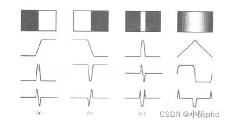
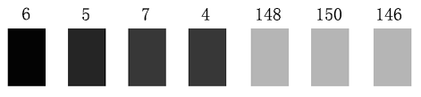
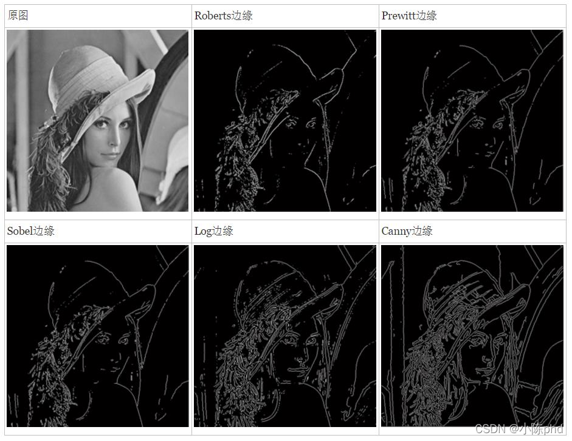
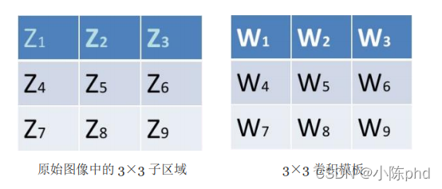

@[TOC](边缘检测)
# 边缘概述
## 认识边缘
###  定义
边缘是不同区域的分界线，是**周围（局部）灰度值有显著变化的像素点的集合**，有**幅值**与**方向**两个属性。这个不是绝对的定义，主要记住边缘是局部特征，以及周围灰度值显著变化产生边缘。 
### 轮廓和边缘的关系
一般认为轮廓是对物体的完整边界的描述，边缘点一个个连接起来构成轮廓。边缘可以是一段边缘，而轮廓一般是完整的。人眼视觉特性，看物体时一般是先获取物体的轮廓信息，再获取物体中的细节信息，比如看到几个人站在那，我们一眼看过去马上能知道的是每个人的高矮胖瘦，然后才获取脸和衣着等信息。
总结：边缘组合起来可以构成轮廓，轮廓可以由多个边缘组成。
### 边缘的类型
简单分为4种类型，阶跃型、屋脊型、斜坡型、脉冲型，其中阶跃型和斜坡型是类似的，只是变化的快慢不同，同样，屋脊型和脉冲型也是如此。在边缘检测中更多关注的是阶跃和屋脊型边缘。见图1，（a）和（b）可认为是阶跃或斜坡型，（c）脉冲型，（d）屋脊型，阶跃与屋脊的不同在于阶跃上升或下降到某个值后持续下去，而屋脊则是先上升后下降。

# 边缘检测的概念
##  概念
边缘检测是图像处理与计算机视觉中极为重要的一种分析图像的方法，它的目的是找到图像中亮度变化剧烈的像素点构成的集合，表现出来往往是轮廓。如果图像中边缘能够精确的测量和定位，那么，就意味着实际的物体能够被定位和测量，包括物体的面积、物体的直径、物体的形状等就能被测量。在对现实世界的图像采集中，有下面4种情况会表现在图像中时形成一个边缘。 
1.  深度的不连续（物体处在不同的物平面上）；
2.  表面方向的不连续（如正方体的不同的两个面）；
3.  物体材料不同（这样会导致光的反射系数不同）；
4.  场景中光照不同（如被树萌投向的地面）； 

例如上面的图像是图像中水平方向7个像素点的灰度值显示效果，我们很容易地判断在第4和第5个像素之间有一个边缘，因为它俩之间发生了强烈的灰度跳变。在实际的边缘检测中，边缘远没有上图这样简单明显，我们需要取对应的阈值来区分出它们。

# 边缘检测方法
# 基本方法
一般图像边缘检测方法主要有如下四个步骤： 
### 图像滤波
作用：进行去噪
传统边缘检测算法主要是基于图像强度的一阶和二阶导数，但导数的计算对噪声很敏感，因此必须使用**滤波器**来改善与噪声有关的边缘检测器的性能。需要指出的是，大多数滤波器在降低噪声的同时也造成了了边缘强度的损失，因此，在增强边缘和降低噪声之间需要一个折衷的选择。 
### 图像增强
增强边缘的基础是**确定图像各点邻域强度的变化值**。增强算法可以将邻域(或局部)强度值有显著变化的点突显出来。边缘增强一般是通过计算**梯度的幅值**来完成的。 
### 图像检测
在图像中有许多点的梯度幅值比较大，而这些点在特定的应用领域中并不都是边缘，所以应该用某种方法来确定哪些点是边缘点。最简单的边缘检测判断依据是梯度幅值。
### 图像定位
如果某一应用场合要求确定边缘位置，则边缘的位置可在子像素分辨率上来估计，边缘的方位也可以被估计出来。 

# 边缘检测算子的概念

在数学中，函数的变化率由导数来刻画，图像我们看成二维函数，其上面的像素值变化，当然也可以用导数来刻画，当然图像是离散的，那我们换成像素的差分来实现。对于阶跃型边缘，图2中显示其一阶导数具有极大值，极大值点对应二阶导数的过零点，也就是，准确的边缘的位置是对应于一阶导数的极大值点，或者二阶导数的过零点（注意不仅仅是二阶导数为0值的位置，二值正负值过渡的零点）。故边缘检测算子的类型当然就存在一阶和二阶微分算子。
# 常见的边缘检测算子 
近20多年来提出了许多边缘检测算子，在这里仅讨论集中常见的边缘检测算子。 

1. 常见的一阶微分边缘算子包括Roberts，Prewitt，Sobel，Kirsch以及Nevitia，
2. 常见的二阶微分边缘算子包括Laplace算子，LOG算子，DOG算子和Canny算子等。
3. 其中Canny算子是最为常用的一种，也是当前被认为最优秀的边缘检测算子。 此外本文还会介绍一种边缘检测方法SUSAN，它没有用到图像像素的梯度（导数）。以及本文会概述一些新兴的边缘检测方法，如小波分析，模糊算法以及人工神经网络等。 
# 用梯度算子实现边缘检测的原理 
##  梯度算子
### 边缘点
对应于一阶微分幅度的最大值点以及二阶微分的零点。 
### 梯度
一个曲面沿着给定方向的倾斜程度，在单变量函数中，梯度只是导数，在线性函数中，是线的斜率——有方向的向量。
### 梯度算子 
梯度属于一阶微分算子，对应一阶导数。若图像含有较小的噪声并且图像边缘的灰度值过渡较为明显，梯度算子可以得到较好的边缘检测结果。Canny，Sobel都属于梯度算子
## 梯度如何衡量
对于连续函数f(x,y)，我们计算出了它在(x,y)处的梯度，并且用一个矢量(沿x方向和沿y方向的两个分量)来表示，如下： 

对于连续函数 $\mathrm{f}(\mathrm{x}, \mathrm{y})$, 我们计算出了它在 $(\mathrm{x}, \mathrm{y})$ 处的梯度, 并且用一个矢量 $($ 沿 $\mathrm{x}$ 方向和沿 $\mathrm{y}$ 方向的两个分量) 来表示, 如下:
$$
\mathrm{G}(\mathrm{x}, \mathrm{y})=\left[\begin{array}{l}
G_{x} \\
G_{y}
\end{array}\right]=\left[\begin{array}{l}
\frac{\partial f}{\partial x} \\
\frac{\partial f}{\partial y}
\end{array}\right]
$$
现在我们需要衡量梯度的幅值, 可以用到以下三种范数:
$$
\begin{array}{r}
|\mathrm{G}(\mathrm{x}, \mathrm{y})|=\sqrt{G_{x}^{2}+G_{y}^{2}}, 2 \text { 范数梯度 } \\
|\mathrm{G}(\mathrm{x}, \mathrm{y})|=\left|G_{x}\right|+\left|G_{y}\right|, \quad 1 \text { 范数梯度 } \\
|\mathrm{G}(\mathrm{x}, \mathrm{y})| \approx \max \left(\left|G_{x}\right|,\left|G_{y}\right|\right) \quad, \quad \infty \text { 范数梯度 }
\end{array}
$$
要注意的是，由于使用2范数梯度要对图像中的每个像素点进行平方及开方运算，计算复杂度高，在实际应用中，通常取绝对值或最大值来近似代替该运算以实现简化，与平方及开方运算相比，取绝对值或最大值进行的边缘检测的准确度和边缘的精度差异都很小。

## 使用梯度算子实现边缘检测
### 原理 
基于梯度算子的边缘检测大多数是基于方向导数求卷积的方法 
### 实现
以3×3的卷积模板为例。 

设定好卷积模板后，将模板在图像中移动，并将图像中的每个像素点与此模板进行卷积，得到每个像素点的响应R，用R来表征每个像素点的邻域灰度值变化率，即灰度梯度值，从而可将灰度图像经过与模板卷积后转化为梯度图像。模板系数𝑊𝑖（i=1,2,3,……9）相加的总和必须为零，以确保在灰度级不变的区域中模板的响应为零。Z表示像素的灰度值 ：
$$
\mathrm{R}=W_{1} Z_{1}+W_{2} Z_{2}+\cdots+W_{9} Z_{9}
$$
然后我们设定一个阈值，如果卷积的结果R大于这个阈值，那么该像素点为边缘点，输出白色；如果R小于这个阈值，那么该像素不为边缘点，输出黑色。于是最终我们就能输出一幅黑白的梯度图像，实现边缘的检测。

