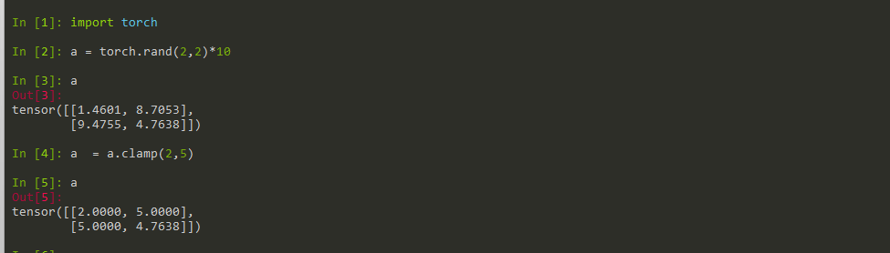
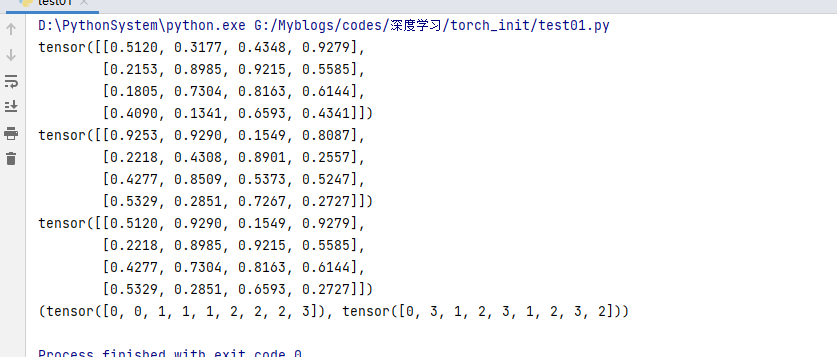
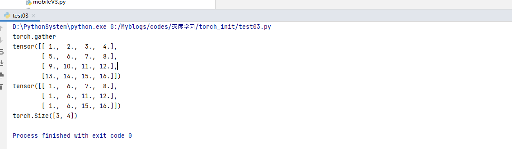
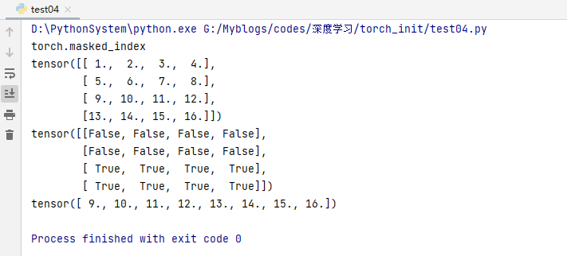
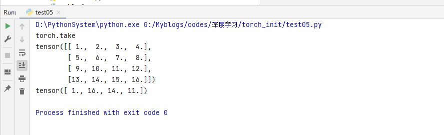
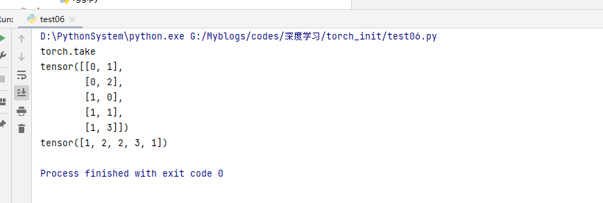

# 深度学习Pytorch框架Tensor张量

- 本文主要介绍了Tensor的裁剪运算、索引与数据筛选、组合/拼接、切片、变形操作、填充操作和Tensor的频谱操作（傅里叶变换）。

## 1 Tensor的裁剪运算


- 对Tensor中的元素进行范围过滤
- 常用于梯度裁剪（gradient clipping），即在发生梯度离散或者梯度爆炸时对梯度的处理
- torch.clamp(input, min, max, out=None) → Tensor：将输入`input`张量每个元素的夹紧到区间 [min,max]，并返回结果到一个新张量。



## 2 Tensor的索引与数据筛选

- torch.where(codition,x,y):按照条件从x和y中选出满足条件的元素组成新的tensor，输入参数condition：条件限制，如果满足条件，则选择a，否则选择b作为输出。
- torch.gather(input,dim,index,out=None):在指定维度上按照索引赋值输出tensor
- torch.inex_select(input,dim,index,out=None):按照指定索引赋值输出tensor
- torch.masked_select(input,mask,out=None):按照mask输出tensor，输出为向量
- torch.take(input,indices):将输入看成1D-tensor，按照索引得到输出tensor
- torch.nonzero(input,out=None):输出非0元素的坐标


```python
import  torch

a = torch.rand(4,4)
b = torch.rand(4,4)

print(a)
print(b)


out = torch.where(a>0.5,a,b)
# // 返回a,b中满足条件的值
print(out)
out = torch.where(a>0.5)
# // 返回a,b中满足条件的索引

print(out)


```



```python
import torch

print("torch.gather")
a = torch.linspace(1, 16, 16).reshape(4, 4)

print(a)


out = torch.gather(a, dim=0,
             index=torch.tensor([[0, 1, 1, 1],
                                 [0, 1, 2, 2],
                                 [0, 1, 3, 3]]))
print(out)
print(out.shape)
#注：从0开始，第0列的第0个，第一列的第1个，第二列的第1个，第三列的第1个，，，以此类推
#dim=0, out[i, j, k] = input[index[i, j, k], j, k]
#dim=1, out[i, j, k] = input[i, index[i, j, k], k]
#dim=2, out[i, j, k] = input[i, j, index[i, j, k]]
```



```python
import torch
print("torch.masked_index")
a = torch.linspace(1, 16, 16).reshape(4, 4)
mask = torch.gt(a, 8)
print(a)
print(mask)
out = torch.masked_select(a, mask)
print(out)
```



```python
import torch
print("torch.take")
a = torch.linspace(1, 16, 16).reshape(4, 4)
print(a)

b = torch.take(a, index=torch.tensor([0, 15, 13, 10]))

print(b)

```



```python
import torch
#torch.nonzero
print("torch.take")
a = torch.tensor([[0, 1, 2, 0], [2, 3, 0, 1]])
out = torch.nonzero(a)
print(out)
#稀疏表示
print(a[out[:,0],out[:,1]])
```



## 3 Tensor的组合/拼接

- torch.cat(seq,dim=0,out=None):按照已经存在的维度进行拼接
- torch.stack(seq,dim=0,out=None):沿着一个新维度对输入张量序列进行连接。序列中所有的张量都应该为相同形状。

```python
import torch
print("torch.stack")
a = torch.linspace(1, 6, 6).reshape(2, 3)
b = torch.linspace(7, 12, 6).reshape(2, 3)
print(a, b)
out = torch.stack((a, b), dim=2)
print(out)
print(out.shape)

print(out[:, :, 0])
print(out[:, :, 1])
```

## 4 Tensor的切片

- torch.chunk(tensor,chunks,dim=0):按照某个维度平均分块（最后一个可能小于平均值）
- torch.split(tensor,split_size_or_sections,dim=0):按照某个维度依照第二个参数给出的list或者int进行分割tensor

## 5 Tensor的变形操作

- torch().reshape(input,shape)
- torch().t(input):只针对2D tensor转置
- torch().transpose(input,dim0,dim1):交换两个维度
- torch().squeeze(input,dim=None,out=None):去除那些维度大小为1的维度
- torch().unbind(tensor,dim=0):去除某个维度
- torch().unsqueeze(input,dim,out=None):在指定位置添加维度,dim=-1在最后添加
- torch().flip(input,dims):按照给定维度翻转张量
- torch().rot90(input,k,dims):按照指定维度和旋转次数进行张量旋转

```python
import torch
a = torch.rand(2, 3)
print(a)
out = torch.reshape(a, (3, 2))
print(out)
```

```python
import torch
print(a)
print(torch.flip(a, dims=[2, 1]))

print(a)
print(a.shape)
out = torch.rot90(a, -1, dims=[0, 2]) #顺时针旋转90°  
print(out)
print(out.shape)
```

## 6 Tensor的填充操作

- torch.full((2,3),3.14)