### 人脸关键点检测

#### 人脸关键点检测基础

人脸关键点：人脸形状的稀疏表达，实现了像素到语义级别的转换。

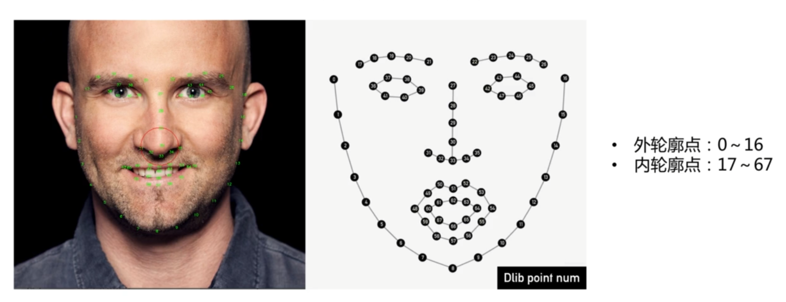

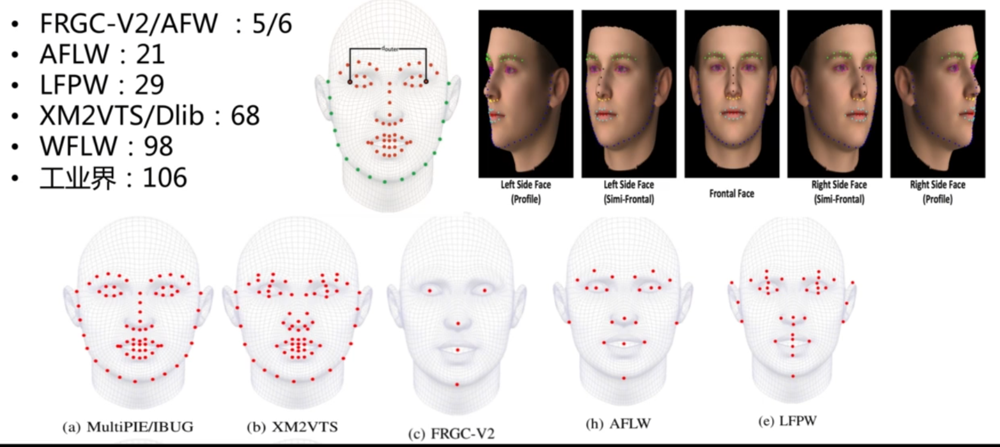

##### 人脸关键点算法应用

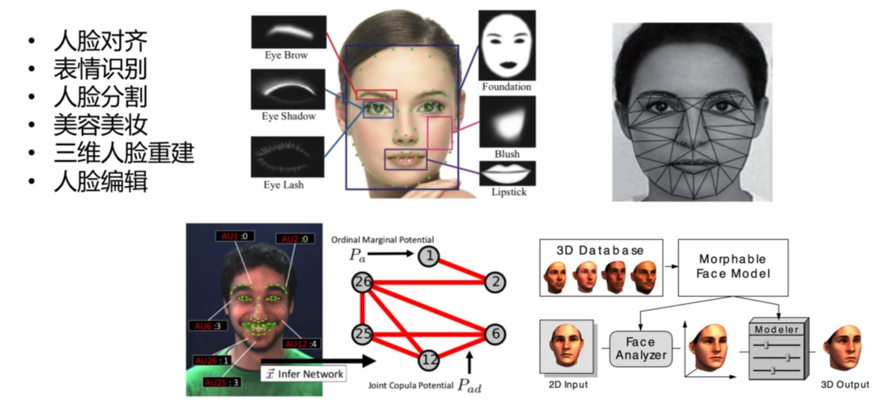

#### 人脸关键点检测算法

- 级联框架

  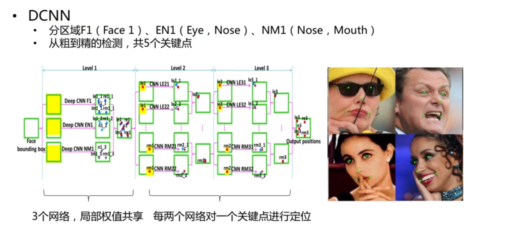

  

  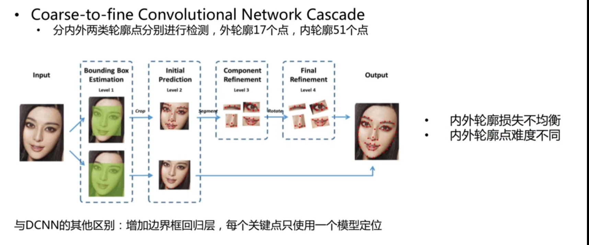

  

  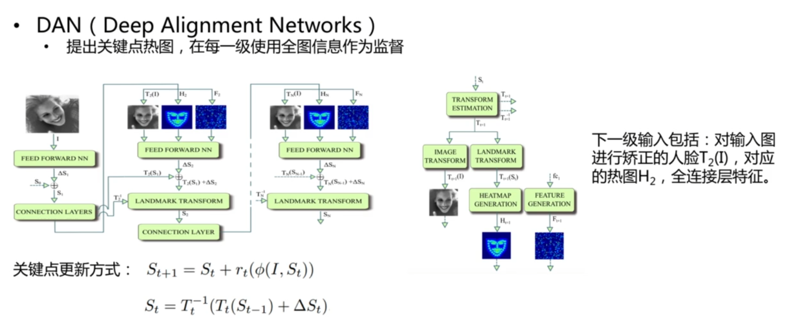

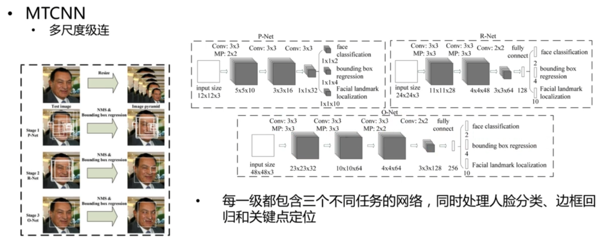

- 多任务框架

  1. TCDCN

  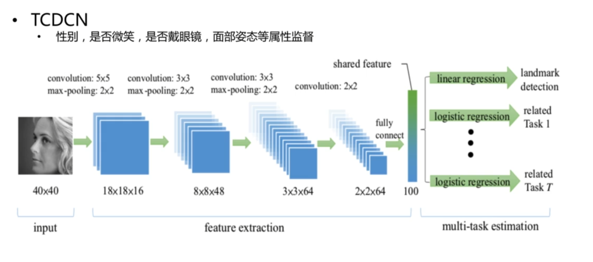

2. boundary-Aware

   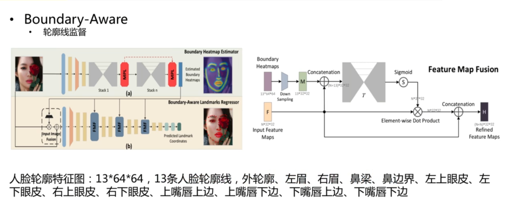

3. PFLD

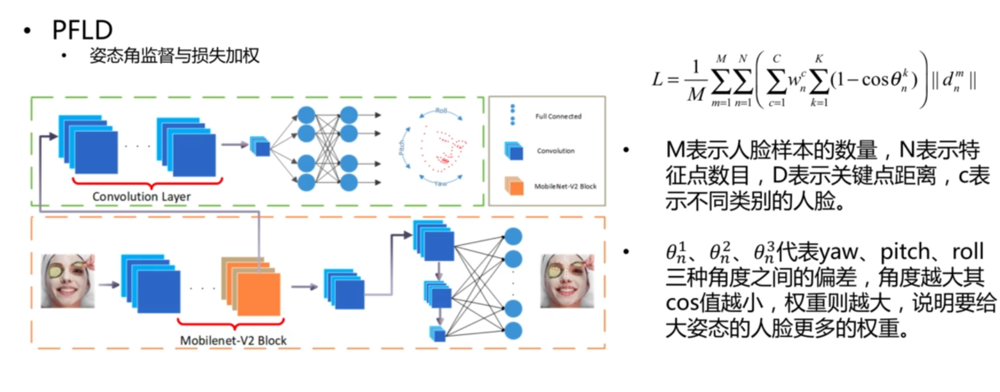

- 人脸关键点检测难点

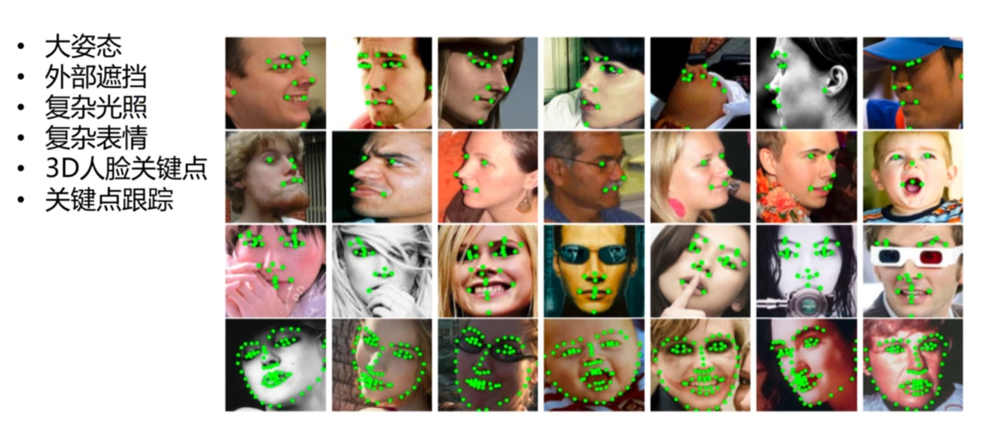

#### 开源项目

- MTCNN
- https://github.com/kpzhang93/MTCNN_face_detection_alignment
- https://github.com/AITTSMD/MTCNN-Tensorflow 
- PFLD
- https://github.com/guoqiangqi/PFLD
- 3DDFA
- https://github.com/cleardusk/3DDFA