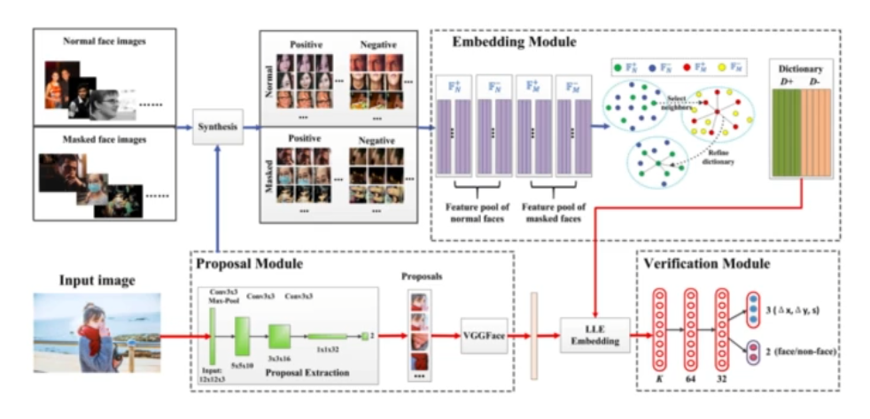
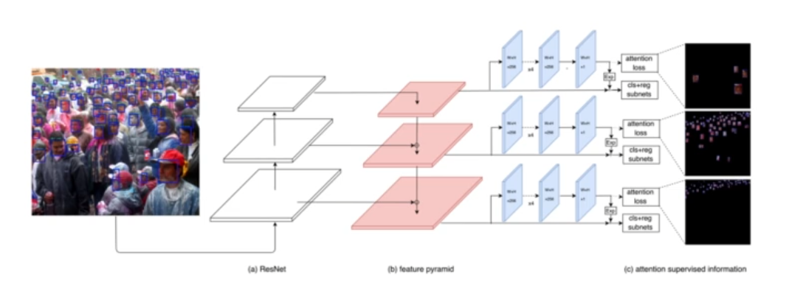
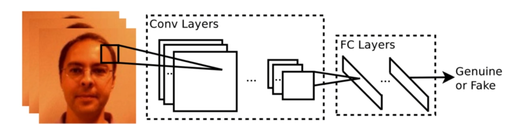
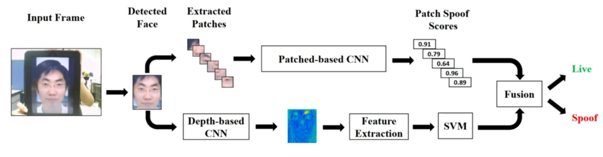
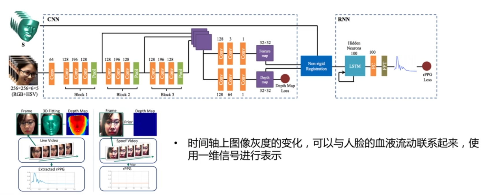
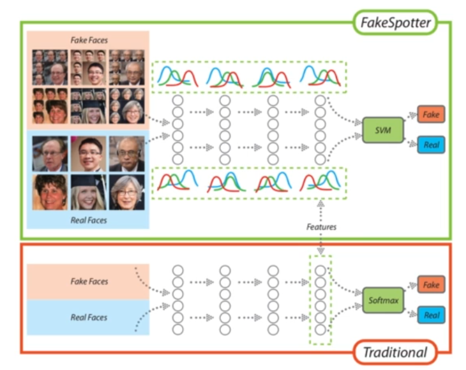
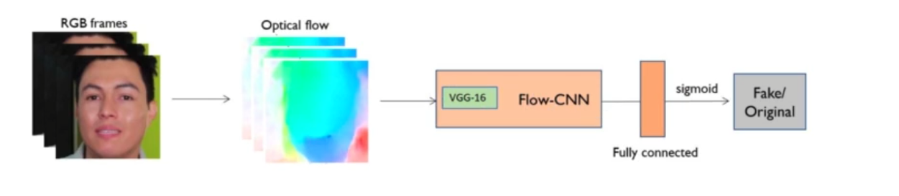
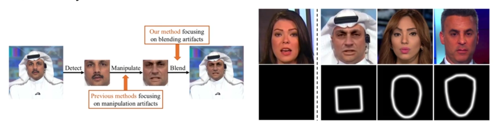
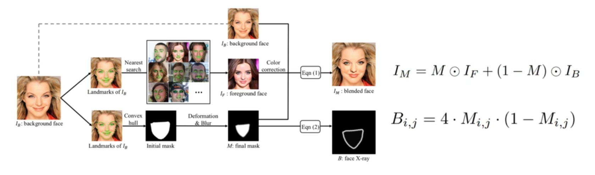

### 人脸检测任务

#### 遮挡人脸检测

- 人脸遮挡带来的主要挑战 : 显著特征缺失
- MAFA : 遮挡人脸数据集，人脸划分成鼻子，眼睛，嘴巴，下巴4个区域

##### 1. 补全遮挡人脸

- LLE-CNN

- Locally linear embedding

  

- Proposal Module, 人脸候选 区域提取 低阈值高召回率
- Embedding Module，正常人 脸与遮挡人脸特征池，KNN匹 配
- Verification Module，使用修 复后特征进行人脸区域验证与微 调

##### 2.遮挡特征增强

- Face attention network(注意力机制)
- 单独的注意力预测分支，用于增强可见区域的特征 

$$
L=\sum_{k} \frac{1}{N_{k}^{c}} \sum_{i \in A_{k}} L_{c}\left(p_{i}, p_{i}^{*}\right)+
$$

##### 3.仿真遮挡

- Occlusion-aware Face Detection

- Mask Generator，生成遮挡区域
- 遮挡分割联合学习

#### 活体人脸检测

##### 常见非活体人脸

- 打印照片、电子屏幕照片
- 录制好的视频
- 塑料面具，蜡像

##### 常用数据集

- NUAA
- Replay-Attack Database
- 3DMask Attack
- WFFD
- CASIA-SURF
- CelebA-Spoof

##### 解决思路

- CNN分类
- 关键技术 : 数据增强
- 模型过于简单，容易过拟合

##### 1. 基于深度信息的模型

算法基础：屏幕中的人脸，估计不出深度信息,(屏幕众人脸估计不出深度信息)

##### 2.基于生理监督信息的模型

- rPPG

-  时间轴上图像灰度的变化，可以与人脸的血液流动联系起来，使 用一维信号进行表示
- 

#### 伪造人脸检测

- 伪造人脸检测问题
- 伪造人脸检测方法

生成式伪造人脸

- 生成的真实，但不存在的人脸
- 对人脸进行局部或者全局的编辑 ( StyleGAN ) ( FaceForensics数据集)

##### 解决思路

1. FakeSpotter（简单的分类模型）
   1. 
   2. 与一般的使用最后的特征进行分类的思路不同，使用了每一层神经元的激活特征作为特征。
2. 基于光流的模型
   1. Optical Flow based CNN
   2. 伪造的视频帧，没有明显的光流信息
   3. 

3. 基于边界的模型

   1. 

   2. Face X-ray

   3. （原理）许多换脸算法都存在人脸融合过程，因此为有边界不连续的缺陷。

   4. 真实人脸M元素为1或者 0 ，而伪造人脸则在 $0 \sim 1$ 之间，B的值在 $0 \sim 1$ 之间

      

4. FaceForensics Benchmark

   

#### 开源项目

- FAN
- https://github.com/rainofmine/Face_Attention_Network
- CelebA-Spoof
- https://github.com/Davidzhangyuanhan/CelebA-Spoof
- FaceForensics
- http://kaldir.vc.in.tum.de/faceforensics_benchmark/