### 人脸识别问题

- face verification : 验证两张人脸是否为同一张脸，是一对一的过程。
- face identification：从数据集中辨认相同的人脸，是一对多的过程。

#### 算法基本流程

- 人脸检测
- 人脸对齐
- 人脸识别/验证

#### 数据集

LFW基准： 5749 个人的 13233 张全世界知名人士的图像，通用的人脸

- 大规模人脸数据集：VGGFace2， MegaFace，MS-Celeb-1M等，VG 含 9131 个人的 $3.31$ 百万张图片，平均每一个人有 $362.6$ 张图
- 细粒度人脸识别数据集
- LAG，跨年龄
- MeGlass, 跨遮挡
- iCartoonFace, 卡通

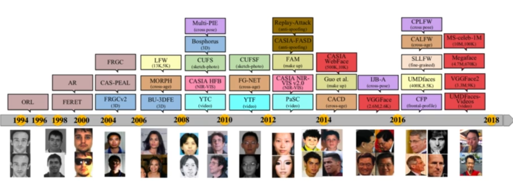

#### 算法

1. 基于度量学习

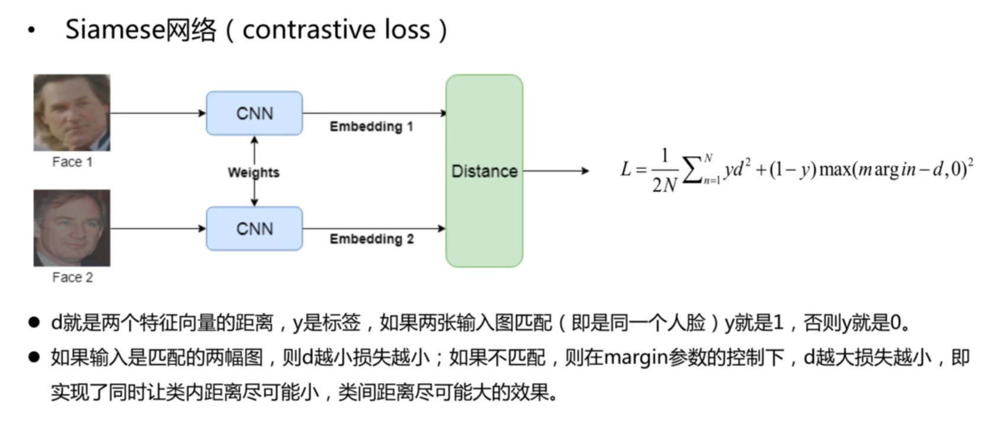

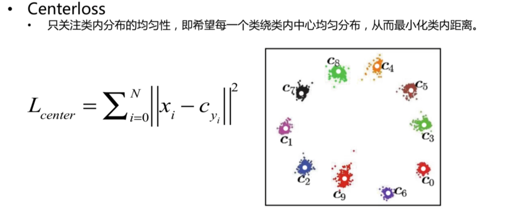

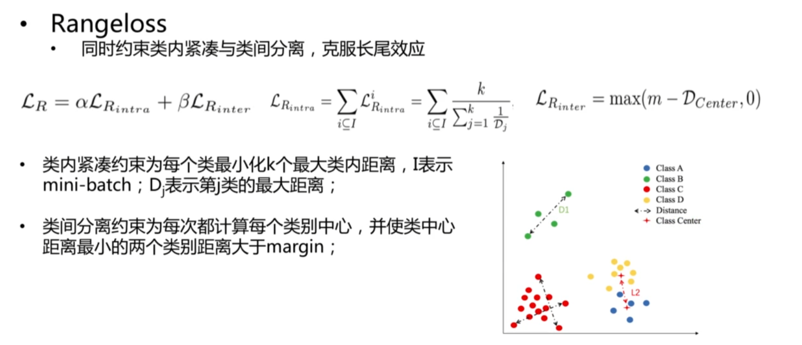

2. 基于分类模型

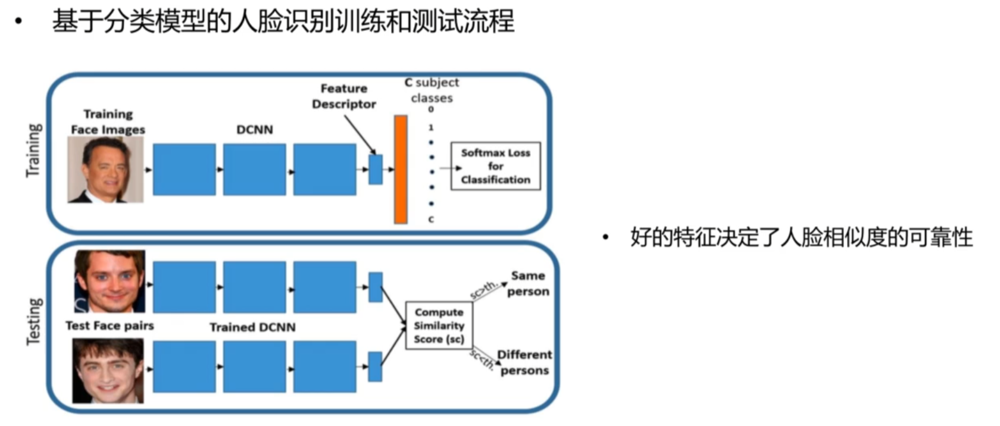

分类目标函数的改进

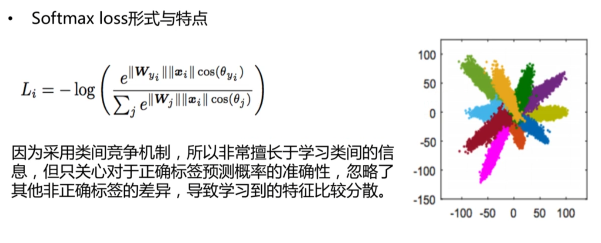

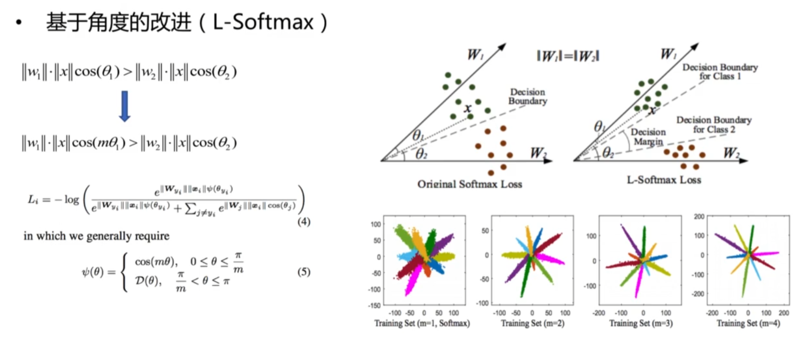

A-Softmax

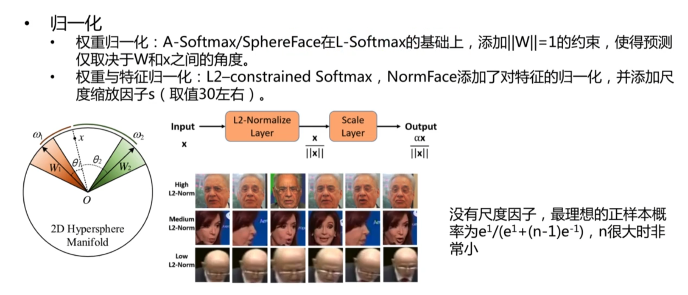

AM-softmax

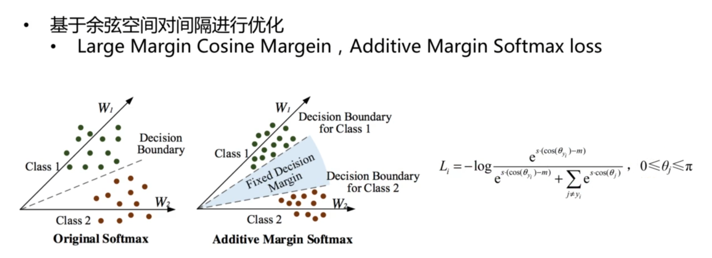

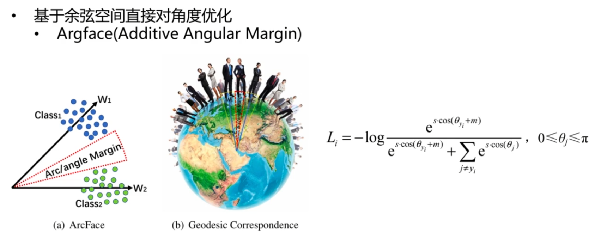

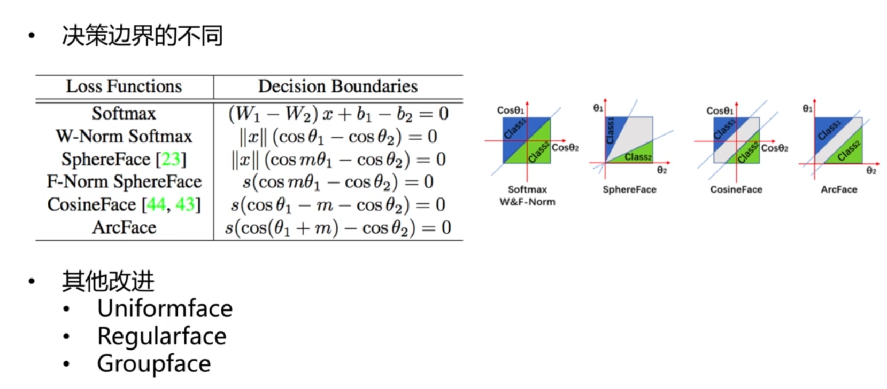

#### 开源项目

- Facenet
- https://github.com/davidsandberg/facenet
- OpenFace
- https://github.com/cmusatyalab/openface
- ArcFace
- https://github.com/ZhaoJ9014/face.evolVe.PyTorch
- https://github.com/deepinsight/insightface
- GroupFace
- https://github.com/SeungyounShin/GroupFace