### 人脸识别难点

#### 遮挡人脸识别

- 光纤
- 实物
- 自遮挡（姿态）

##### 遮挡人脸修复

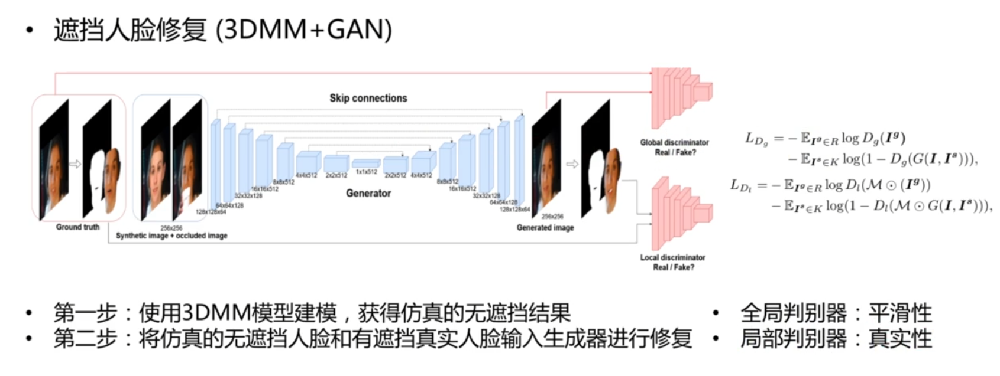

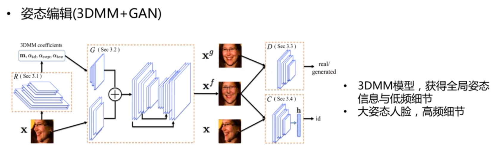

跨年龄人脸识别

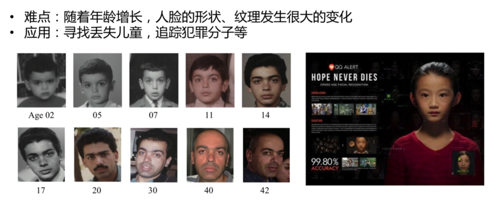

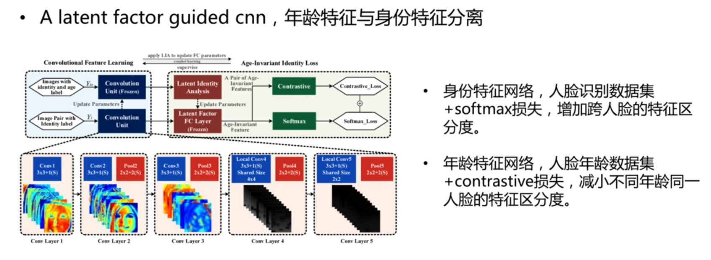

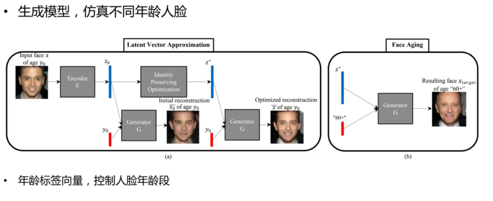

跨妆造人脸识别

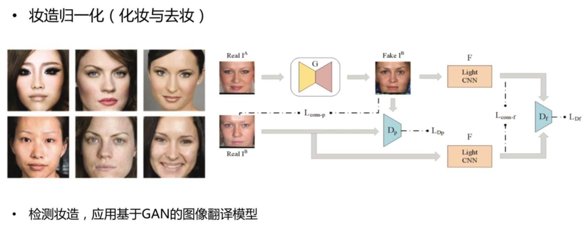

异质源人脸识别

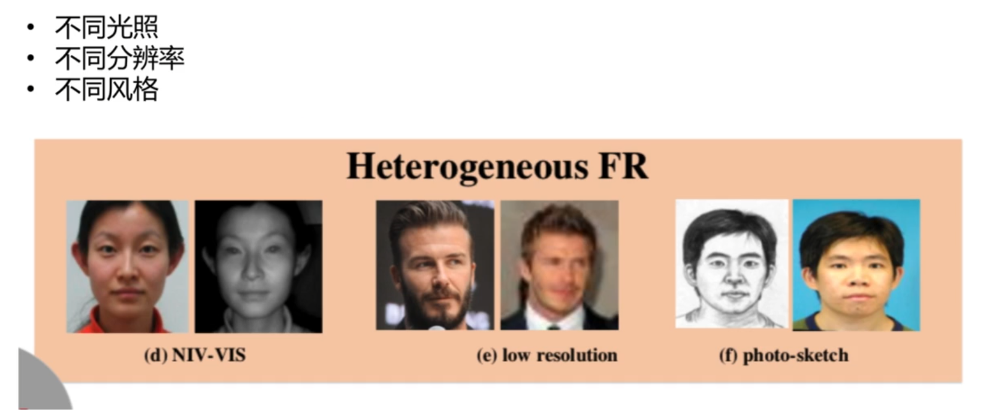

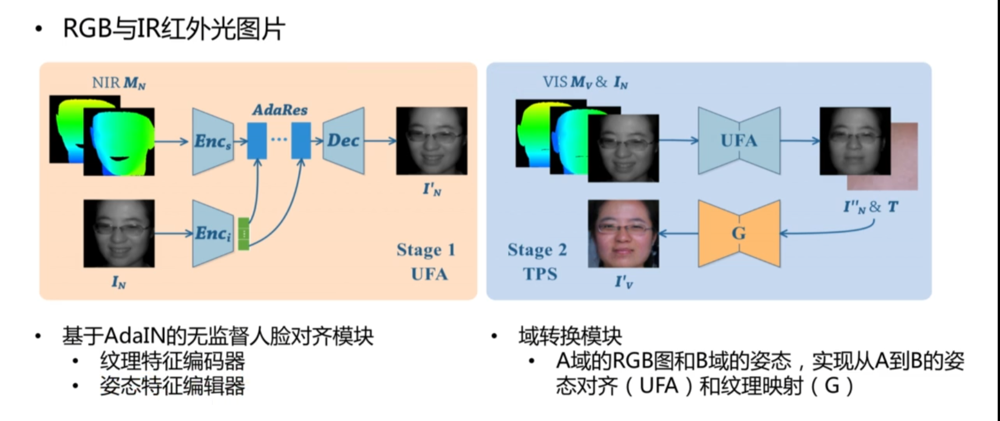

少样本人脸识别

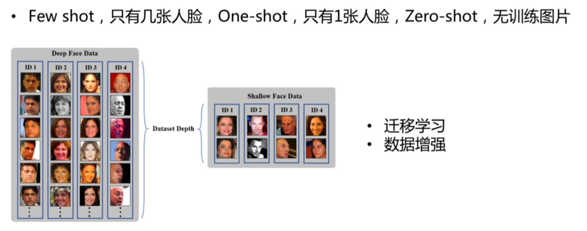

人脸数据增强

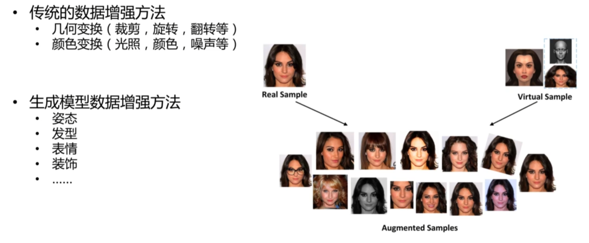

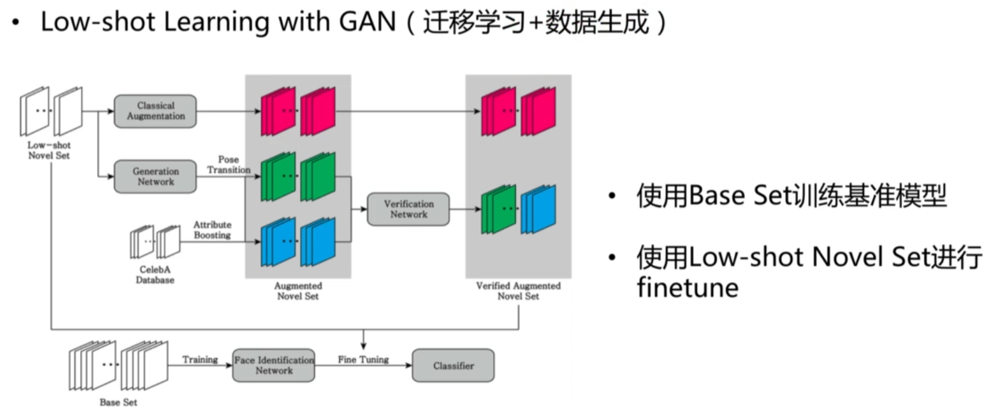

其他难题

#### 开源项目

- TPGAN
- https://github.com/HRLTY/TP-GAN
- Face Aging
- https://github.com/ZZUTK/Face-Aging-CAAE
- Low-shot
- https://github.com/cleardusk/MFR 

