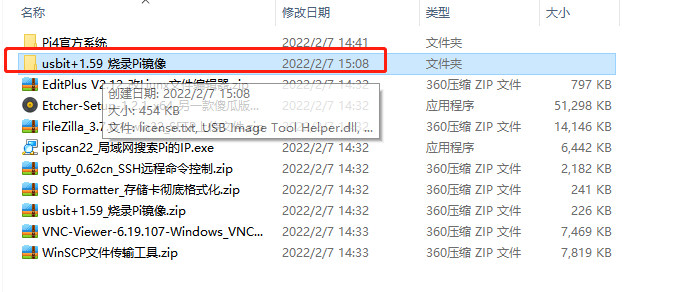
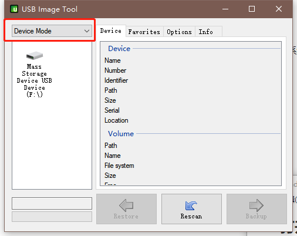
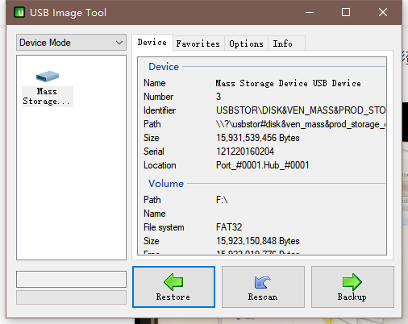
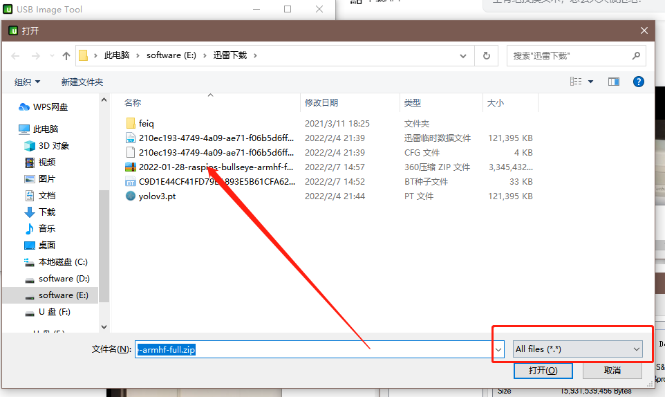
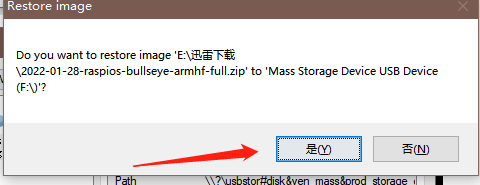

### 1. 下载树莓派系统


https://www.raspberrypi.com/software/operating-systems/#raspberry-pi-os-64-bit


下载之后，请勿解压。

### 2. 打开该软件



### 









- 提示格式化，千万别格式化

- SSH和VNC桌面

  在boot路径下面新建ssh文件

  在windows电脑上，进去boot分区，建一个 wpa_supplicant.conf 文件，文件的内容如下

```shell
country=CN 
ctrl_interface=DIR=/var/run/wpa_supplicant GROUP=netdev
update_config=1 


network={ 
ssid="CMCC-MHJe" #ssid:网络的ssid 
psk="32z6xw2j" #psk:密码 
key_mgmt=WPA-PSK # WiFi 使用WPA/WPA2加密 
priority=1 #priority:连接优先级，数字越大优先级越高（不可以是负数） 
scan_ssid=0 #scan_ssid:连接隐藏WiFi时需要指定该值为1 
}
```

