# MobileNet

### 背景

- 传统卷积神经网络，内存需求大、运算量大导致无法在移动设备以及嵌入式设备上运行

- google团队在2017年提出的，专注于移动端或者嵌入式设备中的轻量级CNN网络。相比传统卷积神经网络，在准确率小幅降低的前提下大大减少模型参数与运算量。(相比VGG16准确率减少了0.9%，但模型参数只有VGG的1/32)

### 亮点

#### 1.Depthwise separable convolution(大大减少运算量和参数数量)

**首先是采用depthwise convolution对不同输入通道分别进行卷积，然后采用pointwise convolution将上面的输出再进行结合，这样其实整体效果和一个标准卷积是差不多的，但是会大大减少计算量和模型参数量。**

- 普通卷积

  - 卷积核channel=输入特征矩阵channel
  - 输出特征矩阵channel=卷积核个数

  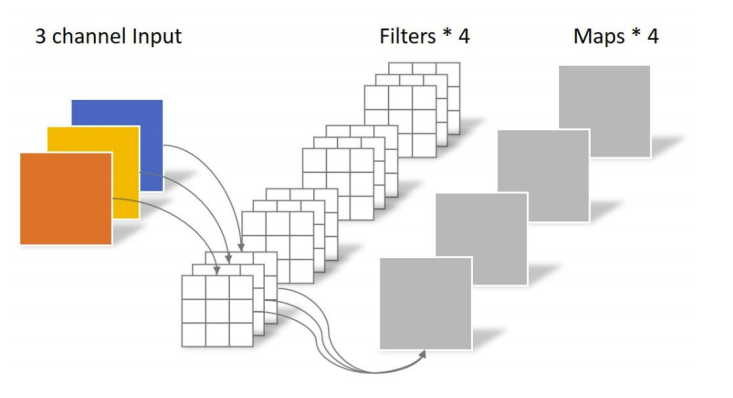

- **Depthwise Convolution**

  - 卷积核channel=1
  - 输入特征矩阵channel=卷积核个数=输出特征矩阵channel
  - 简而言之：一个通道一个卷积核负责

  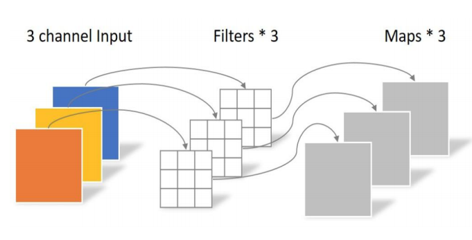


- **PW卷积**（Pointwise Conv）
  - pointwise convolution其实就是普通的卷积，只不过其采用1x1的卷积核。

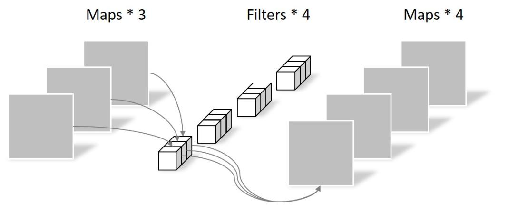

深度可分离卷积的步骤:

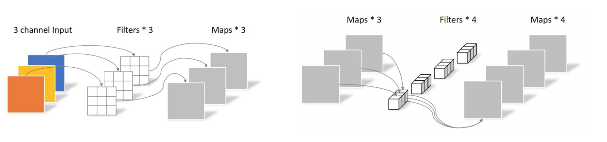


#### 2.增加超参数α、β

- 宽度因子 $\alpha$ (Width Multiplier)  对于深度可分离卷积层，输入的通道数M乘上一个宽度因子α变为αM，输出通道数变为αN，其中α区间为(0,1]，此时深度可分离卷积的参数量为：$\mathrm{D}_{\mathrm{K}}^{*} \mathrm{D}_{\mathrm{K}}^{*} \alpha \mathrm{N}+\alpha \mathrm{M}^{*} \alpha \mathrm{N}=\alpha^{*} \alpha\left(1 / \alpha^{*} \mathrm{D}_{\mathrm{K}}^{*} \mathrm{D}_{\mathrm{K}}^{*} \mathrm{~N}+\mathrm{M}^{*} \mathrm{~N}\right)$，计算量变为$\alpha M^{*} D_{F}^{*} D_{F}^{*} D_{K}^{*} D_{K}+\alpha N^{*} D_{F}^{*} D_{F}^{*} \alpha M=\alpha^{*} \alpha\left(1 / \alpha^{*} M^{*} D_{F}^{*} D_{F}^{*} D_{K}^{*} D_{K}+N^{*} D_{F}^{*} D_{F}^{*} M\right)$，所以参数量和计算量差不多都变为原来的 $\alpha^{*} \alpha$ 倍。

- **分辨率因子 $\rho$ (Resolution Multiplier)**
$\rho$ 改变输入层的分辨率，所以深度可分离卷积的参数量不变，但计算量为 $M^{*} \rho D_{F}{ }^{*} \rho D_{F}{ }^{*} D_{K}{ }^{*} D_{K}+N^{*} \rho D_{F}{ }^{*} \rho D_{F}{ }^{*} M=\rho^{*} \rho\left(M^{*} D_{F}{ }^{*} D_{F}{ }^{*} D_{K}{ }^{*} D_{K}+N^{*} D_{F}{ }^{*} D_{F}{ }^{*} M\right)$ ，即计算量变为原来的 $\rho^{*} \rho$ 倍。

### 模型架构，MobileNetV1

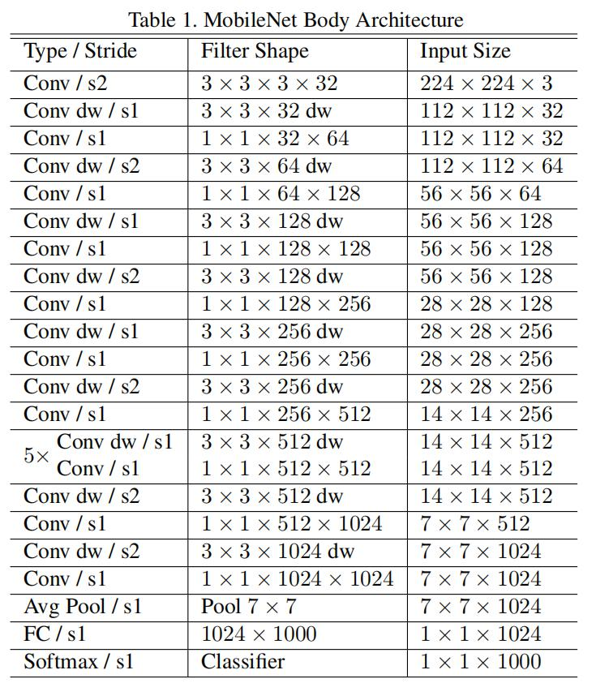

代码实现：

```python
import torch
import torch.nn as nn


class Conv(nn.Module):
    def __init__(self, in_ch, out_ch, stride):
        super(Conv, self).__init__()
        self.conv2d = nn.Sequential(
            nn.Conv2d(in_channels=in_ch, out_channels=out_ch, kernel_size=3,
                      stride=stride, padding=1, bias=False),
            nn.BatchNorm2d(out_ch),
            nn.ReLU(inplace=True)
        )

    def forward(self, x):
        return self.conv2d(x)


class ConvDw(nn.Module):
    def __init__(self, in_ch, out_ch, stride):
        super(ConvDw, self).__init__()
        self.conv_dw = nn.Sequential(
            nn.Conv2d(in_channels=in_ch, out_channels=in_ch, kernel_size=3,
                      stride=stride, padding=1, groups=in_ch, bias=False),
            nn.BatchNorm2d(in_ch),
            nn.ReLU(inplace=True),

            nn.Conv2d(in_channels=in_ch, out_channels=out_ch, kernel_size=1,
                      stride=1, bias=False),
            nn.BatchNorm2d(out_ch),
            nn.ReLU(inplace=True),
        )

    def forward(self, x):
        return self.conv_dw(x)


class MobilenetV1(nn.Module):
    def __init__(self):
        super(MobilenetV1, self).__init__()
        self.feature = nn.Sequential(
            Conv(3, 32, 2),
            ConvDw(32, 64, 1),
            ConvDw(64, 128, 2),
            ConvDw(128, 128, 1),
            ConvDw(128, 256, 2),
            ConvDw(256, 256, 1),
            ConvDw(256, 512, 2),
            ConvDw(512, 512, 1),
            ConvDw(512, 512, 1),
            ConvDw(512, 512, 1),
            ConvDw(512, 512, 1),
            ConvDw(512, 512, 1),
            ConvDw(512, 1024, 2),
            ConvDw(1024, 1024, 1),
            nn.AvgPool2d(7),
        )
        self.fc = nn.Linear(1024, 1000)

    def forward(self, x):
        out = self.feature(x)
        out = out.view(out.size(0), -1)
        out = self.fc(out)
        return out

if __name__ == '__main__':
    a = torch.randn(1, 3, 224, 224)
    net = MobilenetV1()
    res = net(a)
    print(res.shape)

```

### MobileNet v2

google团队:2018年提出的，相比MobileNet V1网络，准确率更高，模型更小。

#### 亮点

- **Inverted Residuals（倒残差结构）**

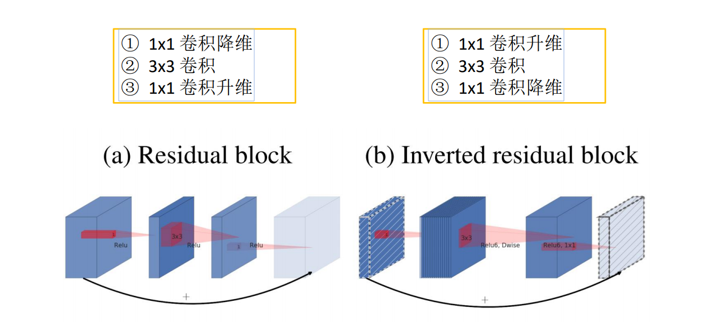

- **Linear Bottlenecks**

ReLU激活函数对低维特征信息照成大量损失。高维特征加个非线性可以升维，低维要是也加非线性就把特征破坏了，不如线性的好，所以1*1后 不加ReLU6 ，改换线性。


$$
y=\operatorname{ReLU} 6(x)=\min (\max (x, 0), 6)
$$


当stride=1且输入特征矩阵与输出特征矩阵shape相同时才有shortcut连接。


### 模型示意

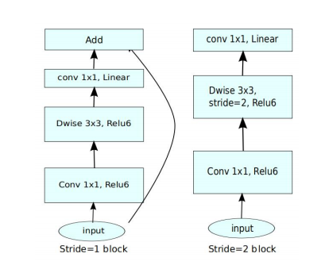

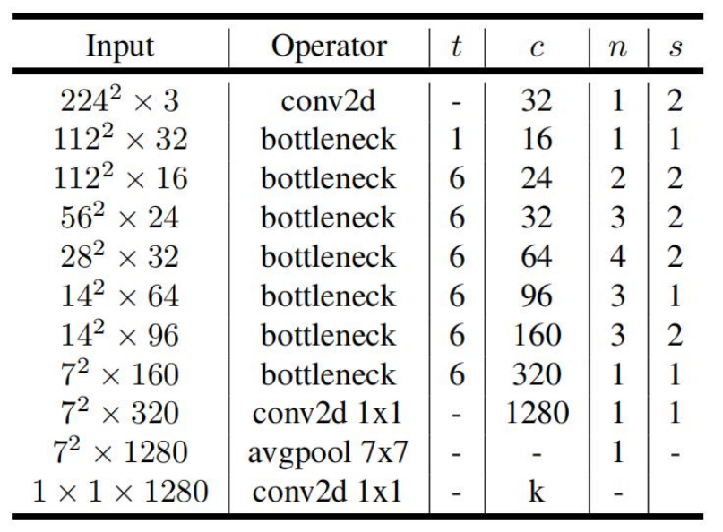

- t是扩展因子

- c是输出特征矩阵深度channel

- n是bottleneck的重复次数

- s是步距（针对第一层，其他为1）

```python
from torch import nn
import torch


def _make_divisible(ch, divisor=8, min_ch=None):
    """
    This function is taken from the original tf repo.
    It ensures that all layers have a channel number that is divisible by 8
    It can be seen here:
    https://github.com/tensorflow/models/blob/master/research/slim/nets/mobilenet/mobilenet.py
    """
    if min_ch is None:
        min_ch = divisor
    new_ch = max(min_ch, int(ch + divisor / 2) // divisor * divisor)
    # Make sure that round down does not go down by more than 10%.
    if new_ch < 0.9 * ch:
        new_ch += divisor
    return new_ch


class ConvBNReLU(nn.Sequential):
    def __init__(self, in_channel, out_channel, kernel_size=3, stride=1, groups=1):
        padding = (kernel_size - 1) // 2
        super(ConvBNReLU, self).__init__(
            nn.Conv2d(in_channel, out_channel, kernel_size, stride, padding, groups=groups, bias=False),
            nn.BatchNorm2d(out_channel),
            nn.ReLU6(inplace=True)
        )


class InvertedResidual(nn.Module):
    def __init__(self, in_channel, out_channel, stride, expand_ratio):
        super(InvertedResidual, self).__init__()
        hidden_channel = in_channel * expand_ratio
        self.use_shortcut = stride == 1 and in_channel == out_channel

        layers = []
        if expand_ratio != 1:
            # 1x1 pointwise conv
            layers.append(ConvBNReLU(in_channel, hidden_channel, kernel_size=1))
        layers.extend([
            # 3x3 depthwise conv
            ConvBNReLU(hidden_channel, hidden_channel, stride=stride, groups=hidden_channel),
            # 1x1 pointwise conv(linear)
            nn.Conv2d(hidden_channel, out_channel, kernel_size=1, bias=False),
            nn.BatchNorm2d(out_channel),
        ])

        self.conv = nn.Sequential(*layers)

    def forward(self, x):
        if self.use_shortcut:
            return x + self.conv(x)
        else:
            return self.conv(x)


class MobileNetV2(nn.Module):
    def __init__(self, num_classes=1000, alpha=1.0, round_nearest=8):
        super(MobileNetV2, self).__init__()
        block = InvertedResidual
        input_channel = _make_divisible(32 * alpha, round_nearest)
        last_channel = _make_divisible(1280 * alpha, round_nearest)

        inverted_residual_setting = [
            # t, c, n, s
            [1, 16, 1, 1],
            [6, 24, 2, 2],
            [6, 32, 3, 2],
            [6, 64, 4, 2],
            [6, 96, 3, 1],
            [6, 160, 3, 2],
            [6, 320, 1, 1],
        ]

        features = []
        # conv1 layer
        features.append(ConvBNReLU(3, input_channel, stride=2))
        # building inverted residual residual blockes
        for t, c, n, s in inverted_residual_setting:
            output_channel = _make_divisible(c * alpha, round_nearest)
            for i in range(n):
                stride = s if i == 0 else 1
                features.append(block(input_channel, output_channel, stride, expand_ratio=t))
                input_channel = output_channel
        # building last several layers
        features.append(ConvBNReLU(input_channel, last_channel, 1))
        # combine feature layers
        self.features = nn.Sequential(*features)

        # building classifier
        self.avgpool = nn.AdaptiveAvgPool2d((1, 1))
        self.classifier = nn.Sequential(
            nn.Dropout(0.2),
            nn.Linear(last_channel, num_classes)
        )

        # weight initialization
        for m in self.modules():
            if isinstance(m, nn.Conv2d):
                nn.init.kaiming_normal_(m.weight, mode='fan_out')
                if m.bias is not None:
                    nn.init.zeros_(m.bias)
            elif isinstance(m, nn.BatchNorm2d):
                nn.init.ones_(m.weight)
                nn.init.zeros_(m.bias)
            elif isinstance(m, nn.Linear):
                nn.init.normal_(m.weight, 0, 0.01)
                nn.init.zeros_(m.bias)

    def forward(self, x):
        x = self.features(x)
        x = self.avgpool(x)
        x = torch.flatten(x, 1)
        x = self.classifier(x)
        return x


if __name__ == '__main__':
    net = MobileNetV2()
    x = torch.randn(1,3,224,224)
    print(net(x).shape)
```

### MobileNet V3

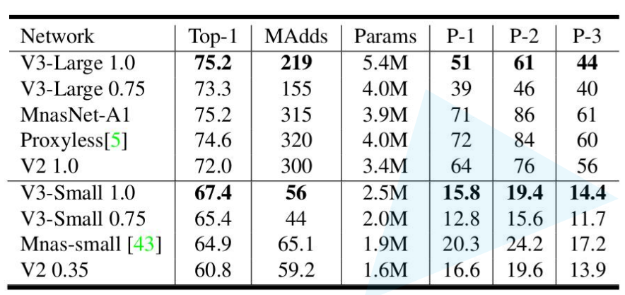

#### 创新点

**1.更新Block(bneck)**

当stride == 1且input_c == output_c，才有shortcut连接

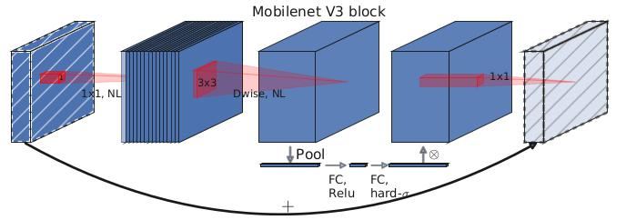

- **1.加入SE模块**(注意力模块)

- **2.更新了激活函数**（hard-swish）

$$
h-\operatorname{swish}[x]=x \frac{\operatorname{ReLU6}(x+3)}{6}
$$

***2. 使用NAS搜索参数（Neural Architecture Search）****

**3.重新设计耗时层结构**

- 减少第一个卷积层的卷积核个数(32->16)

- 精简Last Stage

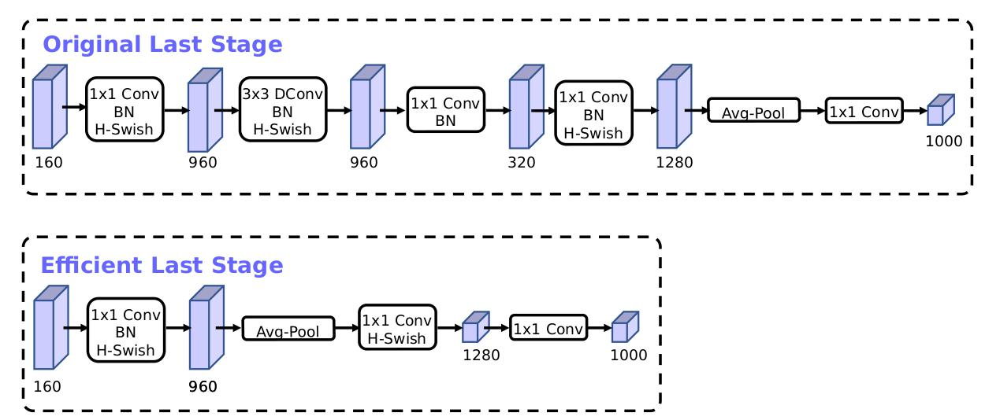

- MobileNetV3-Large


- MobileNetV3-Small

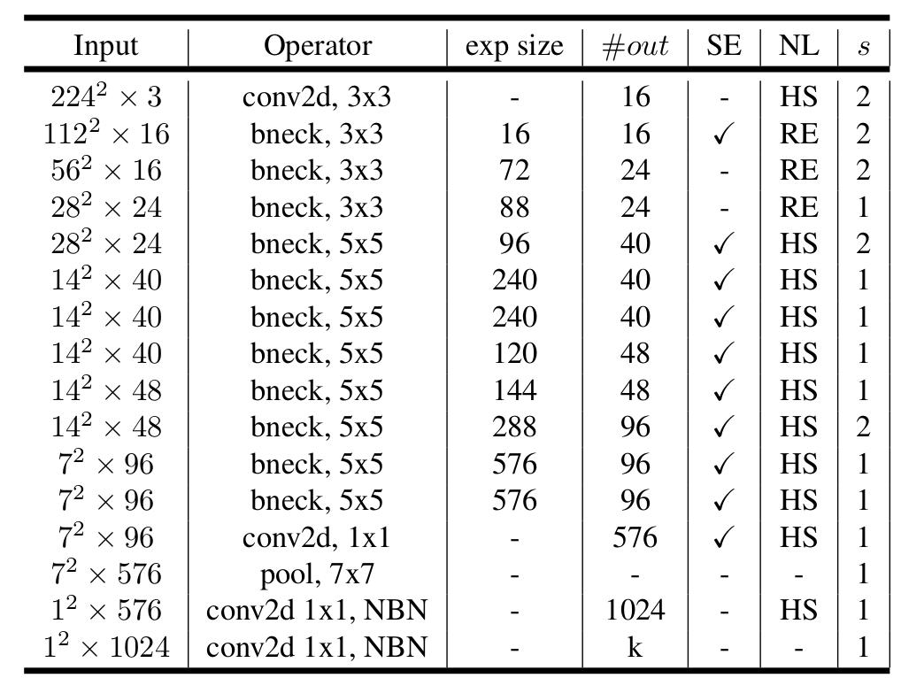

```python
from typing import Callable, List, Optional
import torch
from torch import nn, Tensor
from torch.nn import functional as F
from functools import partial


def _make_divisible(ch, divisor=8, min_ch=None):
    """
    This function is taken from the original tf repo.
    It ensures that all layers have a channel number that is divisible by 8
    It can be seen here:
    https://github.com/tensorflow/models/blob/master/research/slim/nets/mobilenet/mobilenet.py
    """
    if min_ch is None:
        min_ch = divisor
    new_ch = max(min_ch, int(ch + divisor / 2) // divisor * divisor)
    # Make sure that round down does not go down by more than 10%.
    if new_ch < 0.9 * ch:
        new_ch += divisor
    return new_ch


class ConvBNActivation(nn.Sequential):
    def __init__(self,
                 in_planes: int,
                 out_planes: int,
                 kernel_size: int = 3,
                 stride: int = 1,
                 groups: int = 1,
                 norm_layer: Optional[Callable[..., nn.Module]] = None,
                 activation_layer: Optional[Callable[..., nn.Module]] = None):
        padding = (kernel_size - 1) // 2
        if norm_layer is None:
            norm_layer = nn.BatchNorm2d
        if activation_layer is None:
            activation_layer = nn.ReLU6
        super(ConvBNActivation, self).__init__(nn.Conv2d(in_channels=in_planes,
                                                         out_channels=out_planes,
                                                         kernel_size=kernel_size,
                                                         stride=stride,
                                                         padding=padding,
                                                         groups=groups,
                                                         bias=False),
                                               norm_layer(out_planes),
                                               activation_layer(inplace=True))


class SqueezeExcitation(nn.Module):
    def __init__(self, input_c: int, squeeze_factor: int = 4):
        super(SqueezeExcitation, self).__init__()
        squeeze_c = _make_divisible(input_c // squeeze_factor, 8)
        self.fc1 = nn.Conv2d(input_c, squeeze_c, 1)
        self.fc2 = nn.Conv2d(squeeze_c, input_c, 1)

    def forward(self, x: Tensor) -> Tensor:
        scale = F.adaptive_avg_pool2d(x, output_size=(1, 1))
        scale = self.fc1(scale)
        scale = F.relu(scale, inplace=True)
        scale = self.fc2(scale)
        scale = F.hardsigmoid(scale, inplace=True)
        return scale * x


class InvertedResidualConfig:
    def __init__(self,
                 input_c: int,
                 kernel: int,
                 expanded_c: int,
                 out_c: int,
                 use_se: bool,
                 activation: str,
                 stride: int,
                 width_multi: float):
        self.input_c = self.adjust_channels(input_c, width_multi)
        self.kernel = kernel
        self.expanded_c = self.adjust_channels(expanded_c, width_multi)
        self.out_c = self.adjust_channels(out_c, width_multi)
        self.use_se = use_se
        self.use_hs = activation == "HS"  # whether using h-swish activation
        self.stride = stride

    @staticmethod
    def adjust_channels(channels: int, width_multi: float):
        return _make_divisible(channels * width_multi, 8)


class InvertedResidual(nn.Module):
    def __init__(self,
                 cnf: InvertedResidualConfig,
                 norm_layer: Callable[..., nn.Module]):
        super(InvertedResidual, self).__init__()

        if cnf.stride not in [1, 2]:
            raise ValueError("illegal stride value.")

        self.use_res_connect = (cnf.stride == 1 and cnf.input_c == cnf.out_c)

        layers: List[nn.Module] = []
        activation_layer = nn.Hardswish if cnf.use_hs else nn.ReLU

        # expand
        if cnf.expanded_c != cnf.input_c:
            layers.append(ConvBNActivation(cnf.input_c,
                                           cnf.expanded_c,
                                           kernel_size=1,
                                           norm_layer=norm_layer,
                                           activation_layer=activation_layer))

        # depthwise
        layers.append(ConvBNActivation(cnf.expanded_c,
                                       cnf.expanded_c,
                                       kernel_size=cnf.kernel,
                                       stride=cnf.stride,
                                       groups=cnf.expanded_c,
                                       norm_layer=norm_layer,
                                       activation_layer=activation_layer))

        if cnf.use_se:
            layers.append(SqueezeExcitation(cnf.expanded_c))

        # project
        layers.append(ConvBNActivation(cnf.expanded_c,
                                       cnf.out_c,
                                       kernel_size=1,
                                       norm_layer=norm_layer,
                                       activation_layer=nn.Identity))

        self.block = nn.Sequential(*layers)
        self.out_channels = cnf.out_c
        self.is_strided = cnf.stride > 1

    def forward(self, x: Tensor) -> Tensor:
        result = self.block(x)
        if self.use_res_connect:
            result += x

        return result


class MobileNetV3(nn.Module):
    def __init__(self,
                 inverted_residual_setting: List[InvertedResidualConfig],
                 last_channel: int,
                 num_classes: int = 1000,
                 block: Optional[Callable[..., nn.Module]] = None,
                 norm_layer: Optional[Callable[..., nn.Module]] = None):
        super(MobileNetV3, self).__init__()

        if not inverted_residual_setting:
            raise ValueError("The inverted_residual_setting should not be empty.")
        elif not (isinstance(inverted_residual_setting, List) and
                  all([isinstance(s, InvertedResidualConfig) for s in inverted_residual_setting])):
            raise TypeError("The inverted_residual_setting should be List[InvertedResidualConfig]")

        if block is None:
            block = InvertedResidual

        if norm_layer is None:
            norm_layer = partial(nn.BatchNorm2d, eps=0.001, momentum=0.01)

        layers: List[nn.Module] = []

        # building first layer
        firstconv_output_c = inverted_residual_setting[0].input_c
        layers.append(ConvBNActivation(3,
                                       firstconv_output_c,
                                       kernel_size=3,
                                       stride=2,
                                       norm_layer=norm_layer,
                                       activation_layer=nn.Hardswish))
        # building inverted residual blocks
        for cnf in inverted_residual_setting:
            layers.append(block(cnf, norm_layer))

        # building last several layers
        lastconv_input_c = inverted_residual_setting[-1].out_c
        lastconv_output_c = 6 * lastconv_input_c
        layers.append(ConvBNActivation(lastconv_input_c,
                                       lastconv_output_c,
                                       kernel_size=1,
                                       norm_layer=norm_layer,
                                       activation_layer=nn.Hardswish))
        self.features = nn.Sequential(*layers)
        self.avgpool = nn.AdaptiveAvgPool2d(1)
        self.classifier = nn.Sequential(nn.Linear(lastconv_output_c, last_channel),
                                        nn.Hardswish(inplace=True),
                                        nn.Dropout(p=0.2, inplace=True),
                                        nn.Linear(last_channel, num_classes))

        # initial weights
        for m in self.modules():
            if isinstance(m, nn.Conv2d):
                nn.init.kaiming_normal_(m.weight, mode="fan_out")
                if m.bias is not None:
                    nn.init.zeros_(m.bias)
            elif isinstance(m, (nn.BatchNorm2d, nn.GroupNorm)):
                nn.init.ones_(m.weight)
                nn.init.zeros_(m.bias)
            elif isinstance(m, nn.Linear):
                nn.init.normal_(m.weight, 0, 0.01)
                nn.init.zeros_(m.bias)

    def _forward_impl(self, x: Tensor) -> Tensor:
        x = self.features(x)
        x = self.avgpool(x)
        x = torch.flatten(x, 1)
        x = self.classifier(x)

        return x

    def forward(self, x: Tensor) -> Tensor:
        return self._forward_impl(x)


def mobilenet_v3_large(num_classes: int = 1000,
                       reduced_tail: bool = False) -> MobileNetV3:
    """
    Constructs a large MobileNetV3 architecture from
    "Searching for MobileNetV3" <https://arxiv.org/abs/1905.02244>.

    weights_link:
    https://download.pytorch.org/models/mobilenet_v3_large-8738ca79.pth

    Args:
        num_classes (int): number of classes
        reduced_tail (bool): If True, reduces the channel counts of all feature layers
            between C4 and C5 by 2. It is used to reduce the channel redundancy in the
            backbone for Detection and Segmentation.
    """
    width_multi = 1.0
    bneck_conf = partial(InvertedResidualConfig, width_multi=width_multi)
    adjust_channels = partial(InvertedResidualConfig.adjust_channels, width_multi=width_multi)

    reduce_divider = 2 if reduced_tail else 1

    inverted_residual_setting = [
        # input_c, kernel, expanded_c, out_c, use_se, activation, stride
        bneck_conf(16, 3, 16, 16, False, "RE", 1),
        bneck_conf(16, 3, 64, 24, False, "RE", 2),  # C1
        bneck_conf(24, 3, 72, 24, False, "RE", 1),
        bneck_conf(24, 5, 72, 40, True, "RE", 2),  # C2
        bneck_conf(40, 5, 120, 40, True, "RE", 1),
        bneck_conf(40, 5, 120, 40, True, "RE", 1),
        bneck_conf(40, 3, 240, 80, False, "HS", 2),  # C3
        bneck_conf(80, 3, 200, 80, False, "HS", 1),
        bneck_conf(80, 3, 184, 80, False, "HS", 1),
        bneck_conf(80, 3, 184, 80, False, "HS", 1),
        bneck_conf(80, 3, 480, 112, True, "HS", 1),
        bneck_conf(112, 3, 672, 112, True, "HS", 1),
        bneck_conf(112, 5, 672, 160 // reduce_divider, True, "HS", 2),  # C4
        bneck_conf(160 // reduce_divider, 5, 960 // reduce_divider, 160 // reduce_divider, True, "HS", 1),
        bneck_conf(160 // reduce_divider, 5, 960 // reduce_divider, 160 // reduce_divider, True, "HS", 1),
    ]
    last_channel = adjust_channels(1280 // reduce_divider)  # C5

    return MobileNetV3(inverted_residual_setting=inverted_residual_setting,
                       last_channel=last_channel,
                       num_classes=num_classes)


def mobilenet_v3_small(num_classes: int = 1000,
                       reduced_tail: bool = False) -> MobileNetV3:
    """
    Constructs a large MobileNetV3 architecture from
    "Searching for MobileNetV3" <https://arxiv.org/abs/1905.02244>.

    weights_link:
    https://download.pytorch.org/models/mobilenet_v3_small-047dcff4.pth

    Args:
        num_classes (int): number of classes
        reduced_tail (bool): If True, reduces the channel counts of all feature layers
            between C4 and C5 by 2. It is used to reduce the channel redundancy in the
            backbone for Detection and Segmentation.
    """
    width_multi = 1.0
    bneck_conf = partial(InvertedResidualConfig, width_multi=width_multi)
    adjust_channels = partial(InvertedResidualConfig.adjust_channels, width_multi=width_multi)

    reduce_divider = 2 if reduced_tail else 1

    inverted_residual_setting = [
        # input_c, kernel, expanded_c, out_c, use_se, activation, stride
        bneck_conf(16, 3, 16, 16, True, "RE", 2),  # C1
        bneck_conf(16, 3, 72, 24, False, "RE", 2),  # C2
        bneck_conf(24, 3, 88, 24, False, "RE", 1),
        bneck_conf(24, 5, 96, 40, True, "HS", 2),  # C3
        bneck_conf(40, 5, 240, 40, True, "HS", 1),
        bneck_conf(40, 5, 240, 40, True, "HS", 1),
        bneck_conf(40, 5, 120, 48, True, "HS", 1),
        bneck_conf(48, 5, 144, 48, True, "HS", 1),
        bneck_conf(48, 5, 288, 96 // reduce_divider, True, "HS", 2),  # C4
        bneck_conf(96 // reduce_divider, 5, 576 // reduce_divider, 96 // reduce_divider, True, "HS", 1),
        bneck_conf(96 // reduce_divider, 5, 576 // reduce_divider, 96 // reduce_divider, True, "HS", 1)
    ]
    last_channel = adjust_channels(1024 // reduce_divider)  # C5

    return MobileNetV3(inverted_residual_setting=inverted_residual_setting,
                       last_channel=last_channel,
                       num_classes=num_classes)


if __name__ == '__main__':
    model = mobilenet_v3_large()


    print(model)
```

