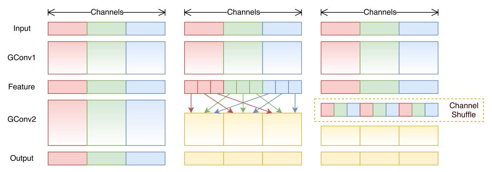
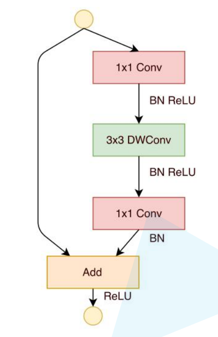
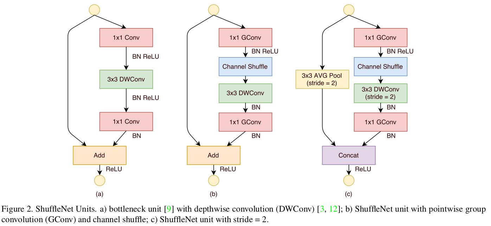
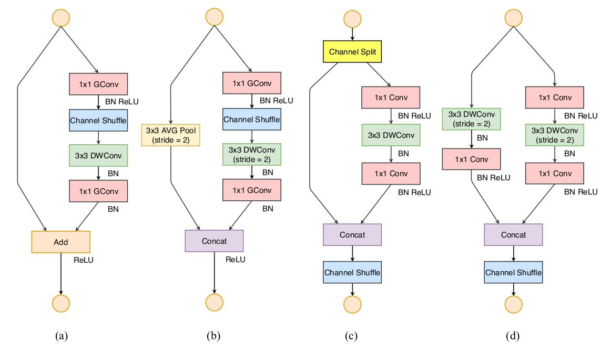

### ShuffleNet v1

#### 1. 全是GConv和DWConv.

分组卷积+点卷积。通道混洗



分组卷积：虽然能够减少参数与计算量，组与组之间不会有信息交流。





瓶颈结构中修改为：通道混洗+深度卷积

通道混洗操作实现:

```python
def channel_shuffle(x: Tensor, groups: int) -> Tensor:

    batch_size, num_channels, height, width = x.size()
    channels_per_group = num_channels // groups

    # reshape
    # [batch_size, num_channels, height, width] -> [batch_size, groups, channels_per_group, height, width]
    x = x.view(batch_size, groups, channels_per_group, height, width)
    x = torch.transpose(x, 1, 2).contiguous()
    # flatten
    x = x.view(batch_size, -1, height, width)

    return x
```

### shufflleV2

#### 四大准则

##### 1.**同等通道大小最小化内存访问量**

- 通道比为1:1

- 同等通道大小最小化内存访问量 对于轻量级CNN网络，常采用深度可分割卷积 (depthwise separable convolutions)，其中点卷积 ( pointwise convolution) 即1x1卷积复 杂度最大。

- 这里假定输入和输出特征的通道数分别为 $c_{1}$ 和 $c_{2}$ ，特征图的空间大小为 $h \times w$ ，那么 $1 \times 1$ 卷积的FLOPs为 $B=h w c_{1} c_{2}$ 。对应的MAC为 $h w\left(c_{1}+c_{2}\right)+c_{1} c_{2}$ (这里假 定内存足够)，根据均值不等式，固定 $B$ 时，MAC存在下限 (令 $c_{2}=\frac{B}{h w c_{1}}$ ) :

  

$$
M A C \geq 2 \sqrt{h w B}+\frac{B}{h w}
$$

仅当 $c_{1}=c_{2}$ 时，MAC取最小值，这个理论分析也通过实验得到证实，通道比为 1:1时速度更快。

##### 2.**过量使用组卷积会增加MAC** 组卷积

- 过量使用组卷积会增加MAC 组卷积 (group convolution) 是常用的设计组件，因为它可 以减少复杂度却不损失模型容量。但是这里发现，分组过多会增加MAC。对于组卷积，FLOPs为 $B=h w c_{1} c_{2} / g \quad$ (其中 $g$ 是组数)，而对应的MAC为 $h w\left(c_{1}+c_{2}\right)+c_{1} c_{2} / g$ 。如果固 定输入 $c_{1} \times h \times w$ 以及 $B$ ，那么MAC为:

$$
M A C=h w c_{1}+B g / c_{1}+B / h w
$$
可以看到，当 $g$ 增加时，MAC会同时增加。这点也通过实验证实,不要使用太大 $g$ 的组卷积。

##### 3.网络碎片化会降低并行度

- 一些网络如Inception，以及Auto ML自动产生的网络NASNETA，它们倾向于采用 “多路" 结构，即存在一个lock中很多不同的小卷积或者pooling，这很容易 造成网络碎片化，减低模型的并行度，相应速度会慢，这也可以通过实验得到证明。

##### 4.不能忽略元素级操作

- 对于元素级 (element-wise operators) 比如ReLU和Add，虽然它 们的FLOPs较小，但是却需要较大的MAC。这里实验发现如果将ResNet中残差单元中的ReLU和 shortcut移除的话，速度有20%的提井。

##### 原则总结

- 1x1卷积进行平衡输入和输出的通道大小；
- 组卷积要谨慎使用，注意分组数；
- 避免网络的碎片化；
- 减少元素级运算。

### shuffleNetV2网络结构




代码实现:

```python
from typing import List, Callable

import torch
from torch import Tensor
import torch.nn as nn


def channel_shuffle(x: Tensor, groups: int) -> Tensor:

    batch_size, num_channels, height, width = x.size()
    channels_per_group = num_channels // groups

    # reshape
    # [batch_size, num_channels, height, width] -> [batch_size, groups, channels_per_group, height, width]
    x = x.view(batch_size, groups, channels_per_group, height, width)
    x = torch.transpose(x, 1, 2).contiguous()
    # flatten
    x = x.view(batch_size, -1, height, width)

    return x


class InvertedResidual(nn.Module):
    def __init__(self, input_c: int, output_c: int, stride: int):
        super(InvertedResidual, self).__init__()

        if stride not in [1, 2]:
            raise ValueError("illegal stride value.")
        self.stride = stride

        assert output_c % 2 == 0
        branch_features = output_c // 2
        # 当stride为1时，input_channel应该是branch_features的两倍
        # python中 '<<' 是位运算，可理解为计算×2的快速方法
        assert (self.stride != 1) or (input_c == branch_features << 1)

        if self.stride == 2:
            self.branch1 = nn.Sequential(
                self.depthwise_conv(input_c, input_c, kernel_s=3, stride=self.stride, padding=1),
                nn.BatchNorm2d(input_c),
                nn.Conv2d(input_c, branch_features, kernel_size=1, stride=1, padding=0, bias=False),
                nn.BatchNorm2d(branch_features),
                nn.ReLU(inplace=True)
            )
        else:
            self.branch1 = nn.Sequential()

        self.branch2 = nn.Sequential(
            nn.Conv2d(input_c if self.stride > 1 else branch_features, branch_features, kernel_size=1,
                      stride=1, padding=0, bias=False),
            nn.BatchNorm2d(branch_features),
            nn.ReLU(inplace=True),
            self.depthwise_conv(branch_features, branch_features, kernel_s=3, stride=self.stride, padding=1),
            nn.BatchNorm2d(branch_features),
            nn.Conv2d(branch_features, branch_features, kernel_size=1, stride=1, padding=0, bias=False),
            nn.BatchNorm2d(branch_features),
            nn.ReLU(inplace=True)
        )

    @staticmethod
    def depthwise_conv(input_c: int,
                       output_c: int,
                       kernel_s: int,
                       stride: int = 1,
                       padding: int = 0,
                       bias: bool = False) -> nn.Conv2d:
        return nn.Conv2d(in_channels=input_c, out_channels=output_c, kernel_size=kernel_s,
                         stride=stride, padding=padding, bias=bias, groups=input_c)

    def forward(self, x: Tensor) -> Tensor:
        if self.stride == 1:
            x1, x2 = x.chunk(2, dim=1)
            out = torch.cat((x1, self.branch2(x2)), dim=1)
        else:
            out = torch.cat((self.branch1(x), self.branch2(x)), dim=1)

        out = channel_shuffle(out, 2)

        return out


class ShuffleNetV2(nn.Module):
    def __init__(self,
                 stages_repeats: List[int],
                 stages_out_channels: List[int],
                 num_classes: int = 1000,
                 inverted_residual: Callable[..., nn.Module] = InvertedResidual):
        super(ShuffleNetV2, self).__init__()

        if len(stages_repeats) != 3:
            raise ValueError("expected stages_repeats as list of 3 positive ints")
        if len(stages_out_channels) != 5:
            raise ValueError("expected stages_out_channels as list of 5 positive ints")
        self._stage_out_channels = stages_out_channels

        # input RGB image
        input_channels = 3
        output_channels = self._stage_out_channels[0]

        self.conv1 = nn.Sequential(
            nn.Conv2d(input_channels, output_channels, kernel_size=3, stride=2, padding=1, bias=False),
            nn.BatchNorm2d(output_channels),
            nn.ReLU(inplace=True)
        )
        input_channels = output_channels

        self.maxpool = nn.MaxPool2d(kernel_size=3, stride=2, padding=1)

        # Static annotations for mypy
        self.stage2: nn.Sequential
        self.stage3: nn.Sequential
        self.stage4: nn.Sequential

        stage_names = ["stage{}".format(i) for i in [2, 3, 4]]
        for name, repeats, output_channels in zip(stage_names, stages_repeats,
                                                  self._stage_out_channels[1:]):
            seq = [inverted_residual(input_channels, output_channels, 2)]
            for i in range(repeats - 1):
                seq.append(inverted_residual(output_channels, output_channels, 1))
            setattr(self, name, nn.Sequential(*seq))
            input_channels = output_channels

        output_channels = self._stage_out_channels[-1]
        self.conv5 = nn.Sequential(
            nn.Conv2d(input_channels, output_channels, kernel_size=1, stride=1, padding=0, bias=False),
            nn.BatchNorm2d(output_channels),
            nn.ReLU(inplace=True)
        )

        self.fc = nn.Linear(output_channels, num_classes)

    def _forward_impl(self, x: Tensor) -> Tensor:
        # See note [TorchScript super()]
        x = self.conv1(x)
        x = self.maxpool(x)
        x = self.stage2(x)
        x = self.stage3(x)
        x = self.stage4(x)
        x = self.conv5(x)
        x = x.mean([2, 3])  # global pool
        x = self.fc(x)
        return x

    def forward(self, x: Tensor) -> Tensor:
        return self._forward_impl(x)


def shufflenet_v2_x1_0(num_classes=1000):
    """
    Constructs a ShuffleNetV2 with 1.0x output channels, as described in
    `"ShuffleNet V2: Practical Guidelines for Efficient CNN Architecture Design"
    <https://arxiv.org/abs/1807.11164>`.
    weight: https://download.pytorch.org/models/shufflenetv2_x1-5666bf0f80.pth

    :param num_classes:
    :return:
    """
    model = ShuffleNetV2(stages_repeats=[4, 8, 4],
                         stages_out_channels=[24, 116, 232, 464, 1024],
                         num_classes=num_classes)

    return model


def shufflenet_v2_x0_5(num_classes=1000):
    """
    Constructs a ShuffleNetV2 with 0.5x output channels, as described in
    `"ShuffleNet V2: Practical Guidelines for Efficient CNN Architecture Design"
    <https://arxiv.org/abs/1807.11164>`.
    weight: https://download.pytorch.org/models/shufflenetv2_x0.5-f707e7126e.pth

    :param num_classes:
    :return:
    """
    model = ShuffleNetV2(stages_repeats=[4, 8, 4],
                         stages_out_channels=[24, 48, 96, 192, 1024],
                         num_classes=num_classes)

    return model

```

