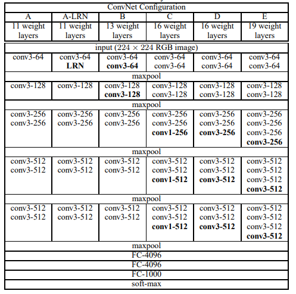

亮点
- 通过堆叠多个3x3的卷积核来替代大尺度卷积核
  （减少所需参数）通过堆叠两个3x3的卷积核替代5x5的卷积核， 堆叠三个3x3的卷积核替代7x7的卷积核。

- 感受野
  - 在卷积神经网络中，决定某一层输出
    结果中一个元素所对应的输入层的区域大
    小，被称作感受野(receptive field)。通俗
    的解释是，输出feature map上的一个单元
    对应输入层上的区域大小。
  
  - 卷积核输出公式 
    $$
    \text { out }_{\text {size }}=\left(\text { in }_{\text {size }}-F_{\text {size }}+2 P\right) / S+1
    $$
  
  - 感受野计算公式感受野计算公式:
    $F(i)=(F(i+1)-1) \times Stride + Ksize$
  
    $F(i)$为第层感受野,$Stride$为第层的步距,$Ksize$为卷积核或池化核尺寸



```python
import torch.nn as nn
import torch

class VGG(nn.Module):
    def __init__(self, features, num_classes=1000, init_weights=False):
        super(VGG, self).__init__()
        self.features = features
        self.classifier = nn.Sequential(
            nn.Linear(512*7*7, 4096),
            nn.ReLU(True),
            nn.Dropout(p=0.5),
            nn.Linear(4096, 4096),
            nn.ReLU(True),
            nn.Dropout(p=0.5),
            nn.Linear(4096, num_classes)
        )
        if init_weights:
            self._initialize_weights()

    def forward(self, x):
        # N x 3 x 224 x 224
        x = self.features(x)
        # N x 512 x 7 x 7
        x = torch.flatten(x, start_dim=1)
        # N x 512*7*7
        x = self.classifier(x)
        return x

    def _initialize_weights(self):
        for m in self.modules():
            if isinstance(m, nn.Conv2d):
                # nn.init.kaiming_normal_(m.weight, mode='fan_out', nonlinearity='relu')
                nn.init.xavier_uniform_(m.weight)
                if m.bias is not None:
                    nn.init.constant_(m.bias, 0)
            elif isinstance(m, nn.Linear):
                nn.init.xavier_uniform_(m.weight)
                # nn.init.normal_(m.weight, 0, 0.01)
                nn.init.constant_(m.bias, 0)


def make_features(cfg: list):
    layers = []
    in_channels = 3
    for v in cfg:
        if v == "M":
            layers += [nn.MaxPool2d(kernel_size=2, stride=2)]
        else:
            conv2d = nn.Conv2d(in_channels, v, kernel_size=3, padding=1)
            layers += [conv2d, nn.ReLU(True)]
            in_channels = v
    return nn.Sequential(*layers)


cfgs = {
    'vgg11': [64, 'M', 128, 'M', 256, 256, 'M', 512, 512, 'M', 512, 512, 'M'],
    'vgg13': [64, 64, 'M', 128, 128, 'M', 256, 256, 'M', 512, 512, 'M', 512, 512, 'M'],
    'vgg16': [64, 64, 'M', 128, 128, 'M', 256, 256, 256, 'M', 512, 512, 512, 'M', 512, 512, 512, 'M'],
    'vgg19': [64, 64, 'M', 128, 128, 'M', 256, 256, 256, 256, 'M', 512, 512, 512, 512, 'M', 512, 512, 512, 512, 'M'],
}


def vgg(model_name="vgg16", **kwargs):
    assert model_name in cfgs, "Warning: model number {} not in cfgs dict!".format(model_name)
    cfg = cfgs[model_name]
    model = VGG(make_features(cfg), **kwargs)
    return model

if __name__ == '__main__':
    model = vgg(model_name="vgg19")
    x = torch.randn(1,3,224,224)
    print(model(x).shape)
```

