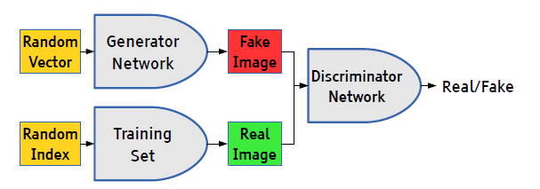
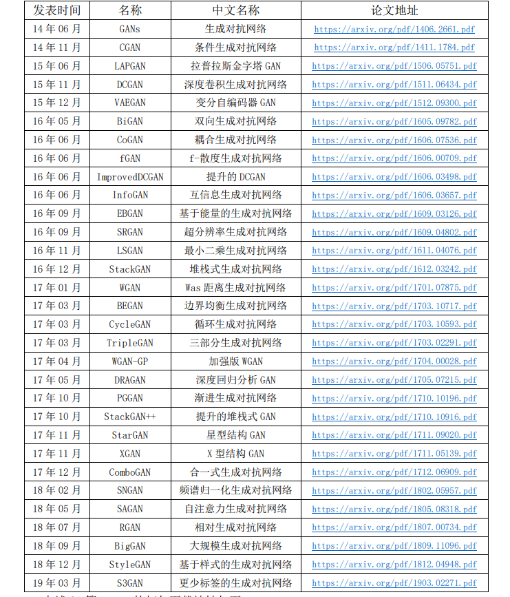

### 第一章 初步了解 GANs 

#### 1. 生成模型与判别模型

判别模型有一个判别界限，通过这个判别界限去区分样本。从概率角度分析就是获得样本 x 属于类别y的概率，是一个条件概率 P（y|x）。

生成模型是需要在整个条件内去产生数据的分布，需要去拟合整个分布，从概率角度分析就是样本 x 在整个分布中的产生的概率，即联合概率 P（xy）。

#### 2.对抗网络基本思想

GANs简单的想法就是用两个模型，一个生成模型，一个判别模型。判别模型用于判断一个给定的图片是不是真实的图片（从数据集里获取的图片），生成模型的任务是去创造一个看起来像真的图片一样的图片。而在开始的时候这两个模型都是没有经过训练的，这两个模型一起对抗训练，生成模型产生一张图片去欺骗判别模型，然后判别模型去判断这张图片是真是假，最终在这两个模型训练的过程中，两个模型的能力越来越强，最终达到稳态。（GANs 的用途很广，不单单是图像，其他方面，譬如文本、语音，或者任何只要含有规律的数据合成，都能用 GANs 实现。）

#### 3.概念实现

##### 1.前向推理阶段

###### 1.模型输入

1、我们随机产生一个随机向量作为生成模型的数据，然后经过生成模型后产生一个新
的向量，作为 Fake Image，记作 D(z)。 
2、从数据集中随机选择一张图片，将图片转化成向量，作为 Real Image,记作 x。

###### 2.模型输出

将由 1 或者 2 产生的输出，作为判别网络的输入，经过判别网络后输出值为一个 0 到 1
之间的数，用于表示输入图片为 Real Image 的概率，real 为 1，fake 为 0。 
使用得到的概率值计算损失函数，解释损失函数之前，我们先解释下判别模型的输入。
根据输入的图片类型是 Fake Image 或 Real Image 将判别模型的输入数据的 label 标记为 0
或者 1。即判别模型的输入类型为(𝑥𝑓𝑎𝑘𝑒,0)或者(𝑥𝑟𝑒𝑎𝑙,1)。 

##### 2.反向传播阶段

###### 1.优化目标 

优化函数：
$$
\min _{G} \max _{D} V(D, G)=E_{x \sim p_{\text {data }}(x)}[\log (D(x))]+E_{z \sim p_{z}(z)}[\log (1-D(G(z)))]
$$
第一步：优化 D ，判别函数：
$$
\max _{D} V(D, G)=E_{x \sim p_{\text {data }}(x)}[\log (D(x))]+E_{z \sim p_{z}(z)}[\log (1-D(G(z)))]
$$
优化 D，即优化判别网络时，没有生成网络什么事，后面的 G(z)就相当于已经得到的假
样本。优化 D 的公式的第一项，使得真样本 x 输入的时候，得到的结果越大越好，因为真样
本的预测结果越接近1越好；对于假样本G(z)，需要优化的是其结果越小越好，也就是D(G(z))
越小越好，因为它的标签为 0。但是第一项越大，第二项越小，就矛盾了，所以把第二项改
为 1-D(G(z))，这样就是越大越好。 

第二步: 优化 G
$$
\min _{G} V(D, G)=E_{z \sim p_{z}(z)}[\log (1-D(G(z)))]
$$
在优化 G 的时候，这个时候没有真样本什么事，所以把第一项直接去掉，这时候只有假
样本，但是这个时候希望假样本的标签是 1，所以是 D(G(z))越大越好，但是为了统一成 1-
D(G(z))的形式，那么只能是最小化 1-D(G(z))，本质上没有区别，只是为了形式的统一。之
后这两个优化模型可以合并起来写，就变成最开始的最大最小目标函数了。

##### 2.判别模型的损失函数 

$$
-((1-y) \log (1-D(G(z)))+y \log D(x))
$$
当输入的是从数据集中取出的 real Image 数据时, 我们只需要考虑第二部分, $\mathrm{D}(\mathrm{x})$ 为 判别模型的输出, 表示输入x为 real 数据的概率, 我们的目的是让判别模型的输出 D(x)的输出尽量靠近 1。
当输入的为 fake 数据时, 我们只计算第一部分, $G(z)$ 是生成模型的输出, 输出的是 一张 Fake Image。我们要做的是让 D $(G(z))$ 的输出尽可能趋向于 0 。这样才能表示判别模型 是有区分力的。
相对判别模型来说, 这个损失函数其实就是交叉熵损失函数。计算 loss, 进行梯度反传。这里的梯度反传可以使用任何一种梯度修正的方法。当更新完判别模型的参数后, 我们再去更新生成模型的参数。

###### 3.生成模型的损失函数 

$$
-((1-y) \log (1-D(G(z)))+y \log D(x))
$$
当输入的是从数据集中取出的 real Iamge 数据时, 我们只需要考虑第二部分, $\mathrm{D}(\mathrm{x})$ 为 判别模型的输出, 表示输入 $x$ 为 real 数据的概率, 我们的目的是让判别模型的输出 $D(x)$ 的输出尽量靠近 1。
当输入的为 fake 数据时, 我们只计算第一部分, $G(z)$ 是生成模型的输出, 输出的是 一张 Fake Image。我们要做的是让 D $(G(z))$ 的输出尽可能趋向于 0 。这样才能表示判别模型 是有区分力的。
相对判别模型来说, 这个损失函数其实就是交叉熵损失函数。计算 loss, 进行梯度反 传。这里的梯度反传可以使用任何一种梯度修正的方法。当更新完判别模型的参数后, 我们再去更新生成模型的参数。

发表时间 名称 中文名称 论文地址 
14 年 06 月 GANs 生成对抗网络 https://arxiv.org/pdf/1406.2661.pdf 
14 年 11 月 CGAN 条件生成对抗网络 https://arxiv.org/pdf/1411.1784.pdf 
15 年 06 月 LAPGAN 拉普拉斯金字塔 GAN https://arxiv.org/pdf/1506.05751.pdf 
15 年 11 月 DCGAN 深度卷积生成对抗网络 https://arxiv.org/pdf/1511.06434.pdf 
15 年 12 月 VAEGAN 变分自编码器 GAN https://arxiv.org/pdf/1512.09300.pdf 
16 年 05 月 BiGAN 双向生成对抗网络 https://arxiv.org/pdf/1605.09782.pdf 
16 年 06 月 CoGAN 耦合生成对抗网络 https://arxiv.org/pdf/1606.07536.pdf 
16 年 06 月 fGAN f-散度生成对抗网络 https://arxiv.org/pdf/1606.00709.pdf 
16 年 06 月 ImprovedDCGAN 提升的 DCGAN https://arxiv.org/pdf/1606.03498.pdf 
16 年 06 月 InfoGAN 互信息生成对抗网络 https://arxiv.org/pdf/1606.03657.pdf 
16 年 09 月 EBGAN 基于能量的生成对抗网络 https://arxiv.org/pdf/1609.03126.pdf 
16 年 09 月 SRGAN 超分辨率生成对抗网络 https://arxiv.org/pdf/1609.04802.pdf 
16 年 11 月 LSGAN 最小二乘生成对抗网络 https://arxiv.org/pdf/1611.04076.pdf 
16 年 12 月 StackGAN 堆栈式生成对抗网络 https://arxiv.org/pdf/1612.03242.pdf 
17 年 01 月 WGAN Was 距离生成对抗网络 https://arxiv.org/pdf/1701.07875.pdf 
17 年 03 月 BEGAN 边界均衡生成对抗网络 https://arxiv.org/pdf/1703.10717.pdf 
17 年 03 月 CycleGAN 循环生成对抗网络 https://arxiv.org/pdf/1703.10593.pdf 
17 年 03 月 TripleGAN 三部分生成对抗网络 https://arxiv.org/pdf/1703.02291.pdf 
17 年 04 月 WGAN-GP 加强版 WGAN https://arxiv.org/pdf/1704.00028.pdf 
17 年 05 月 DRAGAN 深度回归分析 GAN https://arxiv.org/pdf/1705.07215.pdf 
17 年 10 月 PGGAN 渐进生成对抗网络 https://arxiv.org/pdf/1710.10196.pdf 
17 年 10 月 StackGAN++ 提升的堆栈式 GAN https://arxiv.org/pdf/1710.10916.pdf 
17 年 11 月 StarGAN 星型结构 GAN https://arxiv.org/pdf/1711.09020.pdf 
17 年 11 月 XGAN X 型结构 GAN https://arxiv.org/pdf/1711.05139.pdf 
17 年 12 月 ComboGAN 合一式生成对抗网络 https://arxiv.org/pdf/1712.06909.pdf 
18 年 02 月 SNGAN 频谱归一化生成对抗网络 https://arxiv.org/pdf/1802.05957.pdf 
18 年 05 月 SAGAN 自注意力生成对抗网络 https://arxiv.org/pdf/1805.08318.pdf 
18 年 07 月 RGAN 相对生成对抗网络 https://arxiv.org/pdf/1807.00734.pdf 
18 年 09 月 BigGAN 大规模生成对抗网络 https://arxiv.org/pdf/1809.11096.pdf 
18 年 12 月 StyleGAN 基于样式的生成对抗网络 https://arxiv.org/pdf/1812.04948.pdf 
19 年 03 月 S3GAN 更少标签的生成对抗网络 https://arxiv.org/pdf/1903.02271.pdf 

链接：https://pan.baidu.com/s/1Pq-LpgusBQGHLdRpZdB3qQ 
 提取码：tpeh 

