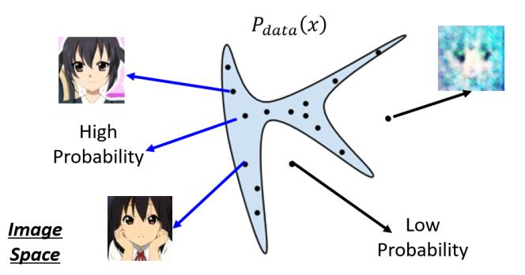

#### GANs 的理论与提升

GAN的本质：
$$
L=\prod_{i=1}^{m} P_{G}\left(x^{i} ; \theta\right)
$$
尽可能采样接近真实数据分布。

最大化 V（G，D）问题的求解实际上就是在求解𝑃𝑑𝑎𝑡𝑎与𝑃𝐺之间 JS 
Div 的值（与前面提到的 KL Div 可以认为是等效的）

#### 2.JS Div距离偏差问题 

不过, 在实际操作中我们往往不会非常多次地训练判别器, 因为找到真正的解 $D_{0}^{*}$ 需要的 训练次数太多, 为了减小训练代价我们只会训练 $\mathrm{k}$ 次, 找到 $D_{0}^{*}$ 的近似解 $D_{0}^{\sim}$ 即可停止。所以 在实际的应用中, **我们计算的都是 JS Div 的近似值, 最终 GANs 学到的是近似分布而不是数 据的真实分布**，这是我们需要明白的地方。

#### 3.训练速度问题 

我们知道, 一开始判别器是很容易鉴别仿造数据的, 因此 $\mathrm{D}(\mathrm{x})$ 的初始值是在靠近 0 的左 端。而对于刚开始训练的模型, 我们希望在初期 $D(x)$ 能够快速地更新, 但不幸的是, 目标函 数 $\log (1-\mathrm{D}(\mathrm{x}))$ 左端刚好是平缓的区域, 依据梯度下降原理这会阻碍 $\mathrm{D}(\mathrm{x})$ 的快速更新。
为了解决这一问题, 有人提出了把 $\log (1-\mathrm{D}(\mathrm{x}))$ 这个表达式换成 $-\log (\mathrm{D}(\mathrm{x}))$, 同样能满 足判别器的目标函数要求, 并且在训练初期还能更新得比较快。
上述方法便是在这个非常小的地方做了改进。不过后来, 人们为了区分这两种 GAN, 还是分别起了不同的名字。第一种 GAN 被叫做 MMGAN (Minimax GAN), 它也是人们常说 的原始 GANs；第二种 GAN 被叫做 NSGAN (Non-saturating GAN)。

#### fGAN——深度理解 GAN 理论 

结论：不只是 JS Div，任何的 Div（统称为 f-Div）都可以被放到 GANs 的架构中去

####  JS Div不是最佳的Div

两者JS相同

### WGAN

WGAN 的全称是 WassersteinGAN，它提出了用 Wasserstein 距离（也称 EM 距离）去取代
JS 距离，这样能更好的衡量两个分布之间的 Div。我们先介绍一下什么是 EM 距离。 

#### EM距离

EM 距离的全称是 EarthMover（推土距离），它的定义非常直观：假设有两堆数据分布 P
和 Q，看作两堆土，现在把 P 这堆土推成 Q 这堆土所需要的最少的距离就是 EM 距离。

假设 P 的分布是上图棕色柱块区域，Q 的分布是上图绿色柱块区域，现在需要把 P 的
分布推成 Q 的分布，我们可以制定出很多不同的 MovingPlan（推土计划）。 

这些不同的推土计划都能把分布 P 变成分布 Q，但是它们所要走的平均推土距离是不
一样的，我们最终选取最小的平均推土距离值作为 EM 距离。例如上面这个例子的 EM 距离
就是下面这个推土方案对应的值。 

那为了更好地表示这个推土问题，我们可以把每一个 moving plan 转化为一个矩阵图： 

每一个色块表示 $P$ 分布到 $Q$ 分布需要分配的土量（移动距离）, 那每一行的色块之和就 是 $\mathrm{P}$ 分布该行位置的柱高度, 每一列的色块之和就是 $Q$ 分布该列位置的柱高度。于是我们] 的求解目标表达式就如下所示:
Average distance of a plan $\gamma$ :
$$
B(\gamma)=\sum_{x_{p}, x_{q}} \gamma\left(x_{p}, x_{q}\right)\left\|x_{p}-x_{q}\right\|
$$
Earth Mover's Distance:
$$
W(P, Q)=\min _{\gamma \in \Pi} B(\gamma)
$$
The best plan
表达式中 $y$ 函数计算当前计划下 $x_{P}$ 到 $x_{Q}$ 的推土量, $\left\|x_{P}-x_{Q}\right\|$ 表示二者间的推土距离。 那如果这个时候我们想直接求解这个表达式的话, 是非常麻烦的, 因为需要穷举所有的 moving plan 然后再选择其最小值。如果我们对之前的理论有印象的话, 我们会想到这个优 化问题依然可以交给判别器来解决。
于是接下来要做的, 就是去改判别器, 让它能够衡量 $P_{G}$ 与 $P_{\text {data }}$ 之间的 wasserstein 距离。

#### WGAN

下面我们直接给出 WGAN 的判别器的目标表达式:
这个表达式的求解结果就是 $P_{G}$ 与 $P_{\text {data }}$ 之间的 wasserstein 距离。至于为什么会等于 Was 距离, 详细证明请参阅 WGAN paper 附录当中的证明部分, 因为过于繁琐, 在此就不赘述 (逃)。反正目前我们构造出了求解 was 距离的判别器。
关于这个表达式, 值得注意的是, D 被加上了 1-Lipschitz function（如下图）的限制。
$$
\begin{aligned}
&\left\|f\left(x_{1}\right)-f\left(x_{2}\right)\right\| \leq K\left\|x_{1}-x_{2}\right\| \\
&\mathrm{K}=1 \text { for " } 1-\text { Lipschitz" }
\end{aligned}
$$
**为什么要对判别器做限制？**传统 GANs 的判别器输出的结果是在(0,1)区间之内，但是在 WGAN 中输出的结果是 was 距离，was 距离是没有上下界的，这意味着，随着训练进行，𝑃𝐺的 was 值会越来越小，𝑃𝑑𝑎𝑡𝑎的 was 值会越来越大，判别器将永远无法收敛。

- GP，WGAN-GP
  - 加入惩罚项，对大于1的参数。
- 频谱归一化, SNGAN
  - 对每一层的参数进行归一化，会近似满足1-lipschitz分布

### BigGAN

- 增加batchsize

- 增加通道

- 共享嵌入

  

- 潜在空间 **噪声 z 的先验分布**

- 截断技巧的使用，使潜在空间的使用不需要更换

- 正交正则化方法，使用截断技巧可以提升生成图片的质量，但是一些较大的模型不适合截
  断，因为在嵌入截断噪声时会产生饱和伪影，正交正则化方法会让权重系数彼此之间的干扰会非常低，受到截断之后消失的权重就不会对结果产生太大影响。 

####  BigGAN的稳定性实现 

每个权重矩阵中的前三个奇异值 的影响最大（这三个奇异值可以使用 Alrnoldi 迭代方法进行有效计算）

对于 G，适当调整奇异值 以抵消光谱爆炸的影响；对
于 D，寻找更多的约束来抵消噪声的影响，实现训练的稳定性。

##### 对于 $G$ 的控制

为了将权重的第一个奇异值 $\sigma_{0}$ 控制住, 防止突然性的爆炸, BigGAN 采用了两种方法:

- 第一种方法是, 直接使每个权重的顶部奇异值 $\sigma_{0}$ 正则化, 朝向固定值 $\sigma_{r e g}$ 或者以某 个比率 $\mathrm{r}$ 朝向第二奇异值 $r \cdot s g\left(\sigma_{1}\right)$ (其中 $s g$ 为停止梯度操作, 适时防止正则化增加 $\left.\sigma_{1}\right)$ 。
. 第二种方法是, 使用部分奇异值分解来代替 $\sigma_{0}$ 。给定权重 $\mathrm{W}$, 其第一个奇异向量 $u_{0}$ 和 $v_{0}$, 以及 $\sigma_{0}$ 将被值 $\sigma_{\text {clamp }}$ 钳制，我们的权重变为:
$$
W=W-\max \left(0, \sigma_{0}-\sigma_{\text {clamp }}\right) v_{0} u_{0}^{\top}
$$
其中 $\sigma_{\text {clamp }}$ 被设置为 $\sigma_{r e g}$ 或 $r \cdot s g\left(\sigma_{1}\right)$ 。
BigGAN 观察到无论有无光谱归一化, 这些技术都具有防止 $\sigma_{0}$ 或 $\frac{\sigma_{0}}{\sigma_{1}}$ 逐渐增加和爆炸的效 果, 但即使在某些情况下它们可以温和地提高性能, 却依然没有任何组合可以防止训练崩溃。 这一证据表明, 虽然调节 $G$ 可能会改善稳定性, 但它不足以确保稳定性。因此, 现在我们 需要将注意力转向 $D$ 。

对于 D 的控制
在图 (b) 中, 我们看到 D 的光谱是嘈杂的, 但是 $\frac{\sigma_{0}}{\sigma_{1}}$ 表现良好, 并且奇异值在整个训练 过程中平稳增长, 在崩溃时只是突然跳跃而不是爆炸。
我们需要解决的问题有两个, 第一个, 嘈杂出现的原因是什么以及这种嘈杂与模型不稳 定性之间是否有直接影响；第二个, 奇异值在整个训练过程中平稳增长 ( $D$ 在训练期间的损 失接近于零), 但在崩溃时经历了急剧的向上跳跃, 这是什么原因导致的。
我们先考虑第一个问题, 频谱噪声与模型不稳定性之间有什么样的影响。
我们先分析一下出现嘈杂的原因, D 光谱中的峰值可能表明它周期性地接收到非常大的 梯度, 但我们观察到 Frobenius 规范是平滑的（见 paper 附录 F), 表明这种效应主要集中在 前几个奇异方向上。于是我们认为这种噪声是通过对抗训练过程进行优化的结果, 其中 $G$ 定 期产生强烈干扰 $D$ 的 batch, 进而导致出现光谱嘈杂。
如果这种频谱噪声与不稳定性有因果关系, 我们该采用的反制措施自然是梯度惩罚, 因 为这明显地规范了 $\mathrm{D}$ 的雅可比行列式的变化。BigGAN 探索了 $R_{1}$ 零中心梯度罚分：
$$
R_{1}:=\frac{\gamma}{2} \mathbb{E}_{p_{\mathcal{D}}(x)}\left[\|\nabla D(x)\|_{F}^{2}\right]
$$
实验结果证明, 在 $\gamma$ 为 10 的情况下, 训练变得稳定并且改善了 $G$ 和 $D$ 中光谱的平 滑度和有界性, 但是性能严重降低, 导致 IS 减少 45\%。减少惩罚可以部分缓解这种恶化, 但会导致频谱越来越不良。即使惩罚强度降低到 1 (没有发生突然崩溃的最低强度), IS 也 减少了 $20 \%$ 。

结论：频谱噪声确实会对模型的不稳定性产生影响，我们可以通过对 D 施加惩罚去解决。当对 D 的惩罚足够高时，可以实现训练的稳定性提升但是图像的生成质量会下降比较多。

缺点：训练成本巨大

##### ImprovedDCGAN

###### 特征匹配(feature mapping) 

为了不让生成器尽可能地去蒙骗鉴别器, ImprovedDCGAN 希望以特征作为匹配标准, 而不是图片作为匹配标准, 于是提出了一种新的生成器的目标函数, 即：
$$
\left\|\mathbb{E}_{\boldsymbol{x} \sim p_{\text {data }}} \mathbf{f}(\boldsymbol{x})-\mathbb{E}_{\boldsymbol{z} \sim p_{\boldsymbol{z}}(\boldsymbol{z})} \mathbf{f}(G(\boldsymbol{z}))\right\|_{2}^{2}
$$
其中 $f(x)$ 是指的生成器把判别器的中间层输出 $f(x)$ 作为目标 (一般中间层都是 $D$ 最后几 层, $f(x)$ 实际上是 feature map), 这样可以让生成的中间层输出和真实数据的中间层输出尽 可能相同。这种做法虽然不能保证到达均衡点, 但是收敛的稳定性应该是有所提高。

###### 批次判别(minibatch discrimination) 

批次判别(minibatch discrimination)
GAN 的一个常见的失败就是收玫到同一个点，并没有什么机制可以让生成器生成不一 样的内容。而只要生成一个会被判别器误认的内容, 那么梯度方向就会不断朝那个方向前进。
ImprovedDCGAN 使用的方法是用 minibatch 判别器。也就是说每次不是判别单张图片, 而是判别一批图片。
具体来说, 将一个中间层 $f(x)$ 乘以一个 tensor, 得到一个新的矩阵 $M$, 计算 $M$ 每一行之 间的 $L 1$ 距离 0 , 以此为 $f(x)$ 下一层的输入。
$$
\begin{aligned}
o\left(\boldsymbol{x}_{i}\right)_{b} &=\sum_{j=1}^{n} c_{b}\left(\boldsymbol{x}_{i}, \boldsymbol{x}_{j}\right) \in \mathbb{R} \\
o\left(\boldsymbol{x}_{i}\right) &=\left[o\left(\boldsymbol{x}_{i}\right)_{1}, o\left(\boldsymbol{x}_{i}\right)_{2}, \ldots, o\left(\boldsymbol{x}_{i}\right)_{B}\right] \in \mathbb{R}^{B} \\
o(\mathbf{X}) & \in \mathbb{R}^{n \times B}
\end{aligned}
$$

###### 单侧标签平滑(one-sided label smoothing) 

###### 历史平均(historical averaging)

在更新参数值时, 把它们过去的值也纳入考虑,也就是在目标函数中加入下面这项:
$$
\left\|\theta-\frac{1}{t} \sum_{i=1}^{t} \theta[i]\right\|^{2}
$$

###### 虚拟批次正态化(virtual batch normalization) 

batch normalize 在神经网络领域有广泛应用，但是也有一些问题，比如特定样例 x 在
神经网络上的输出会受到 minibatch 上其他的样本影响。文中提出了一种 virtual batch 
normalization（VBN），会在训练前提取一个 batch，以后就根据这个 batch 做 normalize，
不过由于这样的计算成本很高，所以它仅仅被用在生成器当中。 

####  SAGAN的模型架构 

深度卷积网络能够提升 GANs 生成高分辨率图片的细节，但是由于卷积
网络的局部感受野的限制，如果要生成大范围相关（Long-range dependency）的区域，卷
积网络就会出现问题。譬如说在生成人脸图片时，是非常注重细节的，以左右眼举例，只要
左右眼有一点点不对称，就会显得生成的人脸特别不真实。但是因为一般的卷积核很难覆盖
很大的区域，在对左眼区域做卷积时它看不到右眼对左眼的影响，这样产生的图片就会缺乏
人脸结构特征的完整性。我们需要解决的问题是，如何找到一种能够利用全局信息的方法。传统的一
些做法，比如用更深的卷积网络，或者直接采用全连接层获取全局信息，明显参数量太大计
算量太大。直到 SAGAN 的提出，把 Attention 机制引入了 GANs 的图像生成当中，才找到
一种比较简约且高效的方法解决了这一问题。