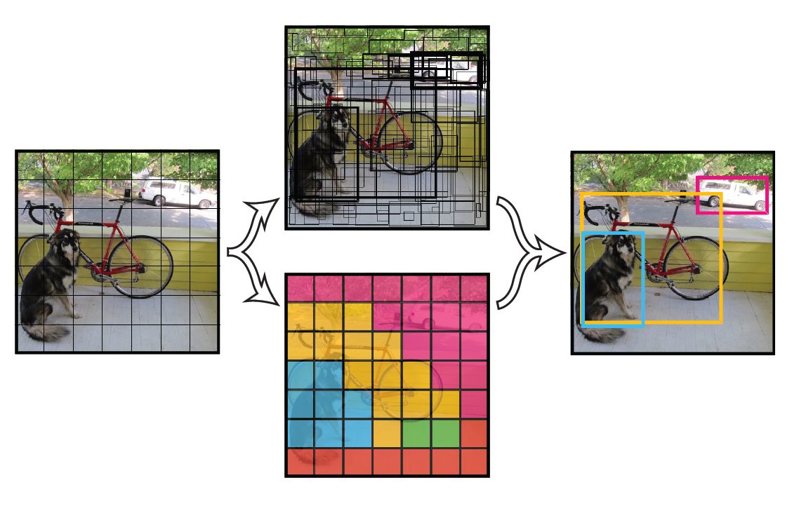
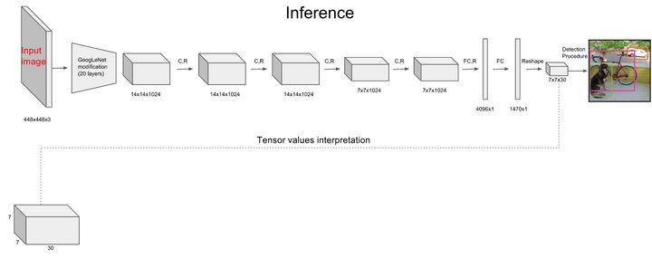
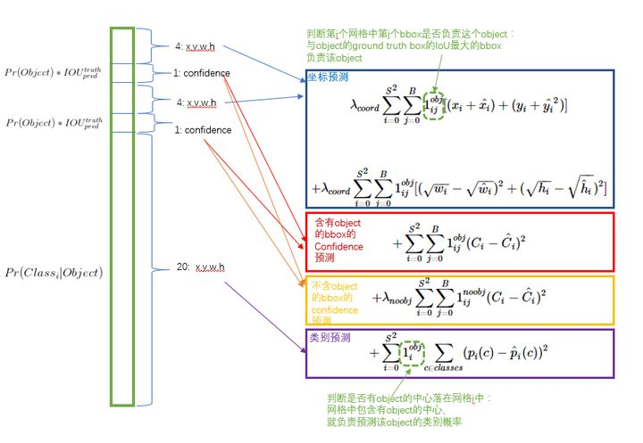

# YOLOV1

- 速度快，能够达到实时的要求。在 Titan X 的 GPU 上 能够达到 45 帧每秒。
- 使用全图作为 Context 信息，背景错误（把背景错认为物体）比较少。
- 泛化能力强。

- YOLO的核心思想就是利用整张图作为网络的输入，直接在输出层回归bounding box的位置和bounding box所属的类别，属于one-Stage 网络。Faster RCNN中也直接用整张图作为输入，但是faster-RCNN整体还是采用了RCNN那种 proposal+classifier的思想，只不过是将提取proposal的步骤放在CNN中实现了。


## 实现方法

- 将一幅图像分成SxS个网格(grid cell)，如果某个object的中心 落在这个网格中，则这个网格就负责预测这个object。 



- 每个网格要预测B个bounding box，每个bounding box除了要回归自身的位置之外，还要附带预测一个confidence值。 
  这个confidence代表了所预测的box中含有object的置信度和这个box预测的有多准两重信息，其值是这样计算的： 

- 每个bounding box要预测(x, y, w, h)和confidence共5个值，每个网格还要预测一个类别信息，记为C类。则SxS个网格，每个网格要预测B个bounding box还要预测C个categories。输出就是S x S x (5*B+C)的一个tensor。
  注意：class信息是针对每个网格的，confidence信息是针对每个bounding box的。

## 推理细节

```python

class YOLOv1(nn.Module):
    def __init__(self, params):

        self.dropout_prop = params["dropout"]
        self.num_classes = params["num_class"]

        super(YOLOv1, self).__init__()
        # LAYER 1
        self.layer1 = nn.Sequential(
            nn.Conv2d(3, 64, kernel_size=7, stride=2, padding=3),
            nn.BatchNorm2d(64),
            nn.LeakyReLU(),
            nn.MaxPool2d(kernel_size=2, stride=2))

        # LAYER 2
        self.layer2 = nn.Sequential(
            nn.Conv2d(64, 192, kernel_size=3, stride=1, padding=1),
            nn.BatchNorm2d(192, momentum=0.01),
            nn.LeakyReLU(),
            nn.MaxPool2d(kernel_size=2, stride=2))

        # LAYER 3
        self.layer3 = nn.Sequential(
            nn.Conv2d(192, 128, kernel_size=1, stride=1, padding=0),
            nn.BatchNorm2d(128, momentum=0.01),
            nn.LeakyReLU())
        self.layer4 = nn.Sequential(
            nn.Conv2d(128, 256, kernel_size=3, stride=1, padding=1),
            nn.BatchNorm2d(256, momentum=0.01),
            nn.LeakyReLU())
        self.layer5 = nn.Sequential(
            nn.Conv2d(256, 256, kernel_size=1, stride=1, padding=1),
            nn.BatchNorm2d(256, momentum=0.01),
            nn.LeakyReLU())
        self.layer6 = nn.Sequential(
            nn.Conv2d(256, 512, kernel_size=3, stride=1, padding=0),
            nn.BatchNorm2d(512, momentum=0.01),
            nn.LeakyReLU(),
            nn.MaxPool2d(kernel_size=2, stride=2))

        # LAYER 4
        self.layer7 = nn.Sequential(
            nn.Conv2d(512, 256, kernel_size=1, stride=1, padding=0),
            nn.BatchNorm2d(256, momentum=0.01),
            nn.LeakyReLU())
        self.layer8 = nn.Sequential(
            nn.Conv2d(256, 512, kernel_size=3, stride=1, padding=1),
            nn.BatchNorm2d(512, momentum=0.01),
            nn.LeakyReLU())
        self.layer9 = nn.Sequential(
            nn.Conv2d(512, 256, kernel_size=1, stride=1, padding=0),
            nn.BatchNorm2d(256, momentum=0.01),
            nn.LeakyReLU())
        self.layer10 = nn.Sequential(
            nn.Conv2d(256, 512, kernel_size=3, stride=1, padding=1),
            nn.BatchNorm2d(512, momentum=0.01),
            nn.LeakyReLU())
        self.layer11 = nn.Sequential(
            nn.Conv2d(512, 256, kernel_size=1, stride=1, padding=0),
            nn.BatchNorm2d(256, momentum=0.01),
            nn.LeakyReLU())
        self.layer12 = nn.Sequential(
            nn.Conv2d(256, 512, kernel_size=3, stride=1, padding=1),
            nn.BatchNorm2d(512, momentum=0.01),
            nn.LeakyReLU())
        self.layer13 = nn.Sequential(
            nn.Conv2d(512, 256, kernel_size=1, stride=1, padding=0),
            nn.BatchNorm2d(256, momentum=0.01),
            nn.LeakyReLU())
        self.layer14 = nn.Sequential(
            nn.Conv2d(256, 512, kernel_size=3, stride=1, padding=1),
            nn.BatchNorm2d(512, momentum=0.01),
            nn.LeakyReLU())
        self.layer15 = nn.Sequential(
            nn.Conv2d(512, 512, kernel_size=1, stride=1, padding=0),
            nn.BatchNorm2d(512, momentum=0.01),
            nn.LeakyReLU())
        self.layer16 = nn.Sequential(
            nn.Conv2d(512, 1024, kernel_size=3, stride=1, padding=1),
            nn.BatchNorm2d(1024, momentum=0.01),
            nn.LeakyReLU(),
            nn.MaxPool2d(kernel_size=2, stride=2))

        # LAYER 5
        self.layer17 = nn.Sequential(
            nn.Conv2d(1024, 512, kernel_size=1, stride=1, padding=0),
            nn.BatchNorm2d(512, momentum=0.01),
            nn.LeakyReLU())
        self.layer18 = nn.Sequential(
            nn.Conv2d(512, 1024, kernel_size=3, stride=1, padding=1),
            nn.BatchNorm2d(1024, momentum=0.01),
            nn.LeakyReLU())
        self.layer19 = nn.Sequential(
            nn.Conv2d(1024, 512, kernel_size=1, stride=1, padding=0),
            nn.BatchNorm2d(512, momentum=0.01),
            nn.LeakyReLU())
        self.layer20 = nn.Sequential(
            nn.Conv2d(512, 1024, kernel_size=3, stride=1, padding=1),
            nn.BatchNorm2d(1024, momentum=0.01),
            nn.LeakyReLU())
        self.layer21 = nn.Sequential(
            nn.Conv2d(1024, 1024, kernel_size=3, stride=1, padding=1),
            nn.BatchNorm2d(1024, momentum=0.01),
            nn.LeakyReLU())
        self.layer22 = nn.Sequential(
            nn.Conv2d(1024, 1024, kernel_size=3, stride=2, padding=1),
            nn.BatchNorm2d(1024, momentum=0.01),
            nn.LeakyReLU())

        # LAYER 6
        self.layer23 = nn.Sequential(
            nn.Conv2d(1024, 1024, kernel_size=3, stride=1, padding=1),
            nn.BatchNorm2d(1024, momentum=0.01),
            nn.LeakyReLU())
        self.layer24 = nn.Sequential(
            nn.Conv2d(1024, 1024, kernel_size=3, stride=1, padding=1),
            nn.BatchNorm2d(1024, momentum=0.01),
            nn.LeakyReLU())

        self.fc1 = nn.Sequential(
            nn.Linear(7 * 7 * 1024, 4096),
            nn.LeakyReLU(),
            nn.Dropout(self.dropout_prop)
        )

        self.fc2 = nn.Sequential(
            nn.Linear(4096, 7 * 7 * ((5) + self.num_classes))
        )

        for m in self.modules():

            if isinstance(m, nn.Conv2d):
                nn.init.kaiming_normal_(m.weight, mode='fan_out', nonlinearity="leaky_relu")
            elif isinstance(m, nn.BatchNorm2d):
                nn.init.constant_(m.weight, 1)
                nn.init.constant_(m.bias, 0)

    def forward(self, x):

        out = self.layer1(x)
        out = self.layer2(out)
        out = self.layer3(out)
        out = self.layer4(out)
        out = self.layer5(out)
        out = self.layer6(out)
        out = self.layer7(out)
        out = self.layer8(out)
        out = self.layer9(out)
        out = self.layer10(out)
        out = self.layer11(out)
        out = self.layer12(out)
        out = self.layer13(out)
        out = self.layer14(out)
        out = self.layer15(out)
        out = self.layer16(out)
        out = self.layer17(out)
        out = self.layer18(out)
        out = self.layer19(out)
        out = self.layer20(out)
        out = self.layer21(out)
        out = self.layer22(out)
        out = self.layer23(out)
        out = self.layer24(out)
        out = out.reshape(out.size(0), -1)
        out = self.fc1(out)
        out = self.fc2(out)
        out = out.reshape((-1, 7, 7, ((5) + self.num_classes)))
        out[:, :, :, 0] = torch.sigmoid(out[:, :, :, 0])  # sigmoid to objness1_output
        out[:, :, :, 5:] = torch.sigmoid(out[:, :, :, 5:])  # sigmoid to class_output

        return out
```


、、

## 损失函数设计

- 针对一个网格，一个框对应的（X,Y,W,H,C），分别代表框的信息，以及对应的置信度信息
- 针对VOC数据集，额外判断20类别
- 输出 20（类别信息）+置信度（置信度）+（X,Y,W,H）(位置信息)

-  lambda_coord = 5, lambda_noobj = 0.5 主要解决类别不平衡的问题，让置信度高也就是含有真实目标得损失权重更大。



```python
def one_hot(output, label, device):

    label = label.cpu().data.numpy()
    b, s1, s2, c = output.shape
    dst = np.zeros([b, s1, s2, c], dtype=np.float32)

    for k in range(b):
        for i in range(s1):
            for j in range(s2):

                dst[k][i][j][int(label[k][i][j])] = 1.

    result = torch.from_numpy(dst)
    if device == 'cpu':
        result = result.type(torch.FloatTensor)
    else:
        result = result.type(torch.FloatTensor).cuda()

    return result
# def detection_loss_4_yolo(output, target):
def detection_loss_4_yolo(output, target, device):

    # hyper parameter

	# 就是让含有物体的格点，在损失函数中的权重更大，让模型更加“重视”含有物体的格点所造成的损失
    lambda_coord = 5
    lambda_noobj = 0.5

    # check batch size
    b, _, _, _ = target.shape
    _, _, _, n = output.shape

    # output tensor slice
    # output tensor shape is [batch, 7, 7, 5 + classes]
    # 置信度，x,y, w,h, 类别
    objness1_output = output[:, :, :, 0]
    x_offset1_output = output[:, :, :, 1]
    y_offset1_output = output[:, :, :, 2]
    width_ratio1_output = output[:, :, :, 3]
    height_ratio1_output = output[:, :, :, 4]
    class_output = output[:, :, :, 5:]

    num_cls = class_output.shape[-1]

    # label tensor slice
    objness_label = target[:, :, :, 0]
    x_offset_label = target[:, :, :, 1]
    y_offset_label = target[:, :, :, 2]
    width_ratio_label = target[:, :, :, 3]
    height_ratio_label = target[:, :, :, 4]


    class_label = one_hot(class_output, target[:, :, :, 5], device)
    #全部设置为正 
    noobjness_label = torch.neg(torch.add(objness_label, -1))


    obj_coord1_loss = lambda_coord * \
                      torch.sum(objness_label *
                        (torch.pow(x_offset1_output - x_offset_label, 2) +
                         torch.pow(y_offset1_output - y_offset_label, 2)))

    obj_size1_loss = lambda_coord * \
                     torch.sum(objness_label *
                               (torch.pow(width_ratio1_output - torch.sqrt(width_ratio_label), 2) +
                                torch.pow(height_ratio1_output - torch.sqrt(height_ratio_label), 2)))

    objectness_cls_map = objness_label.unsqueeze(-1)

    for i in range(num_cls - 1):
        objectness_cls_map = torch.cat((objectness_cls_map, objness_label.unsqueeze(-1)), dim=3)

    obj_class_loss = torch.sum(objectness_cls_map * torch.pow(class_output - class_label, 2))

    noobjness1_loss = lambda_noobj * torch.sum(noobjness_label * torch.pow(objness1_output - objness_label, 2))

    objness1_loss = torch.sum(objness_label * torch.pow(objness1_output - objness_label, 2))

    total_loss = (obj_coord1_loss + obj_size1_loss + noobjness1_loss + objness1_loss + obj_class_loss)

    total_loss = total_loss / b

    return total_loss, obj_coord1_loss / b, obj_size1_loss / b, obj_class_loss / b, noobjness1_loss / b, objness1_loss / b


```

```python
class YoloV1Loss(nn.Module):
    """yolo-v1 损失函数定义实现"""
    def __init__(self, s=7, b=2, l_coord=5, l_noobj=0.5,
                 device=torch.device('cuda' if torch.cuda.is_available() else 'cpu')):
        """ 为了更重视8维的坐标预测，给这些算是前面赋予更大的loss weight
        对于有物体的记为λcoord，在pascal VOC训练中取5，对于没有object的bbox的confidence loss，
        前面赋予更小的loss weight 记为 λnoobj,
        在pascal VOC训练中取0.5, 有object的bbox的confidence loss"""
        super(YoloV1Loss, self).__init__()
        self.s = s  # 正方形网格数
        self.b = b  # 每个格的预测框数
        self.l_coord = l_coord  # 损失函数坐标回归权重
        self.l_noobj = l_noobj  # 损失函数类别分类权重
        self.device = device

    def forward(self, predict_tensor, target_tensor):
        """
        :param predict_tensor:
            (tensor) size(batch_size, S, S, Bx5+20=30) [x, y, w, h, c]---预测对应的格式
        :param target_tensor:
            (tensor) size(batch_size, S, S, 30) --- 标签的准确格式
        :return:
        """
        N = predict_tensor.size()[0]

        # 具有目标标签的索引(bs, 7, 7, 30)中7*7方格中的哪个方格包含目标
        coo_mask = target_tensor[:, :, :, 4] > 0  # coo_mask.shape = (bs, 7, 7)
        # 不具有目标的标签索引
        noo_mask = target_tensor[:, :, :, 4] == 0

        # 得到含物体的坐标等信息(coo_mask扩充到与target_tensor一样形状, 沿最后一维扩充)
        coo_mask = coo_mask.unsqueeze(-1).expand_as(target_tensor)
        # 得到不含物体的坐标等信息
        noo_mask = noo_mask.unsqueeze(-1).expand_as(target_tensor)

        # coo_pred：tensor[, 30](所有batch数据都压缩在一起)
        coo_pred = predict_tensor[coo_mask].view(-1, 30)
        # box[x1,y1,w1,h1,c1], [x2,y2,w2,h2,c2]
        box_pred = coo_pred[:, :10].contiguous().view(-1, 5)
        # class[...]
        class_pred = coo_pred[:, 10:]

        coo_target = target_tensor[coo_mask].view(-1, 30)
        box_target = coo_target[:, :10].contiguous().view(-1, 5)
        class_target = coo_target[:, 10:]

        # compute not contain obj loss
        noo_pred = predict_tensor[noo_mask].view(-1, 30)
        noo_target = target_tensor[noo_mask].view(-1, 30)
        # noo pred只需要计算 Obj1、2 的损失 size[,2]
        noo_pred_mask = torch.ByteTensor(noo_pred.size()).to(self.device)
        noo_pred_mask.zero_()
        noo_pred_mask[:, 4] = 1
        noo_pred_mask[:, 9] = 1

        # 获取不包含目标框的置信度值
        noo_pred_c = noo_pred[noo_pred_mask]
        noo_target_c = noo_target[noo_pred_mask]

        # 不含object bbox confidence 预测
        nooobj_loss = F.mse_loss(noo_pred_c, noo_target_c, reduction='sum')

        # compute contain obj loss
        coo_response_mask = torch.ByteTensor(box_target.size()).to(self.device)
        coo_response_mask.zero_()
        coo_not_response_mask = torch.ByteTensor(box_target.size()).to(self.device)
        coo_not_response_mask.zero_()
        box_target_iou = torch.zeros(box_target.size()).to(self.device)
        # 从两个gt bbox框中二选一(同一个格点的两个gt bbox是一样的)
        for i in range(0, box_target.size()[0], 2):
            # choose the best iou box
            box1 = box_pred[i:i + self.b]  # 获取当前格点预测的b个box
            box1_xyxy = torch.FloatTensor(box1.size())
            # (x,y,w,h)
            box1_xyxy[:, :2] = box1[:, :2] / self.s - 0.5 * box1[:, 2:4]
            box1_xyxy[:, 2:4] = box1[:, :2] / self.s + 0.5 * box1[:, 2:4]
            box2 = box_target[i].view(-1, 5)
            box2_xyxy = torch.FloatTensor(box2.size())
            box2_xyxy[:, :2] = box2[:, :2] / self.s - 0.5 * box2[:, 2:4]
            box2_xyxy[:, 2:4] = box2[:, :2] / self.s + 0.5 * box2[:, 2:4]
            # iou(pred_box[2,], target_box[2,])
            iou = self.compute_iou(box1_xyxy[:, :4], box2_xyxy[:, :4])
            # target匹配到的box, 在self.b个预测box中获取与target box iou 值最大的那个的索引
            max_iou, max_index = iou.max(0)
            _logger.info("max_iou: {}, max_index:{}".format(max_iou, max_index))
            max_index = max_index.to(self.device)

            coo_response_mask[i + max_index] = 1
            coo_not_response_mask[i + 1 - max_index] = 1
            '''we want the confidence score to equal the
            intersection over union (IOU) between the predicted box
            and the ground truth'''
            # iou value 作为box包含目标的confidence(赋值在向量的第五个位置)
            box_target_iou[i + max_index, torch.LongTensor([4]).to(self.device)] = max_iou.to(self.device)

        box_target_iou = box_target_iou.to(self.device)
        # 1.response loss
        # temp = box_pred[coo_response_mask]
        # box_pred[coo_response_mask]将coo_response_mask对应值为1的索引在box_pred的值取出组成一维向量
        box_pred_response = box_pred[coo_response_mask].view(-1, 5)
        box_target_response_iou = box_target_iou[coo_response_mask].view(-1, 5)
        box_target_response = box_target[coo_response_mask].view(-1, 5)

        # 包含目标box confidence的损失
        contain_loss = F.mse_loss(box_pred_response[:, 4], box_target_response_iou[:, 4], reduction='sum')

        # 包含目标box的损失
        loc_loss = (F.mse_loss(box_pred_response[:, :2],
                               box_target_response[:, :2],
                               reduction='sum') +
                    F.mse_loss(torch.sqrt(box_pred_response[:, 2:4]),
                               torch.sqrt(box_target_response[:, 2:4]),
                               reduction='sum'))

        # 2.not response loss
        box_pred_not_response = box_pred[coo_not_response_mask].view(-1, 5)
        box_target_not_response = box_target[coo_not_response_mask].view(-1, 5)
        box_target_not_response[:, 4] = 0
        # not_contain_loss = F.mse_loss(box_pred_response[:,4], box_target_response[:,4], size_average=False)

        # I believe this bug is simply a typo(包含目标格点上不包含目标的box confidence的损失)
        not_contain_loss = F.mse_loss(box_pred_not_response[:, 4], box_target_not_response[:, 4], reduction='sum')

        # 3.class loss(分类损失)
        class_loss = F.mse_loss(class_pred, class_target, reduction='sum')

        return (self.l_coord * loc_loss + 2 * contain_loss +
                not_contain_loss + self.l_noobj * nooobj_loss + class_loss) / N

    def compute_iou(self, box1, box2):
        """iou的作用是，当一个物体有多个框时，选一个相比ground truth最大的执行度的为物体的预测，然后将剩下的框降序排列，
        如果后面的框中有与这个框的iou大于一定的阈值时则将这个框舍去（这样就可以抑制一个物体有多个框的出现了），
        目标检测算法中都会用到这种思想。
        Compute the intersection over union of two set of boxes, each box is [x1,y1,x2,y2].
        Args:
          box1: (tensor) bounding boxes, sized [N,4].
          box2: (tensor) bounding boxes, sized [M,4].
        Return:
          (tensor) iou, sized [N,M]."""

        N = box1.size(0)
        M = box2.size(0)

        # torch.max(input, other, out=None) → Tensor
        # Each element of the tensor input is compared with the corresponding element
        # of the tensor other and an element-wise maximum is taken.
        # left top
        lt = torch.max(
            box1[:, :2].unsqueeze(1).expand(N, M, 2),  # [N,2] -> [N,1,2] -> [N,M,2]
            box2[:, :2].unsqueeze(0).expand(N, M, 2),  # [M,2] -> [1,M,2] -> [N,M,2]
        )
        # right bottom
        rb = torch.min(
            box1[:, 2:].unsqueeze(1).expand(N, M, 2),  # [N,2] -> [N,1,2] -> [N,M,2]
            box2[:, 2:].unsqueeze(0).expand(N, M, 2),  # [M,2] -> [1,M,2] -> [N,M,2]
        )

        wh = rb - lt  # [N,M,2]
        wh[wh < 0] = 0  # clip at 0
        inter = wh[:, :, 0] * wh[:, :, 1]  # [N,M]

        area1 = (box1[:, 2] - box1[:, 0]) * (box1[:, 3] - box1[:, 1])  # [N,]
        area2 = (box2[:, 2] - box2[:, 0]) * (box2[:, 3] - box2[:, 1])  # [M,]
        area1 = area1.unsqueeze(1).expand_as(inter)  # [N,] -> [N,1] -> [N,M]
        area2 = area2.unsqueeze(0).expand_as(inter)  # [M,] -> [1,M] -> [N,M]

        iou = inter / (area1 + area2 - inter)

        return iou

```


### 缺点

- YOLO对相互靠的很近的物体，还有很小的群体 检测效果不好，这是因为一个网格中只预测了两个框，并且只属于一类。
- 对[测试](http://lib.csdn.net/base/softwaretest)图像中，同一类物体出现的新的不常见的长宽比和其他情况是。泛化能力偏弱。
- 由于损失函数的问题，定位误差是影响检测效果的主要原因。尤其是大小物体的处理上，还有待加强。

