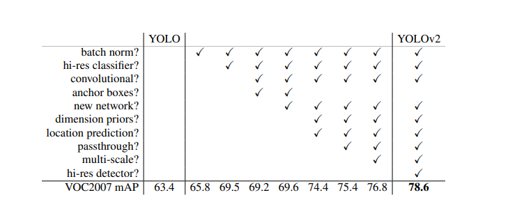
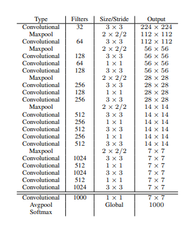
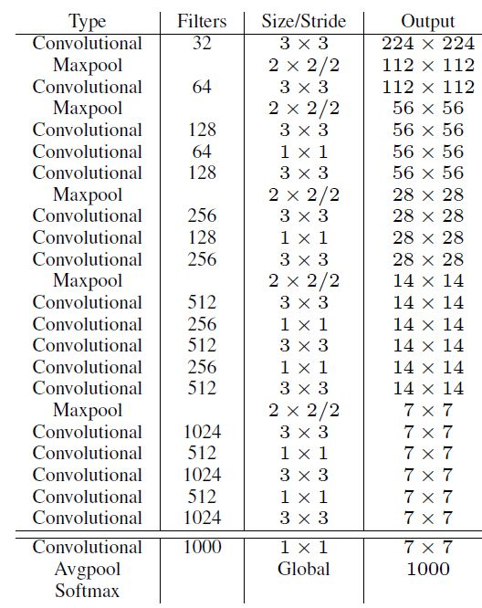
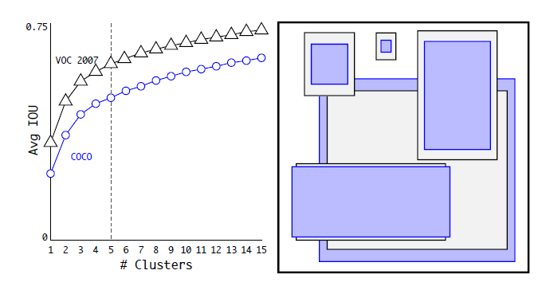
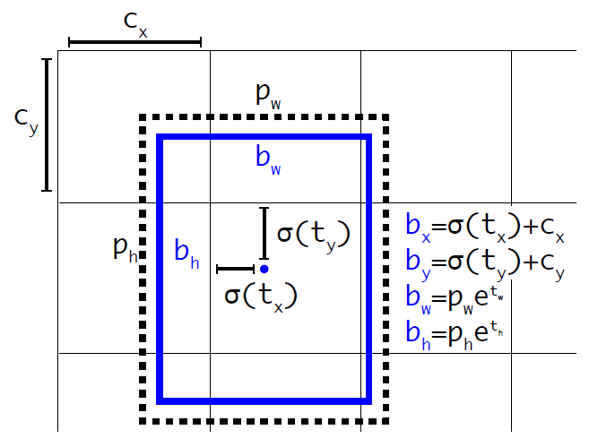
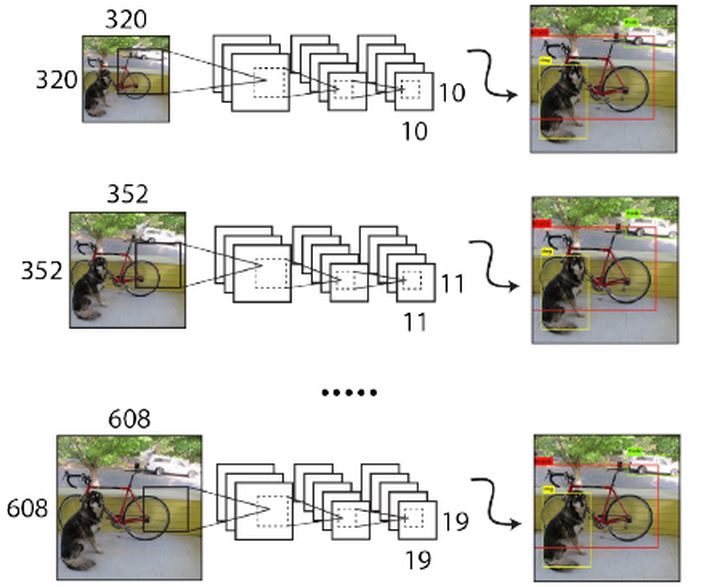
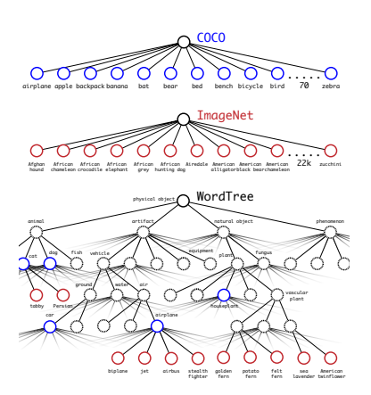
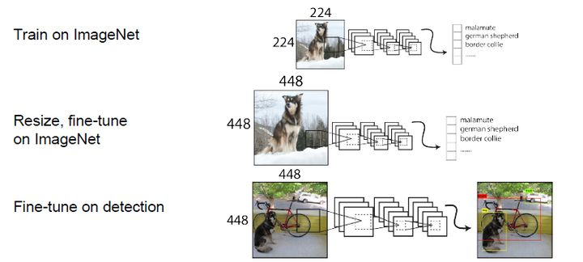
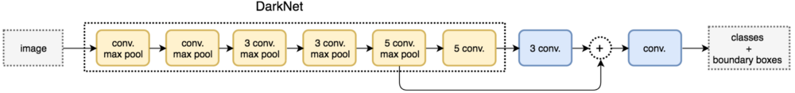

# YOLOV2算法

## 模型

### **Batch Normalization**

卷积后全部加入Batch Normalization

Batch Normalization可以提升模型收敛速度，而且可以起到一定正则化效果，降低模型的过拟合。在YOLOv2中，每个卷积层后面都添加了Batch Normalization层，并且不再使用droput。使用Batch Normalization后，YOLOv2的mAP提升了2.4%。

### **High Resolution Classifier**

- 目前大部分的检测模型都会在先在ImageNet分类数据集上预训练模型的主体部分（CNN特征提取器），由于历史原因，ImageNet分类模型基本采用大小为$224 \times 224$ 的图片作为输入，分辨率相对较低，不利于检测模型。所以YOLOv1在采用 $224 \times 224$分类模型预训练后，将分辨率增加至  $448\times 448$，并使用这个高分辨率在检测数据集上finetune。

- 直接切换分辨率，检测模型可能难以快速适应高分辨率。所以YOLOv2增加了在ImageNet数据集上使用 $448 \times 448$输入来finetune分类网络这一中间过程（10 epochs)，这可以使得模型在检测数据集上finetune之前已经适用高分辨率输入。使用高分辨率分类器后，YOLOv2的mAP提升了约4%。

### **Convolutional With Anchor Boxes**

- **New Network: Darknet-19**

  

  - YOLOv2采用了一个新的基础模型（特征提取器），称为**Darknet-19**，包括**19个卷积层和5个maxpooling层**。Darknet-19与VGG16模型设计原则是一致的，**主要采用 $3 \times 3$ 卷积，采用 $2 \times 2$的maxpooling层之后，特征图维度降低2倍，而同时将特征图的channles增加两倍。**
  - 与NIN([Network in Network]类似，Darknet-19最终采用**global avgpooling**做预测。

  - **在$3 \times 3$ 卷积之间使用$1 \times 1$  卷积来压缩特征图channles以降低模型计算量和参数。**Darknet-19每个卷积层后面同样使用了batch norm层以加快收敛速度，降低模型过拟合。在ImageNet分类数据集上，Darknet-19的top-1准确度为72.9%，top-5准确度为91.2%，但是模型参数相对小一些。使用Darknet-19之后，YOLOv2的mAP值没有显著提升，但是计算量却可以减少约33%。

  

- **放弃全连接推理，利用卷积来预测框参数**。在YOLOv1中，输入图片最终被划分为  $7 \times 7$网格，每个单元格预测2个边界框。YOLOv1最后采用的是全连接层直接对边界框进行预测，其中边界框的宽与高是相对整张图片大小的，而由于各个图片中存在不同尺度和长宽比（scales and ratios）的物体，YOLOv1在训练过程中学习适应不同物体的形状是比较困难的，这也导致YOLOv1在精确定位方面表现较差。YOLOv2借鉴了Faster R-CNN中RPN网络的先验框（anchor boxes，prior boxes，SSD也采用了先验框）策略。RPN对CNN特征提取器得到的特征图（feature map）进行卷积来预测每个位置的边界框以及置信度（是否含有物体），并且各个位置设置不同尺度和比例的先验框，所以RPN预测的是边界框相对于先验框的offsets值，采用先验框使得模型更容易学习。所以YOLOv2移除了YOLOv1中的全连接层而采用了卷积和anchor boxes来预测边界框。

- **为了使检测所用的特征图分辨率更高，移除其中的一个pool层。**在检测模型中，YOLOv2不是采用 $448 \times 448$图片作为输入，而是采用  $416 \times 416$大小。因为YOLOv2模型下采样的总步长为  $32$，对于 $416 \times 416$大小图片，最终得到的特征图大小为 $13 \times 13$，维度是奇数，这样特征图恰好只有一个中心位置。对于一些大物体，它们中心点往往落入图片中心位置，此时使用特征图的一个中心点去预测这些物体的边界框相对容易些。所以在YOLOv2设计中要保证最终的特征图有奇数个位置。对于YOLOv1，每个cell都预测2个boxes，每个boxes包含5个值： $（X,Y,W,H,C）$ ，前4个值是边界框位置与大小，最后一个值是置信度（confidence scores，包含两部分：含有物体的概率以及预测框与ground truth的IOU）。但是每个cell只预测一套分类概率值（class predictions，其实是置信度下的条件概率值）,供2个boxes共享。YOLOv2使用了anchor boxes之后，每个位置的各个anchor box都单独预测一套分类概率值，这和SSD比较类似（但SSD没有预测置信度，而是把background作为一个类别来处理)。使用anchor boxes之后，YOLOv2的mAP有稍微下降（这里下降的原因，我猜想是YOLOv2虽然使用了anchor boxes，但是依然采用YOLOv1的训练方法）。YOLOv1只能预测98个边界框（ $7 \times 7\times 2$），而YOLOv2使用anchor boxes之后可以预测上千个边界框（$13 \times 13 \times num_anchors$)。所以使用anchor boxes之后，YOLOv2的召回率大大提升，由原来的81%升至88%。

- **Dimension Clusters**

  在Faster R-CNN和SSD中，先验框的维度（长和宽）都是手动设定的，带有一定的主观性。如果选取的先验框维度比较合适，那么模型更容易学习，从而做出更好的预测。因此，YOLOv2采用k-means聚类方法对训练集中的边界框做了聚类分析。因为设置先验框的主要目的是为了使得预测框与ground truth的IOU更好，所以聚类分析时选用box与聚类中心box之间的IOU值作为距离指标：
  $$
  d(\text { box }, \text { centroid })=1-I O U(\text { box }, \text { centroid })
  $$
  在VOC和COCO数据集上的聚类分析结果，随着聚类中心数目的增加，平均IOU值（各个边界框与聚类中心的IOU的平均值）是增加的，但是综合考虑模型复杂度和召回率，作者最终选取5个聚类中心作为先验框，其相对于图片的大小如右边图所示。对于两个数据集，5个先验框的width和height如下所示:

  

  ### **Direct location prediction**

  YOLOv2借鉴RPN网络使用anchor boxes来预测边界框相对先验框的 offsets。边界框 的实际中心位置 $(x, y)$ ，需要根据预测的坐标偏移值 $\left(t_{x}, t_{y}\right)$ ，先验框的尺度 $\left(w_{a}, h_{a}\right)$ 以 及中心坐标 $\left(x_{a}, y_{a}\right)$ (特征图每个位置的中心点) 来计算:
  $$
  \begin{aligned}
  &x=\left(t_{x} \times w_{a}\right)-x_{a} \\
  &y=\left(t_{y} \times h_{a}\right)-y_{a}
  \end{aligned}
  $$
  但是上面的公式是无约束的，预测的边界框很容易向任何方向偏移，如当 $t_{x}=1$ 时边界框将向 右偏移先验框的一个宽度大小，而当 $t_{x}=-1$ 时边界框将向左偏移先验框的一个宽度大小，因 此每个位置预测的边界框可以落在图片任何位置，这导致模型的不稳定性，在训练时需要很长时间 来预测出正确的 offsets。所以，YOLOv2弃用了这种预测方式，而是沿用YOLOv1的方法，就是预 测边界框中心点相对于对应cell左上角位置的相对偏移值，为了将边界框中心点约束在当前cell 中，使用sigmoid函数处理偏移值，这样预测的偏移值在 $(0,1)$ 范围内 (每个 cell的尺度看做 1 )。总 结来看，根据边界框预测的 4 个offsets $t_{x}, t_{y}, t_{w}, t_{h}$ ，可以按如下公式计算出边界框实际位置和 大小:
  $$
  \begin{gathered}
  b_{x}=\sigma\left(t_{x}\right)+c_{x} \\
  b_{y}=\sigma\left(t_{y}\right)+c_{y} \\
  b_{w}=p_{w} e^{t_{w}} \\
  b_{h}=p_{h} e^{t_{h}}
  \end{gathered}
  $$
  其中 $\left(c_{x}, x_{y}\right)$ 为cell的左上角坐标，如图所示，在计算时每个cell的尺度为 1 ，所以当前cell的左 上角坐标为 $(1,1)$ 。

  

  由于 sigmoid函数的处理，边界框的中心位置会约束在当前cell内部，防止 偏移过多。而 $\left|p_{w}\right|$ 和 $p_{h}$ 是先验框的宽度与长度，前面说过它们的值也是相对于特征图大小的， 在特征图中每个cell的长和宽均为 1 。这里记特征图的大小为 $|(W, H)|$ (在文中是 $|(13,13)|$ ， 伩样我们可以将边界框相对于整长图片的位置和大小计算出来 (4个值均在 0 和 1 之间)：
  $$
  \begin{gathered}
  b_{x}=\left(\sigma\left(t_{x}\right)+c_{x}\right) / W \\
  b_{y}=\left(\sigma\left(t_{y}\right)+c_{y}\right) / H \\
  b_{w}=p_{w} e^{t_{w}} / W \\
  b_{h}=p_{h} e^{t_{h}} / H
  \end{gathered}
  $$
  如果再将上面的4个值分别乘以图片的宽度和长度 (像素点值) 就可以得到边界框的最终位置和大 小了。这就是YOLOv2边界框的整个解码过程。约束了边界框的位置预测值使得模型更容易稳定训 练，结合聚类分析得到先验框与这种预测方法，YOLOv2的mAP值提升了约 $5 \%$ 。

  ### **Fine-Grained Features**

  YOLOv2的输入图片大小为 $416 \times 416$ ，经过5次maxpooling之后得到 $13 \times 13$ 大小的特征 图，并以此特征图采用卷积做预测。 $13 \times 13$ 大小的特征图对检测大物体是足够了，但是对于 小物体还需要更精细的特征图 (Fine-Grained Features)。因此SSD使用了多尺度的特征图来分 别检测不同大小的物体，前面更精细的特征图可以用来预测小物体。YOLOv2提出了一种 passthrough层来利用更精细的特征图。YOLOv2所利用的Fine-Grained Features是 $26 \times 26$ 大小的特征图（最后一个maxpooling层的输入），对于Darknet-19模型来说就是大小为 $26 \times 26 \times 512$ 的特征图。passthrough层与ResNet网络的shortcut类似，以前面更高分辨率 的特征图为输入，然后将其连接到后面的低分辨率特征图上。前面的特征图维度是后面的特征图的 2倍，passthrough层抽取前面层的每个 $2 \times 2$ 的局部区域，然后将其转化为channel维度，对 于 $26 \times 26 \times 512$ 的特征图，经passthrough层处理之后就变成了 $13 \times 13 \times 2048$ 的新特 征图 (特征图大小降低4倍，而channles增加4倍，图6为一个实例)，这样就可以与后面的
  $13 \times 13 \times 1024$ 特征图连接在一起形成 $13 \times 13 \times 3072$ 大小的特征图，然后在此特征图 基础上卷积做预测。在YOLO的C源码中，passthrough层称为reorg layer。在TensorFlow中，可 以使用tf.extract_image_patches或者tf.space_to_depth来实现passthrough层:

  

  另外，作者在后期的实现中借鉴了ResNet网络，不是直接对高分辨特征图处理，而是增加了一个 中间卷积层，先采用 64 个 $1 \times 1$ 卷积核进行卷积，然后再进行passthrough处理，这样 $26 \times 26 \times 512$ 的特征图得到 $13 \times 13 \times 256$ 的特征图。这算是实现上的一个小细节。使 用Fine-Grained Features之后YOLOv2的性能有 $1 \%$ 的提升。

  ### **Multi-Scale Training**

  由于YOLOv2模型中只有卷积层和池化层，所以YOLOv2的输入可以不限于 $416 \times 416$ 大小的图 片。为了增强模型的鲁棒性，YOLOv2采用了多尺度输入训练策略，具体来说就是在训练过程中每 间隔一定的iterations之后改变模型的输入图片大小。由于YOLOv2的下采样总步长为32，输入图 片大小选择一系列为32倍数的值: $\{320,352, \ldots, 608\}$ ，输入图片最小为 $320 \times 320$ ， 此时对应的特征图大小为 $10 \times 10$ (不是奇数了，确实有点尤答)，而输入图片最大为 $608 \times 608$ ，对应的特征图大小为 $19 \times 19$ 。在训练过程，每隔 10 个iterations随机选择一种 输入图片大小，然后只需要修改对最后检则层的处理就可以重新训练。

  

  采用Multi-Scale Training策略，YOLOv2可以适应不同大小的图片，并且预测出很好的结果。在 测试时，YOLOv2可以采用不同大小的图片作为输入，在VOC 2007数据集上的效果如下图所示。 可以看到采用较小分辨率时，YOLOv2的mAP值略低，但是速度更快，而采用高分辨输入时， $\mathrm{mAP}$ 值更高，但是速度略有下降，对于 $544 \times 544 ， \mathrm{mAP}$ 高达 $78.6 \%$ 。注意，这只是测试时输 入图片大小不同，而实际上用的是同一个模型（采用Multi-Scale Training训练）。

## YOLO9000

- YOLOv2的一大创新是采用Multi-Scale Training策略，这样同一个模型其实就可以适应多种大小的图片了。

## YOLOV2训练

YOLOv2的训练主要包括三个阶段。

- 第一阶段就是先在ImageNet分类数据集上预训练Darknet19，此时模型输入为 $224 \times 224$ ，共训练 160 个epochs。
- 第二阶段将网络的输入调整为 $448 \times 448$ ，继续在ImageNet数据集上finetune分类模型，训练10个epochs，此时分类模型 的top-1准确度为 $76.5 \%$ ，而top-5准确度为 $93.3 \%$ 。
- 第三个阶段就是修改Darknet-19分类模型为 检测模型，并在检测数据集上继续finetune网络。

### 网络修改

- 移除最后一 个卷积层、 global avgpooling层以及softmax层，

- 新增了三个 $3 \times 3 \times 2014$ 卷积层，同 时增加了一个passthrough层，最后使用 $1 \times 1$ 卷积层输出预测结果。

- 输出的channels数为: num_anchors $\times(5+$ num_classes $)$ ，和训练采用的数据集有关系。由于anchors数为 5，对于VOC数据集输出的channels数就是 125 ，而对于COCO数据集则为 425 。这里以VOC数据 集为例，最终的预则矩阵为 $T$ (shape为 (batch_size, 13, 13,125) )，可以先将其 reshape为 (batch_size, $13,13,5,25$ )，其中 $T[:,:,:,:, 0: 4]$ 为边界框的位置和大小 $\left(t_{x}, t_{y}, t_{w}, t_{h}\right) ， T[:,:,:,:, 4]$ 为边界框的置信度，而 $T[:,:,:,:, 5:]$ 为类别预测值。

  

### 网络结构

### 损失函数

$$
\begin{aligned}
\operatorname{loss}_{t}=\sum_{i=0}^{W} \sum_{j=0}^{H} \sum_{k=0}^{A} & 1_{\text {Max IOU }<\text { Thresh }} \lambda_{\text {noobj }} *\left(-b_{i j k}^{o}\right)^{2} \\
&+1_{t<12800} \lambda_{\text {prior }} * \sum_{r \in(x, y, w, h)}\left(p r i o r_{k}^{r}-b_{i j k}^{r}\right)^{2} \\
&+1_{k}^{\text {truth }}\left(\lambda_{\text {coord }} * \sum_{r \epsilon(x, y, w, h)}\left(t r u t h^{r}-b_{i j k}^{r}\right)^{2}\right.\\
&+\lambda_{o b j} *\left(I O U_{t r u t h}^{k}-b_{i j k}^{o}\right)^{2} \\
&\left.+\lambda_{\text {class }} *\left(\sum_{c=1}^{C}\left(\operatorname{truth}^{c}-b_{i j k}^{c}\right)^{2}\right)\right)
\end{aligned}
$$

