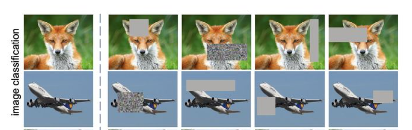
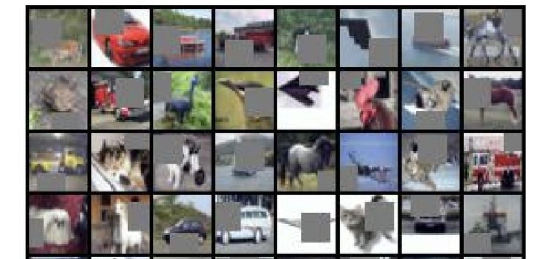
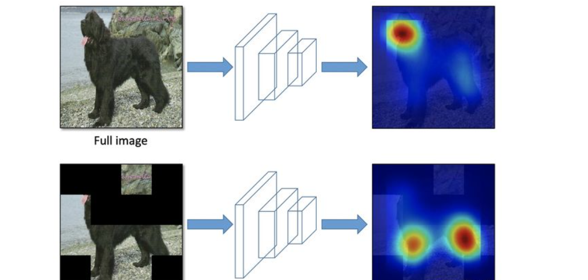
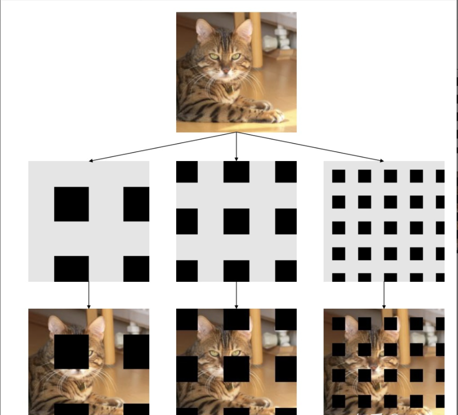
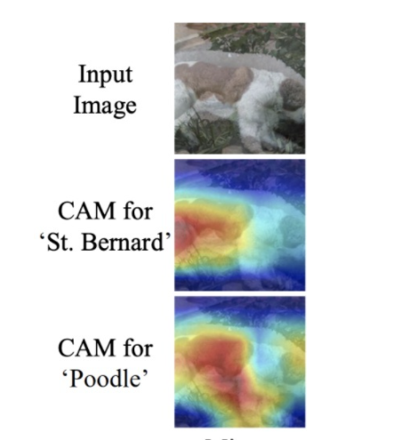
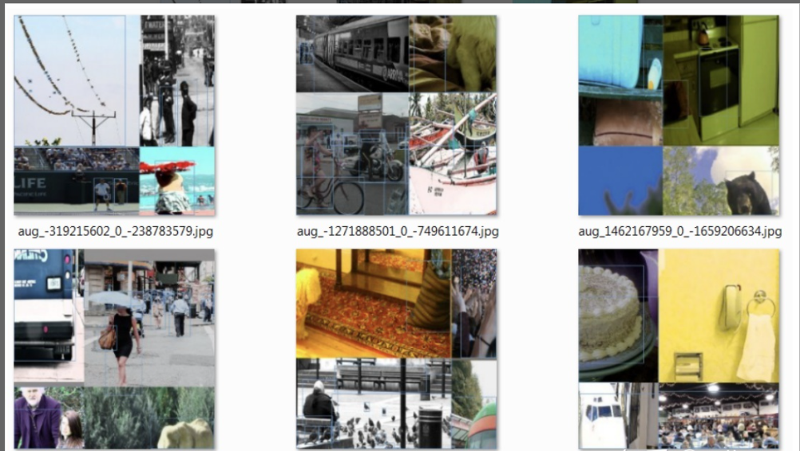

### **BoF**：

**能够提高精度而不增加推断时间**

- 比如数据增广的方法：图像几何变换、Cutout、grid mask等，
- 网络正则化的方法：Dropout、Dropblock等，
- 类别不平衡的处理方法，
- 难例挖掘方法，
- 损失函数的设计等

### **BoS**（bag of specials）

是指那些**增加稍许推断代价，但可以提高模型精度**的方法。

- 比如增大模型感受野的SPP、ASPP、RFB等，
- 引入注意力机制Squeeze-and-Excitation (SE) 、Spatial Attention Module (SAM)等 ，
- 特征集成方法SFAM , ASFF , BiFPN等，
- 改进的激活函数Swish、Mish等，
- 或者是后处理方法如soft NMS、DIoU NMS等，

### 在目标检测训练中，通常对CNN的优化改进方法

- 激活函数：ReLU，leaky-ReLU，parameter-ReLU，ReLU6，SELU，Swish或**Mish**
- bbox回归loss函数：MSE，IoU，GIoU，**CIoU**，DIoU
- 数据增强：CutOut，MixUp，**CutMix**
- 正则化方法：DropOut，DropPath，Spatial DropOut或**DropBlock**
- 通过均值和方差对网络激活进行归一化：Batch Normalization (BN), Cross-GPU Batch Normalization (CGBN or SyncBN), Filter Response Normalization (FRN), or**Cross-Iteration Batch Normalization (CBN)**
- 跨连接：Residual connections, Weightedresidual connections, Multi-input weighted residualconnections, or Cross stage partial connections (CSP)

### 数据处理

1. **Random** **Erase**

   ### **图像遮挡**

   - 用随机值或训练集的平均像素值替换图像的区域。

   

2. **Cutout**

   - 仅对 CNN 第一层的输入使用剪切方块Mask。

   

3. **Hide and Seek**

   - 将图像分割成一个由 SxS 图像补丁组成的网格，根据概率设置随机隐藏一些补丁，从而让模型学习整个对象的样子，而不是单独一块，比如不单独依赖动物的脸做识别。

   

4. **Grid Mask** 

   1. 将图像的区域隐藏在网格中，作用也是为了让模型学习对象的整个组成部分。

as

5. **MixUp**
   1. 图像对及其标签的凸面叠加。
   2. 
6. **CutMix**
   1. 将另一个图像中的剪切部分粘贴到增强图像。图像的剪切迫使模型学会根据大量的特征进行预测。
   2. 
7. **Self-Adversarial Training (SAT)**
   1. 在一定程度上抵抗对抗攻击的数据增强技术，CNN计算出Loss, 然后通过反向传播改变图片信息，形成图片上没有目标的假象，然后对修改后的图像进行正常的目标检测。需要注意的是在SAT的反向传播的过程中，是不需要改变网络权值的。
   2. 使用对抗生成可以改善学习的决策边界中的薄弱环节，提高模型的鲁棒性。因此这种数据增强方式被越来越多的对象检测框架运用。
8. **Mosaic data augmentation**
   1. 组合了两张图像，而在 Mosaic 中我们使用四张训练图像按一定比例组合成一张图像，使模型学会在更小的范围内识别对象。其次还有助于显著减少对batch-size的需求，毕竟大多数人的GPU显存有限。
   2. 

### 主干网络

1. **CSPDarknet53**

保留**yolov3的head部分，修改了主干网络为CSPDarknet53，同时采用了SPP（空间金字塔池化）的思想来扩大感受野，PANet作为neck部分。**

2. **SAM**

Attention机制中的CBAM, CBAM含有空间注意力机制和通道注意力机制,**SAM就是其中的空间注意力机制.**

3. **PANet**

   PANet融合的时候使用的方法是Addition,yoloV4中转变为cat。

   理解：cat可以明确出具体那部分权重对最终结果造成影响。

### 网络训练

### 激活函数

### 损失函数

#### 类标签平滑

- Class label smoothing是一种正则化方法。如果神经网络过度拟合和/或过度自信，我们都可以尝试平滑标签。也就是说在训练时标签可能存在错误，而我们可能“过分”相信训练样本的标签，并且在某种程度上没有审视了其他预测的复杂性。因此为了避免过度相信，更合理的做法是对类标签表示进行编码，以便在一定程度上对不确定性进行评估。YOLO V4使用了类平滑，选择模型的正确预测概率为0.9，例如[0,0,0,0.9,0...,0 ]。

