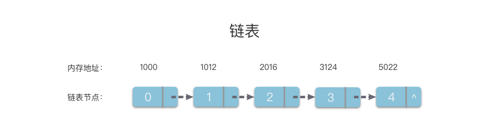
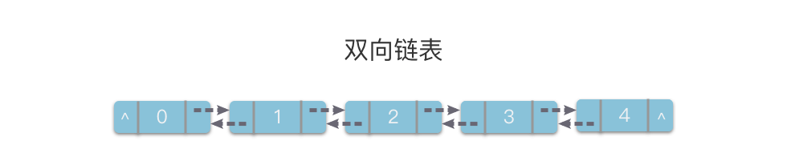

# 链表简介

## 链表定义

### **链表（Linked List）**：

一种线性表数据结构。它使用一组任意的存储单元（可以是连续的，也可以是不连续的），来存储一组具有相同类型的数据。

顺序表：一定是连续的。

**「链表」** 是实现线性表的链式存储结构的基础。

- 在链表中，数据元素之间的逻辑关系是通过指针来间接反映的。

- 逻辑上相邻的数据元素在物理地址上可能相邻，可也能不相邻。

- 其在物理地址上的表现是随机的。

  #### 优缺点

  - 优点：存储空间不必事先分配，在需要存储空间的时候可以临时申请，不会造成空间的浪费；一些操作的时间效率远比数组高（插入、移动、删除元素等）。
  - 缺点：不仅数据元素本身的数据信息要占用存储空间，指针也需要占用存储空间，链表结构比数组结构的空间开销大。

### 双向链表

> 它的每个链节点中有两个指针，分别指向直接后继和直接前驱。

从双链表的任意一个节点开始，都可以很方便的访问它的前驱节点和后继节点。

### 循环链表

它的最后一个链节点指向头节点，形成一个环。

从循环链表的任何一个节点出发都能找到任何其他节点。

