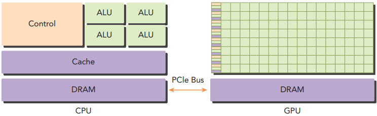
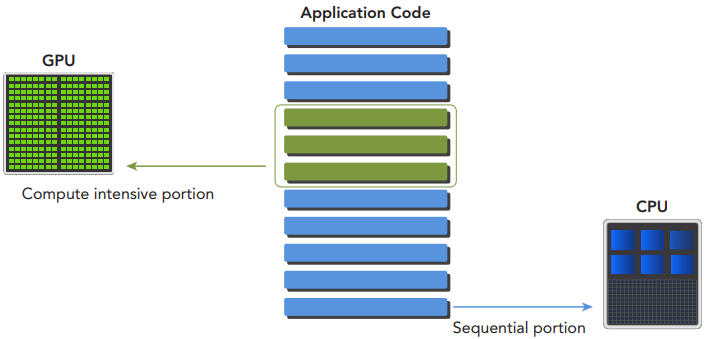
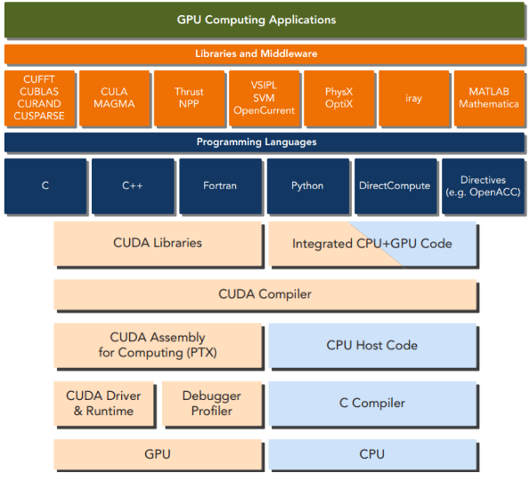

# CUDA C编程权威指南
一.异构架构编程思维
1.异构架构
一个典型的异构计算节点包括2个多核CPU插槽和2个或更多个的众核GPU。
GPU通过PCIe总线与基于CPU的主机相连来进行操作。CPU是主机端，而GPU是设备端，这样一个异构应用就包含主机代码（逻辑）和设备代码（计算）。




2.CUDA平台
CUDA平台可以通过CUDA加速库、编译器指令、应用编程接口以及行业标准程序语言的扩展（包括C|C++|Fortran|Python等）来使用。CUDA提供了2层API来管理GPU设备和组织线程，其中驱动API是一种低级API，它相对来说较难编程，
但是它对于在GPU设备使用上提供了更多的控制，每个运行时API函数都被分解为更多传给驱动API的基本运算。



 Hello World例子实战，如下所示：

```c++
#include <iostream>
__global__ void helloFromGPU()
{
    printf("Hello World from GPU!\n");
}


int main() {
    helloFromGPU<<<1,1>>>();
    return 0;
}

```

