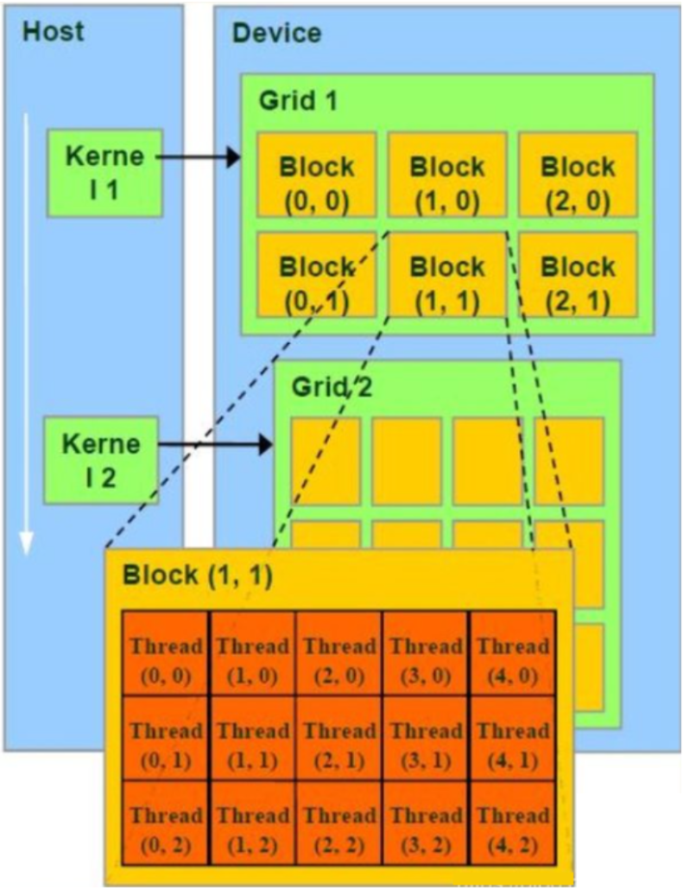
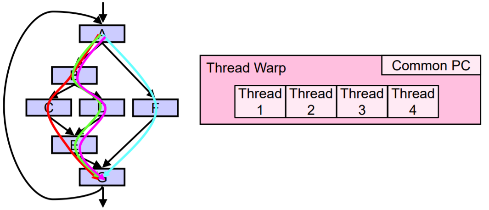

# 编程与入门

## 1.cmake 编译规则

### 1.1基本规则
```cmake
cmake_minimum_required(VERSION 3.10)
project(demo)
```
### 1.1.1 include指令
执行 include 指令时，它会把指定的文件内容读入当前的Makefile环境中。
```cmake
CONFIG        :=  ../../config/Makefile.config
CONFIG_LOCAL  :=  ./config/Makefile.config


# 执行 include 指令时，它会把指定的文件内容读入当前的Makefile环境中。
include $(CONFIG)
include $(CONFIG_LOCAL)
```
### 1.1.2 wildcard
wildcard 指令可以搜索指定目录下的所有文件，并将搜索到的文件名保存到变量中。
```cmake
KERNELS_SRC   :=  $(wildcard $(SRC_PATH)/*.cu)
```
### 1.1.3 patsubst
patsubst 指令可以搜索指定目录下的所有文件，并将搜索到的文件名保存到变量中。
```cmake
APP_OBJS      +=  $(patsubst $(SRC_PATH)%, $(BUILD_PATH)%, $(KERNELS_SRC:.cu=.cu.o))  
APP_DEPS      +=  $(KERNELS_SRC)
```
其中的%是通配符，表示任意字符串。KERNELS_SRC:.cu=.cu.o代表将KERNELS_SRC中的.cu替换为.cu.o。
### 1.1.4 编译器选项
- Xcompiler：这个选项允许您传递参数给C/C++编译器。
- fPIC：这是一个编译选项，表示生成位置无关的代码（Position Independent Code）。这意味着生成的代码可以在任何地址执行，而不仅仅是加载到固定的内存地址。这在创建共享库时很有用，因为共享库需要在多个进程或系统中共享。
```cmake
CUDAFLAGS     :=  -Xcompiler -fPIC 
```
### 1.1.5 调试选项
- g：生成用于调试的信息。
- G：生成图形调试信息，通常与NVIDIA的Nsight工具一起使用。
- O0：禁用所有优化，这有助于在调试时获得更一致的代码行为
- Wall：显示所有警告。
- Wunused-function：警告未使用的函数。
- Wunused-variable：警告未使用的变量。
- Wfatal-errors：将某些错误视为致命错误。
###  $@
Makefile中的自动变量，代表目标文件名。

### 自动编译cuda
```shell
$(BUILD_PATH)/%.cu.o: $(SRC_PATH)/%.cu
	@echo Compile CUDA $@
	@mkdir -p $(BUILD_PATH)
	@$(CUCC) -o $@ -c $< $(CUDAFLAGS) $(INCS)
	@echo finished compiling $<
.PHONY: all update show clean 
```

## GPU计算流程（CPU协同GPU计算）
一个典型的计算流程是这样的:
    - 数据从CPU的内存拷贝到GPU的内存
    - CPU把计算指令传送给GPU
    - GPU把计算任务分配到各个CUDA core并行处理
    - 计算结果写到GPU内存里, 再拷贝到CPU内存里.
在CPU上运行的称为Host程序
在GPU上运行的称为Device程序
GPU上运行的函数又被叫做Kernel函数。

Host程序在调用Device程序时，可以通过参数确定执行该Kernel的CUDA threads的数量。
CUDA在执行的时候是让Host程序里面的一个一个的Kernel函数按照Grid（线程网格）的概念在GPU上执行。

一个Kernel函数对应一个Grid。

每个Grid中的任务是一定的。当要执行这些任务的时候，每一个Grid又把任务分成一部分一部分的Block（线程块），Block中间有若干Thread（线程），再分成线程来完成。
- 每个Thread在执行Kernel函数时，会被分配一个thread ID，Kernel函数可以通过内置变量threadIdx访问。
- 每个Block在执行Kernel函数时，会被分配一个block ID，Kernel函数可以通过内置变量blockIdx访问。


GPU中的SIMT体系结构相对于CPU的SIMD（单指令多数据，Single Instruction Multiple Data）。中文翻译：单指令多线程。SIMT对于可编程性的好处使得NVIDIA的GPU架构师为这种架构命名，而不是将其描述为 SIMD 。

为了有效地管理和执行多个单线程，流多处理器（SM）采用了SIMT架构。此架构在第一个unified computing GPU中由NVIDIA公司生产的GPU引入。
## Single Instruction Multiple Threads（SIMT）
GPU使用SIMT执行 32 个并行线程的 Warp ，实现单指令、多线程，这使得每个线程能够访问自己的寄存器，从不同的地址加载和存储，并遵循不同的控制流路径。CUDA编译器和GPU一起工作，以确保Warp的线程组尽可能频繁地被分配到SM中，一起执行相同的指令序列，从而最大限度地提高性能。

每个线程可以包含控制流指令（控制流指令为标量指令）

同组Warp中的这些线程可以执行不同的控制流路径

当一个Warp中的线程分支到不同的执行路径时，产生分支发散（Branch divergence）



### Grid
一个Kernel函数对应一个Grid。

一个Grid中会分成若干个Block。同一Grid下的不同Block可能会被分发到不同的SM上执行。
Grid跑在GPU上的时候，可能是独占一个GPU，也可能是多个kernel函数并发占用一个GPU（后面这种实现需要fermi及更新的GPU架构支持）。

### Block

数个threads会被群组成一个block，同一个block中的threads可以同步，也可以通过shared memory通信


#### Thread

一个CUDA的并行程序会被以许多个Thread来执行

每个Thread中的局域变量被映射到SM的寄存器上，而Thread的执行则由CUDA核心也就是SP来完成。


Warp是GPU执行程序时的调度单位，同一个Warp里的线程执行相同的指令，即SIMT。

一个SM的CUDA core会分成几个Warp（即CUDA core在SM中分组)，由Warp scheduler负责调度。尽管Warp中的线程从同一程序地址，但可能具有不同的行为，比如分支结构。因为GPU规定同一Warp中所有线程在同一周期执行相同的指令，Warp发散分支过多会导致有效分支减少性能下降。

一个SM同时并发的Warp是有限的，因为资源限制，SM要为每个线程块分配共享内存，也要为每个线程束中的线程分配独立的寄存器，所以SM的配置会影响其所支持的线程块和Warp并发数量。

一个Warp中的线程必然在同一个block中，如果block所含线程数目不是Warp大小的整数倍，那么多出的那些thread所在的Warp中，会剩余一些inactive的thread，也就是说，即使凑不够Warp整数倍的thread，硬件也会为Warp凑足，只不过那些thread是inactive状态，需要注意的是，即使这部分thread是inactive的，也会消耗SM资源。由于warp的大小一般为32，所以block所含的thread的大小一般要设置为32的倍数。


### 编程实现
#### 1. 打印block和thread的索引
```cuda
__global__ void print_idx_kernel(){
    printf("block idx: (%3d, %3d, %3d), thread idx: (%3d, %3d, %3d)\n",
    blockIdx.z, blockIdx.y, blockIdx.x, threadIdx.z, threadIdx.y, threadIdx.x);
    
}
```
#### 2. 打印block和thread的维度
```cuda
__global__ void print_dim_kernel(){
    printf("grid dimension: (%3d, %3d, %3d), block dimension: (%3d, %3d, %3d)\n",
         gridDim.z, gridDim.y, gridDim.x,
         blockDim.z, blockDim.y, blockDim.x);
}
```
#### 3. 打印block下thread的dimension线性索引
```cuda
__global__ void print_thread_idx_per_block_kernel(){
    int index = threadIdx.z * blockDim.x * blockDim.y + \
              threadIdx.y * blockDim.x + \
              threadIdx.x;

    printf("block idx: (%3d, %3d, %3d), thread idx: %3d\n",
         blockIdx.z, blockIdx.y, blockIdx.x,
         index);
}
```
#### 4.0 打印grid下thread的dimension线性索引
```cuda

__global__ void print_thread_idx_per_grid_kernel(){
    int bSize  = blockDim.z * blockDim.y * blockDim.x;

    int bIndex = blockIdx.z * gridDim.x * gridDim.y + \
               blockIdx.y * gridDim.x + \
               blockIdx.x;

    int tIndex = threadIdx.z * blockDim.x * blockDim.y + \
               threadIdx.y * blockDim.x + \
               threadIdx.x;

    int index  = bIndex * bSize + tIndex;

    printf("block idx: %3d, thread idx in block: %3d, thread idx: %3d\n", 
         bIndex, tIndex, index);
}
```

### cuda宏处理

    错误处理：CUDA API 调用可能会因为各种原因失败，例如资源不足、错误的参数等。通过宏，你可以在每个 CUDA API 调用后立即检查错误，确保代码的健壮性。
    调试方便：如果发生错误，宏会打印出错误的文件名和行号，以及具体的错误代码和描述。这对于调试非常有帮助，因为你可以快速定位到出错的位置。
    简化代码：使用宏可以避免在每个 CUDA API 调用后都写一遍错误检查代码。通过宏，你可以在任何地方简单地使用 CUDA_CHECK(some_cuda_call)，而不需要每次都写出完整的错误检查逻辑。
    程序健壮性：一旦发现错误，宏会立即通过 exit(1) 终止程序。这确保了如果程序无法继续正确运行，它会立即停止，而不是继续执行可能导致更多问题的代码。

```cuda
#ifndef __UTILS_HPP__
#define __UTILS_HPP__

#include <cuda_runtime.h>
#include <system_error>

// 一般cuda的check都是这样写成宏
#define CUDA_CHECK(call) {                                                 \
    cudaError_t error = call;                                              \
    if (error != cudaSuccess) {                                            \
        printf("ERROR: %s:%d, ", __FILE__, __LINE__);                      \
        printf("CODE:%d, DETAIL:%s\n", error, cudaGetErrorString(error));  \
        exit(1);                                                           \
    }                                                                      \
}
#endif //__UTILS__HPP__

```cuda
inline static void __kernelCheck(const char* file, const int line) {
    /* 
     * 在编写CUDA是，错误排查非常重要，默认的cuda runtime API中的函数都会返回cudaError_t类型的结果，
     * 但是在写kernel函数的时候，需要通过cudaPeekAtLastError或者cudaGetLastError来获取错误
     */
    cudaError_t err = cudaPeekAtLastError();
    if (err != cudaSuccess) {
        printf("ERROR: %s:%d, ", file, line);
        printf("CODE:%s, DETAIL:%s\n", cudaGetErrorName(err), cudaGetErrorString(err));
        exit(1);
    }
}
```

#### cuda运算
- 设置大小
- 分配内存；拷贝到GPU
- 调用kernel来进行matmul计算
- 结果拷贝到CPU
- 释放内存

#### 打印cuda信息
```cuda
// 使用变参进行LOG的打印。比较推荐的打印log的写法
static void __log_info(const char* format, ...) {
    char msg[1000];
    va_list args;
    va_start(args, format);

    vsnprintf(msg, sizeof(msg), format, args);

    fprintf(stdout, "%s\n", msg);
    va_end(args);
}
int main(){
    int count;
    int index = 0;
    cudaGetDeviceCount(&count);
    while (index < count) {
        cudaSetDevice(index);
        cudaDeviceProp prop;
        cudaGetDeviceProperties(&prop, index);
        LOG("%-40s",             "*********************Architecture related**********************");
        LOG("%-40s%d%s",         "Device id: ",                   index, "");
        LOG("%-40s%s%s",         "Device name: ",                 prop.name, "");
        LOG("%-40s%.1f%s",       "Device compute capability: ",   prop.major + (float)prop.minor / 10, "");
        LOG("%-40s%.2f%s",       "GPU global meory size: ",       (float)prop.totalGlobalMem / (1<<30), "GB");
        LOG("%-40s%.2f%s",       "L2 cache size: ",               (float)prop.l2CacheSize / (1<<20), "MB");
        LOG("%-40s%.2f%s",       "Shared memory per block: ",     (float)prop.sharedMemPerBlock / (1<<10), "KB");
        LOG("%-40s%.2f%s",       "Shared memory per SM: ",        (float)prop.sharedMemPerMultiprocessor / (1<<10), "KB");
        LOG("%-40s%.2f%s",       "Device clock rate: ",           prop.clockRate*1E-6, "GHz");
        LOG("%-40s%.2f%s",       "Device memory clock rate: ",    prop.memoryClockRate*1E-6, "Ghz");
        LOG("%-40s%d%s",         "Number of SM: ",                prop.multiProcessorCount, "");
        LOG("%-40s%d%s",         "Warp size: ",                   prop.warpSize, "");

        LOG("%-40s",             "*********************Parameter related************************");
        LOG("%-40s%d%s",         "Max block numbers: ",           prop.maxBlocksPerMultiProcessor, "");
        LOG("%-40s%d%s",         "Max threads per block: ",       prop.maxThreadsPerBlock, "");
        LOG("%-40s%d:%d:%d%s",   "Max block dimension size:",     prop.maxThreadsDim[0], prop.maxThreadsDim[1], prop.maxThreadsDim[2], "");
        LOG("%-40s%d:%d:%d%s",   "Max grid dimension size: ",     prop.maxGridSize[0], prop.maxGridSize[1], prop.maxGridSize[2], "");
        index ++;
        printf("\n");
    }
    return 0;
}
```
[//] 打印信息
*********************Architecture related**********************
Device id:                              0
Device name:                            NVIDIA GeForce RTX 4090 Laptop GPU
Device compute capability:              8.9
GPU global meory size:                  15.68GB
L2 cache size:                          64.00MB
Shared memory per block:                48.00KB
Shared memory per SM:                   100.00KB
Device clock rate:                      1.45GHz
Device memory clock rate:               9.00Ghz
Number of SM:                           76
Warp size:                              32
*********************Parameter related************************
Max block numbers:                      24
Max threads per block:                  1024
Max block dimension size:               1024:1024:64
Max grid dimension size:                2147483647:65535:65535

#### Tiling
/*
    使用Tiling技术
    一个tile处理的就是block, 将一个矩阵分为多个小的tile，这些tile之间的执行独立，并且可以并行
*/
```cuda
  dim3 dimBlock(blockSize, blockSize);
    dim3 dimGrid(width / blockSize, width / blockSize);
    if (staticMem) {
        MatmulSharedStaticKernel <<<dimGrid, dimBlock>>> (M_device, N_device, P_device, width);
    } else {
        MatmulSharedDynamicKernel <<<dimGrid, dimBlock, sMemSize, nullptr>>> (M_device, N_device, P_device, width, blockSize);
    }

```
####  动态共享变量
```cuda
    /* 
        声明动态共享变量的时候需要加extern，同时需要是一维的 
        注意这里有个坑, 不能够像这样定义： 
            __shared__ float M_deviceShared[];
            __shared__ float N_deviceShared[];
        因为在cuda中定义动态共享变量的话，无论定义多少个他们的地址都是一样的。
        所以如果想要像上面这样使用的话，需要用两个指针分别指向shared memory的不同位置才行
    */


```

#### 流式处理


