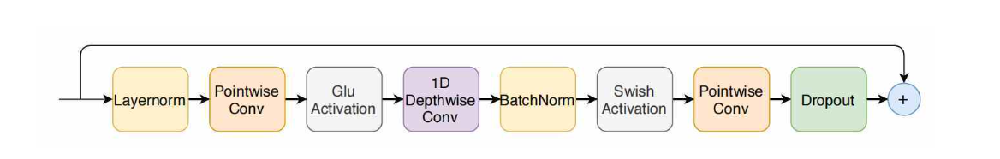
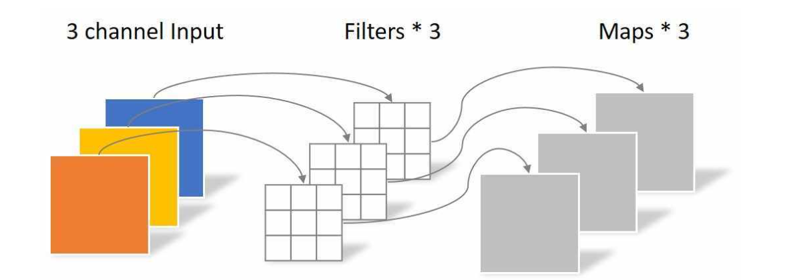
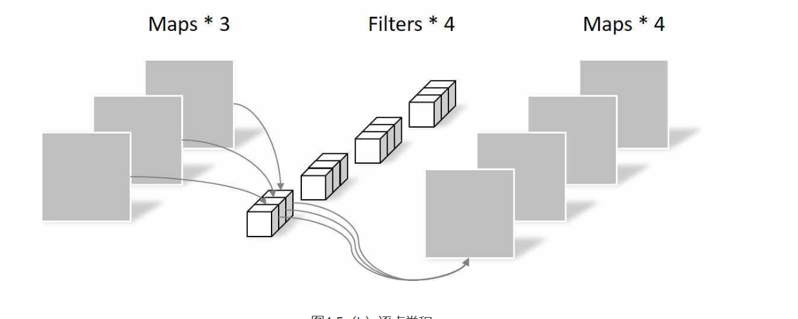
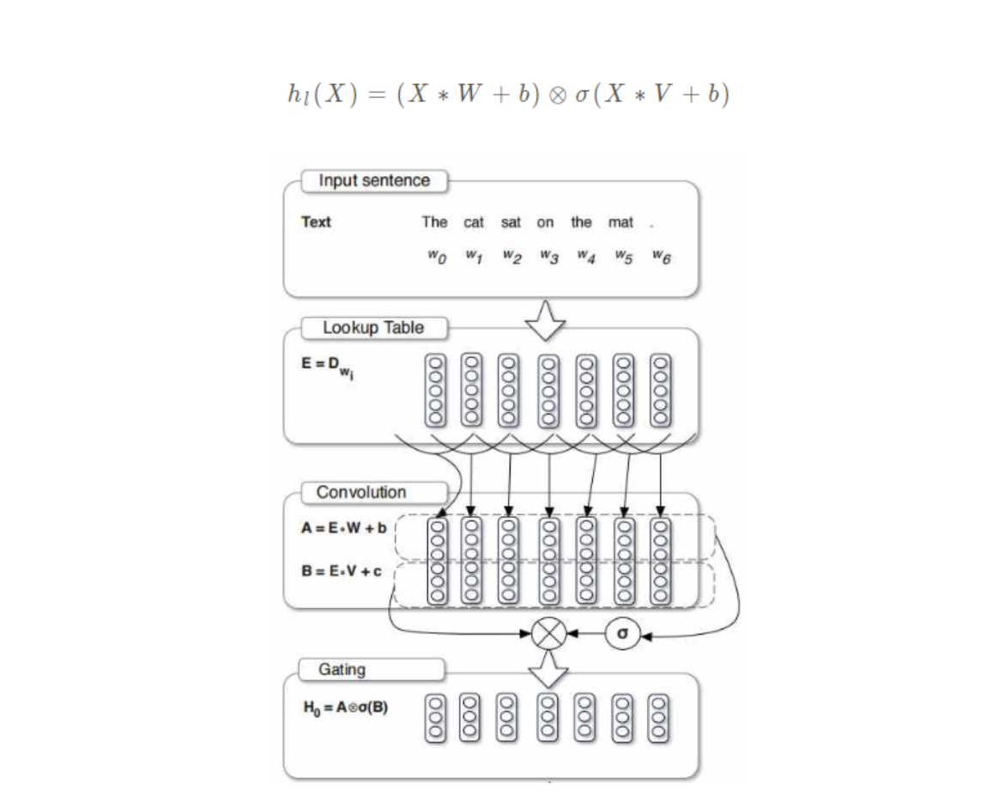

[TOC]

# Conformer

## 1.语音特征提取

### 1.1 为什么使用原始音频

- 最原始的输入是一个音频文件。
- 将音频文件读取到程序后，它们是一系列离散的采样点，通常采样率是16000，即一秒钟采样16000个点，每个采样点表示该时刻声音的振幅。
- 在这个采样率下，一条只有几秒钟的输入音频，其序列长度也会非常长，且每个采样点所包含的语音信息比较少，因此原始音频不适合直接作为模型的输入。

### 1.2 声学特征提取

更普遍的做法是提取具有更多信息的声学特征

常用的声学特征有

- 滤波器组（Filter-Bank，FBank）
- 梅尔频率倒谱系数（Mel-frequency Cepstral Coefficient，MFCC）。

以FBank特征的提取为例，对语音信号进行预处理，进行预加重、分帧、加窗等操作，最终获得FBank声学特征。[代码实现参考](/source/语音识别/md/speech.md)

- 一段音频提取出来的FBank特征可以用形状为（帧数，FBank维度）的张量矩阵来表示。

- Conformer使用的声学特征是维度为80的FBank特征

## 2 常见ASR模型

### 2. 1基于Transformer的ASR模型

​	基于Transformer的ASR模型，其输入是提取的FBank或MFCC语音特征。由于语音特征序列一般比较长，在送入模型之前，通常会进行两层步长为2的卷积操作，将序列变为原来的1/4长。

​	基于Transformer的ASR模型编码器和解码器与原始Transformer没有差别，在编码器端，是一个多头注意力子层和一个前馈网络子层，它们分别进行残差连接和层标准化（LayerNorm）操作，而在解码器端则会多一个编码器-解码器多头注意力层，用于进行输入和输出之间的交互。

 

## 2.2 基于CNN的ASR模型

- 除了Transformer外，也有部分工作是基于CNN来捕获局部的特征来进行语音识别，比如ContextNet{Contextnet: Improving convolutional neural networks for automatic speech recognition with global context}。

- 受感受野范围的限制，CNN只能够在局部的范围内对文本进行建模，相比于RNN或Transformer，缺乏全局的文本信息。ContextNet通过引入“压缩和激发（Squeeze-and-Excitation，SE）”层{Squeeze-and-excitation networks}来获取全局特征信息。
- 如下图所示，SE在不同特征向量之间进行全局平均池化（Global Average Pooling），然后再通过两个全连接层和sigmoid得到每个特征向量的权重，从而实现全局信息交互。然而由于只是通过平均池化和全连接来进行全局信息的交互，这种方法仍然无法很好地获取全局特征。

### 2.3 conformer 

#### 2.3.1 传统transfomer与cnn的不足

基于自注意力的Transformer和基于CNN的模型各有优势和不足。

- 自注意力机制能够对全局的上下文进行建模，不擅长提取细粒度的局部特征模式；
- CNN则相反，缺乏上下文的提取能力。

作者认为，对于ASR任务来说，**全局特征**和局部特征都在语音序列的建模中起到关键的作用。其中作用如下：

- 全局特征的作用比较好理解，因为语音序列和文本序列一样，其语义信息也会受到上下文的影响，比方说，在中文的语音识别里，可能会出现相同的音节对应多个不同的字（词），如“他”“她”和“它”、“矿工”和“旷工”、“记忆”和“技艺”等，这时候就需要包含上下文信息的全局特征来进行消歧。

- 局部特征的作用则体现为，一个发音单元是由多个相邻的语音帧构成的，用CNN可以捕获如发音单元边界等局部特征信息。相关工作{Attention augmented convolutional networks}已经验证了将两者结合起来的优势。

Conformer块包括四个部分：第一个前馈模块、一个多头注意力模块、一个卷积模块以及第二个前馈模块，其中每一个模块内又会有一些子模块。Conformer块的输出会最终进行LayerNorm。相比于Transformer，除了在多头自注意力之后增加卷积模块外，Conformer还进行了其它一些改进，如Pre-Norm、相对位置编码等，这些改进都对模型有很重要的影响。

## 3. conformer 结构参考

### 3.1 Post-Norm和Pre-Norm

LayerNorm{Layer Normalization}是一种正则化手段，有助于训练深层模型并加速训练。

根据**LayerNorm在残差块中的位置不同**，可以分为**Post-Norm**和Pre-Norm两种结构。

### 3.2 多头自注意力模块

- 自注意力机制**无法获取输入元素序列的顺序信息**，因此引入了**位置编码**来作为补充。

单词的位置与顺序定义了语法，也影响着语义。无法捕获的单词顺序会导致我们很难理解一句话的含义。

在NLP任务中，对于任何神经网络架构，能够有效识别每个词的位置与词之间的顺序是十分关键的。传统的循环神经网络（RNN）本身通过自回归的方式考虑了单词之间的顺序。然而Transformer 架构不同于RNN，Transformer 使用纯粹的自注意力机制来捕获词之间的联系。纯粹的自注意力机制具有**置换不变**的性质（[证明请见 (opens new window)](https://arxiv.org/abs/1912.10077)）。换句话说，Transformer中的自注意力机制无法捕捉输入元素序列的顺序。因此我们需要一种方法将单词的顺序合并到Transformer架构中，于是**位置编码**应运而生。

### 3.3 卷积模块

引入卷积模块来建模序列的局部特征。卷积模块使用了深度可分离卷积来建模序列，以及门控线性单元对信息进行过滤，此外还使用批量标准化（BatchNorm）和Swish激活函数来帮助训练深层模型。

#### 3.3.1 深度可分离卷积

深度卷积（Depthwise-Convolution，也可以称为逐通道卷积）和逐点卷积（Pointwise-Convolution）配合起来使用，是一种用于代替传统卷积网络的高效组合方式，称为深度可分离卷积（Depthwise Separable Convolution）。相比于传统卷积，深度可分离卷积可以有效降低网络的参数量，提高计算效率。其中，深度卷积只关注每个通道内序列之间的依赖关系，不关注不同通道之间的依赖；而逐点卷积关注了不同通道之间的依赖关系，不关注通道内的依赖。将这两种卷积组合起来，可以在较少参数量下，实现传统卷积的效果。

深度卷积：

点卷积：

#### 3.3.2 门控线性单元

门控线性单元（Gated Linear Unit，GLU）是一个基于CNN的门控机制，可以缓解梯度消失现象，加速模型收敛。如图所示，GLU将输入分别经过两个卷积变换，其中一个经过变换之后再通过非线性函数sigmoid，作为门控单元来对输出进行控制。其输出公式如下所示。

在RNN中，信息会随着序列的变长而逐渐丢失，因此需要门控机制来筛选信息，使有用的信息得以保留并往下传递。GLU的门控机制也有类似的作用，可以对特征进行筛选，使有用的特征传递到下一层，因此有利于CNN对语言进行逐层建模Conformer利用GLU的这种语言建模能力，更好地建模局部特征。

#### 3.3.3 Swish激活函数

Swish函数的公式和图像如下，相比于常用的ReLU函数，其具有平滑、非单调的特点，在深层模型上的表现要更优。使用**Swish**能够使得Conformer更快地收敛。
$$
f(x)=x * \operatorname{sigmoid}(\beta x)
$$

## 参考

[Conformer的来龙去脉你都了解清楚了吗？——语音识别论文解读](https://weibo.com/ttarticle/p/show?id=2309404773315696001660)