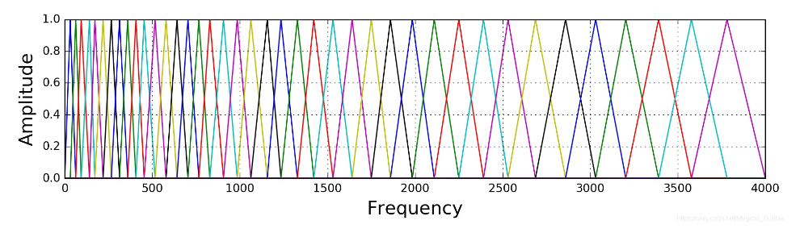

[TOC]


# 语音识别算法

## 1. 语音识别简介

### 1.1 **语音识别**

#### 1.1.1 自动语音识别

（Automatic Speech Recognition，ASR)，其目标是将人类的语音转换为文字。

#### 1.1.2 应用

- 离线语音识别（非流式）

指包含语音的音频文件已经存在，需使用语音识别应用对音频的内容进行整体识别。典型应用有音视频会议记录转写、**音频内容分析**及审核、视频字幕生成等。

- 实时在线语音识别（流式）

指包含语音的实时音频流，被连续不断地送入语音识别引擎，过程中获得的识别结果即时返回给调用方。典型应用有手机语音输入法、交互类语音产品（如智能音箱、车载助手）、会场同声字幕生成和翻译、网络直播平台实时监控、电话客服实时质量检测等。

### 1.2 语音识别流程

#### 1.2.1 预处理

预处理(格式转换、压缩编解码、音频数据抽取、声道选择（通常识别引擎只接收单声道数据）、采样率/重采样（常见的识别引擎和模型采样率一般为8kHz、16kHz），FBank**特征提取**。

语音信号被设备接收后 (比如麦克风)，会通过 $A / D$ 转换，将模拟信号转换为数字信号，一般会有采样、量化和编码三个步骤，采样率要遵循奈奎斯特采样定律: $f s>=2 f$ ，比如电话语音的频率一般在 $300 \mathrm{~Hz} \sim 3400 \mathrm{~Hz}$ ，所以采用 $8 \mathrm{kHz}$ 的采样率足矣。

- 将音频文件读取到程序后，它们是一系列离散的采样点，通常采样率是**16k/8k**，即一秒钟采样16000/8000个点，每个采样点表示该时刻声音的振幅。
- 在这个采样率下，一条只有几秒钟的输入音频，其序列长度也会非常长，且每个采样点所包含的语音信息比较少，因此原始音频不适合直接作为模型的输入。无论是传统方法的语音识别技术还是基于神经网络的语音识别技术，都**需要进行语音的预处理。**
- 预处理流程的核心是**快速傅立叶变换**。快速傅立叶变换的作用看似杂乱无章的信号考虑分解为一定振幅、相位、频率的基本正弦(余弦)信号。**傅里叶变换允许我们分解一个信号，以确定不同频率的波的相对强度。**

#### 1.2.2 语音检测和断句

对于离线语音识别应用，断句模块的作用是快速过滤并切分出音频文件中的人声片段，且尽最大可能保证每个片段都为完整的一句话；**对于实时在线语音识别应用**，断句模块则需要能够从一个持续的语音流中，第一时间检测出用户什么时候开始说话（也称为起点检测），以及什么时候说完（也称为尾点检测）。

#### 1.2.3 音频场景分析

除断句外，由于一些应用本身的复杂性，导致原生的音频在被送入识别引擎之前，还需要进一步进行分析和过滤，我们把这类统称为音频场景分析。一般情况**语种识别**也会放在这里。

#### 1.2.4 识别引擎(**语音识别的模型**)

##### 1. 传统语音识别模型

- 经典的语音识别概率模型 ，分为**声学模型**和**语言模型**两部分，现将语音转换为音素，再将音素转换为单词。

- 对于声学模型来说，单词是一个比较大的建模单元，因此声学模型p（Y|w）中的单词序列w会被进一步拆分成一个音素序列。假设Q是单词序列w对应的发音单元序列，这里简化为音素序列，那么声学模型p（Y|w）可以被进一步转写为。一般会用隐马尔可夫模型来进行建模。**音素表，由声学专家定义。**

- 语言模型，使用n-gram模型。

- 传统语音识别 缺点，精度差；优点，速度快可部署在嵌入式设备。

##### 2. 端到端的语音识别模型

2014年左右，谷歌的研究人员发现，在大量数据的支撑下，直接用神经网络可以从输入的音频或音频对应的特征直接预测出与之对应的单词，而**不需要**像我们上面描述的那样，拆分成声学模型和语言模型。简单来说构建一个模型，input ：语音，output：文本即可。

###### 基于Transformer的ASR模型

- ASR可以被看成是一种序列到序列任务，输入一段声音特征序列，通过模型计算后，输出对应的文字序列信号。在端到端ASR模型中，这种序列到序列的转换**不需要经过中间状态，如音素等，而直接生成输出结果。**
- 基于Transformer的ASR模型，**其输入是提取的FBank或MFCC语音特征。**由于语音特征序列一般比较长，在送入模型之前，通常会进行两层步长为2的卷积操作，将序列变为原来的1/4长。
- **基于Transformer的ASR模型编码器和解码器与原始Transformer没有差别**，在编码器端，是一个多头注意力子层和一个前馈网络子层，它们分别进行残差连接和层标准化（LayerNorm）操作，而在解码器端则会多一个编码器-解码器多头注意力层，用于进行输入和输出之间的交互。
- 缺点:自注意力机制能够对全局的上下文进行建模，不擅长提取细粒度的局部特征模式

######  基于CNN的ASR模型

- 基于CNN来捕获局部的特征来进行语音识别，比如 ContextNet。
- 由于受**感受野**范围的限制，CNN只能够在局部的范围内对文本进行建模，相比于RNN或Transformer，缺乏全局的文本信息。ContextNet通过引入“压缩和激发（Squeeze-and-Excitation，SE）”层{Squeeze-and-excitation networks}来获取全局特征信息。
- Squeeze-and-Excitation，SE 模块捕获全局特征的能力， 在图像领域的应用很多。 目标检测，通过引该模块,可以再不损失提取局部特征的能力下，加强对全局特征的提取。即，添加注意力可以加强一定的全局特征提取。但只是通过平均池化和全连接来进行全局信息的交互，这种方法在语音识别领域**仍然无法很好地**获取全局特征。

###### Conformer

- 目前业界主流框架，通过一定的组合方式(Transfomer+CNN)应用到ASR任务上。考虑到语音序列建模的特点，Conformer加入了卷积模块，利用CNN的局部建模能力来获取序列的局部特征。
- Conformer结构是在Transformer模型编码器的基础上增加卷积模块, 构成Conformer 模块。
- WeNet 是一款面向工业落地应用的语音识别工具包(框架)，提供了从语音识别模型的训练到部署的一条龙服务，也是目前业界最常用的开源框架。

###### Paraformer

- Paraformer 是阿里INTERSPEECH 2022 提出的一个模型，并已经开源。一种具有高识别率与计算效率的单轮非自回归模型 Paraformer。

- 该模型开箱可用，该开源模型的实际识别效果和TEG 的模型效果差不多。**是目前唯一开箱即用的开源预训练模型**， 我认为主要原因是该模型的训练集中包含了工业级别的数据。

#### 1.2.5 工程调度 & 异常处理

工程部署和异常类型处理

### 1.3 基础知识

- 声音（sound)是由物体**振动**产生的声波。是通过**介质**（空气或固体、液体）传播。
- 语音的产生基本原理还是振动。不同位置的震动频率不一样，信号也就不一样，不过信号由**基频**和一些**谐波**构成
- 一个振动产生的波是一个具有一定频率的振幅最大的正弦波叫**基频**。 这些高于基波频率的小波就叫作**谐波**。
- 采样率（Sample Rate）：
  - 采样率是指在**单位时间内对连续模拟信号进行离散采样的次数**。它通常以赫兹（Hz）为单位表示。
  - 采样率决定了数字音频信号中每秒包含多少个采样点（样本）。例如，如果采样率为8000 Hz，表示每秒会对模拟音频信号进行8,000次采样，生成相应数量的离散样本。
  - 采样率决定了数字音频信号的频率范围。根据奈奎斯特定理（Nyquist Theorem），为了正确重构连续信号，采样率必须至少是模拟信号中最高频率的两倍。
- 采样时长（Sampling Duration）：
  - 采样时长是指在连续模拟信号中，每个采样点之间的时间间隔。它通常以秒为单位表示。
  - 采样时长是由采样率决定的，可以通过以下公式计算：采样时长 = 1 / 采样率。这表示采样率越高，采样时长越短。
  - 采样时长决定了数字音频信号中相邻采样点之间的时间分辨率。较短的采样时长可以更精细地捕捉信号的瞬时变化。


## 2.语音预处理

### 2.1 数据预处理流程

#### 2.1.1 时域与频域图显示

```python
import numpy as np
from scipy.io import wavfile
from scipy.fftpack import dct
import warnings
warnings.filterwarnings('ignore')
import matplotlib.pyplot as plt
# 绘制时域图
def plot_time(signal, sample_rate):
    time = np.arange(0, len(signal)) * (1.0 / sample_rate)
    plt.figure(figsize=(20, 5))
    plt.plot(time, signal)
    plt.xlabel('Time(s)')
    plt.ylabel('Amplitude')
    plt.grid()
    plt.show()

# 绘制频域图
def plot_freq(signal, sample_rate, fft_size=512):
    xf = np.fft.rfft(signal, fft_size) / fft_size
    freqs = np.linspace(0, sample_rate/2, int(fft_size/2) + 1)
    xfp = 20 * np.log10(np.clip(np.abs(xf), 1e-20, 1e100))
    plt.figure(figsize=(20, 5))
    plt.plot(freqs, xfp)
    plt.xlabel('Freq(hz)')
    plt.ylabel('dB')
    plt.grid()
    plt.show()


# 绘制频谱图
def plot_spectrogram(spec, note):
    fig = plt.figure(figsize=(20, 5))
    heatmap = plt.pcolor(spec)
    fig.colorbar(mappable=heatmap)
    plt.xlabel('Time(s)')
    plt.ylabel(note)
    plt.tight_layout()
    plt.show()


if __name__ == '__main__':
    # signal 是音频信号，sample_rate 是采样率。fft_size 是用于离散傅里叶变换（FFT）的窗口大小。 spec 是频谱数据
    sample_rate, signal = wavfile.read('./zh.wav')
    # 打印采样率和信号长度的信息。
    signal = signal[0: int(3.5 * sample_rate)]  # Keep the first 3.5 seconds
    print('sample rate:', sample_rate, ', frame length:', len(signal))
    # plot_time函数绘制时域图，显示音频信号的波形。
    # plot_freq 函数绘制频域图，显示音频信号的频谱信息。
    plot_time(signal, sample_rate)
    plot_freq(signal, sample_rate)


```


#### 2.1.2 预加重（Pre-Emphasis）

- 在音频信号中**突出重要的高频信息，减小低频噪音的影响，从而改善音频信号的特性，提高信噪比，以便更好地进行后续信号处理和特征提取**

- 语音信号往往会有频谱倾斜（Spectral Tilt）现象，即高频部分的幅度会比低频部分的小，预加重在这里就是起到一个平衡频谱的作用，增大高频部分的幅度。它使用如下的一阶滤波器来实现：
  $$
  y(t)=x(t)-\alpha x(t-1), \quad 0.95<\alpha<0.99
  $$
  信号频率的高低主要是由信号电平变化的速度所决定，对信号做一阶差分时，高频部分（变化快的地方）差分值大，低频部分（变化慢的地方）差分值小，达到平衡频谱的作用。有助于减小信号的连续性，并提高语音特征的辨识度。

  一阶滤波器对音频信号中的快速变化进行增强，尤其是在高频部分。这有助于突出音频信号的高频成分，减小低频成分的影响。

添加以下代码：

```python
pre_emphasis = 0.97
emphasized_signal = np.append(signal[0], signal[1:] - pre_emphasis * signal[:-1])
plot_time(emphasized_signal, sample_rate)
```

前后两张时域图对比：


#### 2.1.3 分帧

在预加重之后，需要将信号分成**短时帧**。分为短时帧原因如下：

1. 时间-频域分析：语音信号通常是时域信号，通过分帧可以将长时间的语音信号分割成短时间的帧或段。也就是说：**信号中的频率会随时间变化（不稳定的），一些信号处理算法（比如傅里叶变换）通常希望信号是稳定**，认为每一帧之内的信号是短时不变的。每个帧可以视为短时间内的静态信号，这有助于进行时间-频域分析。语音信号在短时间内通常是稳态的，这使得在每个帧上进行频谱分析更加准确。
2. 特征提取：在语音识别中，常常需要提取各种语音特征，例如梅尔频率倒谱系数（MFCC）、短时能量、短时过零率等。这些特征通常在每个帧上计算，然后用于训练和识别过程。分帧使得可以针对每个帧独立地计算这些特征，从而更好地捕获语音信号的动态特性。
3. 噪声抑制：在分帧过程中，可以采用一些噪声抑制技术来减小每个帧上的噪声影响。这可以帮助提高语音识别系统的性能，尤其是在嘈杂环境中。
4. 帧间重叠：通常，相邻帧之间会有一定的重叠，以确保语音信号的连续性。这有助于减小帧与帧之间的不连续性，使特征提取和识别过程更加平滑。
5. 窗函数应用：在分帧过程中，通常会应用窗函数来减小每个帧的边界效应。常见的窗函数包括汉宁窗（Hanning window）和汉明窗（Hamming window）等。这些窗函数有助于减小帧边界处的振荡，提高频谱估计的准确性。

如何分帧：

1. 采样率和帧长的选择：首先，需要确定音频信号的采样率和帧长。典型的采样率为8 kHz、16 kHz或者44.1 kHz等。帧长通常在20毫秒（ms）到30毫秒之间，常见的帧长是25 ms。帧移（帧之间的时间间隔）通常为10毫秒，以确保帧之间有重叠。
2. 帧间重叠：为了减小帧与帧之间的不连续性，通常会应用帧间重叠。典型的重叠比例为50%或者75%，这意味着相邻帧之间有一半或三分之一的数据重叠。例如，对于25毫秒帧长，12.5毫秒的帧移可以实现50%的重叠。
3. 窗函数的应用：在每个帧上应用窗函数以减小帧边界处的振荡。常用的窗函数包括汉宁窗（Hanning window）、汉明窗（Hamming window）、布莱克曼窗（Blackman window）等。窗函数的选择可以根据应用的具体需求来决定。
4. 帧的提取：音频信号被划分为一系列重叠的帧。每个帧通常以时间域形式表示为一个一维数组。
5. 特征提取：对每个帧进行特征提取，常用的特征包括梅尔频率倒谱系数（MFCC）、短时能量、短时过零率等。这些特征用于描述每个帧的频谱特性。
6. 后续处理：提取的特征可以进一步进行处理，例如，进行降维、去除不相关的信息，或者用于语音识别系统的训练和分类。

```python
# 定义帧的时长和帧之间的时间间隔（以秒为单位）
frame_size, frame_stride = 0.025, 0.01

# 计算帧的长度和帧之间的时间间隔（以样本点数表示）
frame_length, frame_step = int(round(frame_size * sample_rate)), int(round(frame_stride * sample_rate))

# 获取输入音频信号的长度
signal_length = len(emphasized_signal)

# 计算需要的帧数量
num_frames = int(np.ceil(np.abs(signal_length - frame_length) / frame_step)) + 1

# 计算填充后的信号长度，以确保能容纳所有帧
pad_signal_length = (num_frames - 1) * frame_step + frame_length

# 创建一个零数组，用于填充信号，以满足长度要求
z = np.zeros((pad_signal_length - signal_length))
pad_signal = np.append(emphasized_signal, z)

# 创建帧的索引矩阵
indices = np.arange(0, frame_length).reshape(1, -1) + np.arange(0, num_frames * frame_step, frame_step).reshape(-1, 1)

# 提取每个帧并存储在 frames 数组中
frames = pad_signal[indices]

# 打印帧数组的形状
print(frames.shape)

```

#### 2.1.4 加窗

- 改善信号的频谱分析窗函数
- （也称为窗口函数）是一种数学函数，它与原始信号相乘以限制信号在一段时间内的有效窗口，以减小频谱泄漏（spectral leakage）和改善频谱分辨率。加窗的主要目的包括以下几点：
  1. 减小频谱泄漏：频谱泄漏是指当你对一个信号进行傅立叶变换以进行频谱分析时，由于信号在无穷的时间范围内存在，导致频谱图中的能量泄漏到邻近的频率分量中。通过应用窗函数，你可以将信号限制在窗口内，减小了信号在窗口之外的影响，从而减小频谱泄漏。
  2. 窗口形状：窗口函数的形状可以根据需要选择，不同的窗口函数具有不同的性质。例如，汉宁窗（Hanning window）、汉明窗（Hamming window）和布莱克曼-哈里斯窗（Blackman-Harris window）等常见窗口函数具有不同的频谱特性，可用于调整频谱分析的性能。
  3. 频谱分辨率：窗口函数的选择会影响频谱分析的频率分辨率。某些窗口函数可以提供较高的频率分辨率，而其他窗口函数可以提供更低的频率分辨率。根据任务需求，可以选择适当的窗口函数来平衡时间分辨率和频率分辨率。
- 如果需要更精确的频谱分析和较低的频谱泄漏，则通常会选择**布莱克曼-哈里斯窗**。如果需要**一般性能**的窗口函数，可以考虑使用**汉宁窗或汉明窗**。选择窗口函数时，需要权衡频谱分辨率、频谱泄漏和计算复杂性等因素。

在分帧之后，通常需要对每帧的信号进行加窗处理。目的是让帧两端平滑地衰减，这样可以降低后续傅里叶变换后旁瓣的强度，取得更高质量的频谱。常用的窗有：矩形窗、汉明 (Hamming) 窗、汉宁窗 (Hanning)，以汉明窗为例，其窗函数为:
$$
w(n)=0.54-0.46 \cos \left(\frac{2 \pi n}{N-1}\right)
$$

这里的 $0<=n<=N-1 ， N$ 是窗的宽度。

```python
frames *= hamming
#%%
plot_time(frames[1], sample_rate)
```


#### 2.1.5 快速傅里叶变换 (FFT)

对于每一帧的加窗信号，进行N点FFT变换，也称短时傅里叶变换（STFT），N通常取256或512，然后用如下的公式计算能量谱:
$$
P=\frac{\left|F F T\left(x_i\right)\right|^2}{N}
$$
在信号处理中，对加窗后的信号进行快速傅里叶变换（FFT）的主要目的是将信号从时域转换为频域，以便进行频谱分析和频域特征提取。这个过程具有以下几个重要的原因和优势：

1. **频谱分析：** 加窗后的信号可以被视为有限持续时间的信号，这种信号的频谱是有限的，因此可以通过FFT来计算其频谱。频谱分析允许你了解信号在不同频率上的频率成分和能量分布。
2. **频域特征提取：** 对信号进行FFT后，可以提取各种频域特征，如频率、频谱幅度、相位等。这些特征对于信号识别、分析和处理非常有用，例如，在语音识别中提取声谱特征（MFCC）。
3. **计算效率：** 快速傅里叶变换（FFT）是一种高效的算法，可以快速计算大量数据点的频谱。与传统的傅里叶变换方法相比，FFT通常更快，因此适用于实时信号处理和大规模数据的频谱分析。
4. **减小频谱泄漏：** 使用窗口函数对信号加窗有助于减小频谱泄漏。频谱泄漏是指由于信号在时间轴上不是完美的周期信号，导致频谱中出现非目标频率分量的现象。通过加窗，你可以限制信号在窗口内，减小了信号在窗口之外的影响，从而减小了频谱泄漏。

```python
NFFT = 512
mag_frames = np.absolute(np.fft.rfft(frames, NFFT))
pow_frames = ((1.0 / NFFT) * (mag_frames ** 2))
print(pow_frames.shape)
```

```python
plt.figure(figsize=(20, 5))
plt.plot(pow_frames[1])
plt.grid()
```


#### 2.1.6  FBank特征（Filter Banks）

过上面的步骤之后，在能量谱上应用Mel滤波器组，就能提取到FBank特征。Mel刻度，这是一个能模拟人耳接收声音规律的刻度，人耳在接收声音时呈现非线性状态，对高频的更不敏感，因此Mel刻度在低频区分辨度较高，在高频区分辨度较低，与频率之间的换算关系为：
$$
\begin{gathered}
m=2595 \log _{10}\left(1+\frac{f}{700}\right) \\
f=700\left(10^{m / 2595}-1\right)
\end{gathered}
$$

Mel滤波器组就是一系列的三角形滤波器，通常有 40 个或 80 个，在中心频率点响应值为 1 ，在两边的滤波器中心点衰减到0，如下图:



具体公式可以写为:
$$
H_m(k)=\left\{\begin{array}{cl}
0 & k<f(m-1) \\
\frac{k-f(m-1)}{f(m)-f(m-1)} & f(m-1) \leq k<f(m) \\
1 & k=f(m) \\
\frac{f(m+1)-k}{f(m+1)-f(m)} & f(m)<k \leq f(m+1) \\
0 & k>f(m+1)
\end{array}\right.
$$

最后在能量谱上应用Mel滤波器组，其公式为:
$$
Y_t(m)=\sum_{k=1}^N H_m(k)\left|X_t(k)\right|^2
$$

其中， $k$ 表示FFT变换后的编号， $\mathrm{m}$ 表示meli虑波器的编号。

```python
low_freq_mel = 0
high_freq_mel = 2595 * np.log10(1 + (sample_rate / 2) / 700)
print(low_freq_mel, high_freq_mel)
nfilt = 40
mel_points = np.linspace(low_freq_mel, high_freq_mel, nfilt + 2)  # 所有的mel中心点，为了方便后面计算mel滤波器组，左右两边各补一个中心点
hz_points = 700 * (10 ** (mel_points / 2595) - 1)
fbank = np.zeros((nfilt, int(NFFT / 2 + 1)))  # 各个mel滤波器在能量谱对应点的取值
bin = (hz_points / (sample_rate / 2)) * (NFFT / 2)  # 各个mel滤波器中心点对应FFT的区域编码，找到有值的位置
for i in range(1, nfilt + 1):
    left = int(bin[i-1])
    center = int(bin[i])
    right = int(bin[i+1])
    for j in range(left, center):
        fbank[i-1, j+1] = (j + 1 - bin[i-1]) / (bin[i] - bin[i-1])
    for j in range(center, right):
        fbank[i-1, j+1] = (bin[i+1] - (j + 1)) / (bin[i+1] - bin[i])
print(fbank)
filter_banks = np.dot(pow_frames, fbank.T)
filter_banks = np.where(filter_banks == 0, np.finfo(float).eps, filter_banks)
filter_banks = 20 * np.log10(filter_banks)  # dB
print(filter_banks.shape)
plot_spectrogram(filter_banks.T, 'Filter Banks')

```


#### 2.1.7 MFCC

Mel频率倒谱系数（MFCC）是一种常用于音频信号处理和语音识别的特征提取方法，它可以帮助捕捉声音的频谱信息。

对每个Mel滤波器通道的幅度谱取对数，以增加特征的动态范围，通常使用自然对数或对数变换。取对数后的结果表示为 $log(E)$，其中 $E$ 是能量。然后进行**离散余弦变换（Discrete Cosine Transform，DCT）：** 对取对数后的Mel滤波器通道进行$DCT$，以获得最终的$MFCC$系数。$DCT$的公式为：
$$
C(k) = \sum_{n=0}^{N-1} \log(E(n)) \cdot \cos\left(\frac{\pi}{N} \cdot k \cdot (n + \frac{1}{2})\right)
$$
其中，$C(k)$ 是第 $k$ 个$MFCC$系数，$N$ 是Mel滤波器通道的数量。

最终，得到的$MFCC$系数 $C(k)$ 可以用于进行音频特征的表示和分析，通常作为机器学习模型的输入用于语音识别等任务。这些系数捕捉了声音的频谱特征，具有很好的辨识性。

```python
# MFCC绘制
num_ceps = 12
mfcc = dct(filter_banks, type=2, axis=1, norm='ortho')[:, 1:(num_ceps+1)]
print(mfcc.shape)
plot_spectrogram(mfcc.T, 'MFCC Coefficients')

```


MFCC（Mel频率倒谱系数）计算通常包括一个正弦提升（cepstral mean normalization 或 cepstral mean subtraction）步骤，用于进一步改善MFCC特征的性能。正弦提升的目的是减小不同说话人和环境条件下的语音信号之间的差异，以提高语音识别系统的鲁棒性。

正弦提升的主要思想是在MFCC系数上应用一个谱凸显（spectral flattening）函数，以**平滑MFCC系数之间的差异，并降低高频分量的权重，从而减小高频分量对语音识别的影响**。正弦提升通常包括以下几个步骤：

1. 计算MFCC系数：首先，计算原始MFCC系数，按照上述步骤计算出MFCC系数。

2. 计算MFCC的均值：对于每个MFCC系数 \(C(k)\)，计算在训练数据集中的所有样本中该系数的均值。这将得到一个均值向量，其中每个元素对应一个MFCC系数。

3. 应用正弦提升：对于每个MFCC系数 \(C(k)\)，将其减去相应的均值 \(M(k)\) 并乘以一个正弦提升系数（通常是一个谱凸显函数的系数），得到提升后的MFCC系数 \(C'(k)\)。
   $$
   C'_i(k) = wC_i(k)
   $$

   $$
   w_i=\frac{D}{2} \sin \left(\frac{\pi * i}{D}\right)
   $$

   

4. 使用提升后的MFCC系数：可以使用提升后的MFCC系数 \(C'(k)\) 作为特征向量，用于语音识别或其他音频处理任务。

正弦提升有助于消除说话人和环境条件的变化，使MFCC特征更具判别性和鲁棒性。提升的程度通常由正弦提升系数的选择来控制，这个系数通常需要在训练数据上进行调整和优化。正弦提升是MFCC特征处理中的一个重要步骤，通常在计算MFCC后应用。

```python
cep_lifter = 23
(nframes, ncoeff) = mfcc.shape
n = np.arange(ncoeff)
lift = 1 + (cep_lifter / 2) * np.sin(np.pi * n / cep_lifter)
mfcc *= lift
plot_spectrogram(mfcc.T, 'MFCC Coefficients')
```


## 参考笔记

[通俗的讲解语音识别技术 - 知乎 (zhihu.com)](https://zhuanlan.zhihu.com/p/635372844)

[ASR中常用的语音特征之FBank和MFCC（原理 + Python实现）_完成fbank、mfcc两种声学特征提取的代码实现-CSDN博客](https://blog.csdn.net/Magical_Bubble/article/details/90295814)

