- - nosql介绍

    ## NoSQL：一类新出现的数据库(not only sql)

    - 泛指非关系型的数据库
    - 不支持SQL语法
    - 存储结构跟传统关系型数据库中的那种关系表完全不同，nosql中存储的数据都是KV形式
    - NoSQL的世界中没有一种通用的语言，每种nosql数据库都有自己的api和语法，以及擅长的业务场景
    - NoSQL中的产品种类相当多：
      - Redis
      - Mongodb
      - Hbase hadoop
      - Cassandra hadoop

    ## NoSQL和SQL数据库的比较：

    - 适用场景不同：sql数据库适合用于关系特别复杂的数据查询场景，nosql反之
    - **事务** 特性的支持：sql对事务的支持非常完善，而nosql基本不支持事务
    - 两者在不断地取长补短，呈现融合趋势

    # Redis简介

    - Redis是一个开源的使用ANSI C语言编写、支持网络、可基于内存亦可持久化的日志型、Key-Value数据库，并提供多种语言的API。从2010年3月15日起，Redis的开发工作由VMware主持。从2013年5月开始，Redis的开发由Pivotal赞助。
    - Redis是 NoSQL技术阵营中的一员，它通过多种键值数据类型来适应不同场景下的存储需求，借助一些高层级的接口使用其可以胜任，如缓存、队列系统的不同角色

    # Redis特性

    - Redis 与其他 key - value 缓存产品有以下三个特点：
    - Redis支持数据的持久化，可以将内存中的数据保存在磁盘中，重启的时候可以再次加载进行使用。
    - Redis不仅仅支持简单的key-value类型的数据，同时还提供list，set，zset，hash等数据结构的存储。
    - Redis支持数据的备份，即master-slave模式的数据备份。

    # Redis 优势

    - 性能极高 – Redis能读的速度是110000次/s,写的速度是81000次/s 。
    - 丰富的数据类型 – Redis支持二进制案例的 Strings, Lists, Hashes, Sets 及 Ordered Sets 数据类型操作。
    - 原子 – Redis的所有操作都是原子性的。
    - 丰富的特性 – Redis还支持 publish/subscribe, 通知, key 过期等等特性。

    # Redis应用场景

    - 用来做缓存(ehcache/memcached)——redis的所有数据是放在内存中的（内存数据库）
    - 可以在某些特定应用场景下替代传统数据库——比如社交类的应用
    - 在一些大型系统中，巧妙地实现一些特定的功能：session共享、购物车
    - 只要你有丰富的想象力，redis可以用在可以给你无限的惊喜…….

    # 推荐阅读

    - [redis官方网站](https://redis.io/)
    - [redis中文官网](http://redis.cn/)

### 1. 安装

# Redis 安装

- 当前redis最新稳定版本是4.0.9

- 当前ubuntu虚拟机中已经安装好了redis，以下步骤可以跳过 最新稳定版本下载链接： http://download.redis.io/releases/redis-4.0.9.tar.gz

- step1:下载

  > wget http://download.redis.io/releases/redis-4.0.9.tar.gz

  

- step2:解压

  > tar xzf redis-4.0.9.tar.gz

- step3:移动，放到usr/local⽬录下

  > sudo mv ./redis-4.0.9 /usr/local/redis/

- step4:进⼊redis⽬录

  > cd /usr/local/redis/

- step5:生成

  > sudo make

  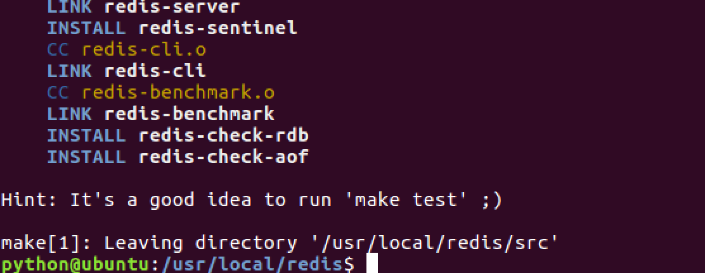

- step6:测试,这段运⾏时间会较⻓

  > sudo make test

  

- step7:安装,将redis的命令安装到`/usr/local/bin/`⽬录

  > sudo make install

- step8:安装完成后，我们进入目录`/usr/local/bin`中查看

  > cd /usr/local/bin
  > ls -all

  

  > - redis-server redis服务器
  > - redis-cli redis命令行客户端
  > - redis-benchmark redis性能测试工具
  > - redis-check-aof AOF文件修复工具
  > - redis-check-rdb RDB文件检索工具

- step9:配置⽂件，移动到`/etc/`⽬录下

  - 配置⽂件⽬录为`/usr/local/redis/redis.conf`

    > sudo cp /usr/local/redis/redis.conf /etc/redis/

## 其他补充

- Mac 上安装 Redis:

  - 安装 Homebrew：

  > https://brew.sh/

  - 使用 brew 安装 Redis

  > https://www.cnblogs.com/cloudshadow/p/mac_brew_install_redis.html

# 配置

- Redis的配置信息在`/etc/redis/redis.conf`下。

- 查看

  > sudo vi /etc/redis/redis.conf

# 核心配置选项

- 绑定ip：如果需要远程访问，可将此⾏注释，或绑定⼀个真实ip

  > bind 127.0.0.1

- 端⼝，默认为6379

  > port 6379

- 是否以守护进程运⾏

  - 如果以守护进程运⾏，则不会在命令⾏阻塞，类似于服务
  - 如果以⾮守护进程运⾏，则当前终端被阻塞
  - 设置为yes表示守护进程，设置为no表示⾮守护进程
  - 推荐设置为yes

  > daemonize yes

- 数据⽂件

  > dbfilename dump.rdb

- 数据⽂件存储路径

  > dir /var/lib/redis

- ⽇志⽂件

  > logfile "/var/log/redis/redis-server.log"

- 数据库，默认有16个

  > database 16

- 主从复制，类似于双机备份。

  > slaveof

# 参考资料

redis配置信息http://blog.csdn.net/ljphilp/article/details/52934933

- # 服务器端

- 服务器端的命令为redis-server

- 可以使⽤help查看帮助⽂档

  > redis-server --help

- 个人习惯

  > ps aux | grep redis 查看redis服务器进程
  > sudo kill -9 pid 杀死redis服务器
  > sudo redis-server /etc/redis/redis.conf 指定加载的配置文件

# 客户端

- 客户端的命令为redis-cli

- 可以使⽤help查看帮助⽂档

  > redis-cli --help

- 连接redis

  > 

- 运⾏测试命令

  > ping

  

- 切换数据库

- 数据库没有名称，默认有16个，通过0-15来标识，连接redis默认选择第一个数据库

  > select 10


### 数据操作

#### 数据结构

- redis是key-value的数据结构，每条数据都是⼀个键值对

- 键的类型是字符串

- 注意：键不能重复

  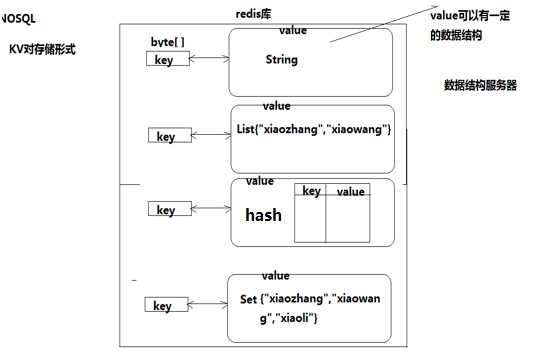

- 值的类型分为五种：

  - 字符串string
  - 哈希hash
  - 列表list
  - 集合set
  - 有序集合zset

#### 数据操作行为

- 保存
- 修改
- 获取
- 删除

点击中⽂官⽹查看命令⽂档http://redis.cn/commands.html

##### string类型

- 字符串类型是 Redis 中最为基础的数据存储类型，它在 Redis 中是二进制安全的，这便意味着该类型可以接受任何格式的数据，如JPEG图像数据或Json对象描述信息等。在Redis中字符串类型的Value最多可以容纳的数据长度是512M。

# 保存

如果设置的键不存在则为添加，如果设置的键已经存在则修改

- 设置键值

  > set key value

- 例1：设置键为`name`值为`itcast`的数据

  > set name itcast

  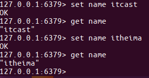

- 设置键值及过期时间，以秒为单位

  > setex key seconds value

- 例2：设置键为`aa`值为`aa`过期时间为3秒的数据

  > setex aa 3 aa

  

- 设置多个键值

  > mset key1 value1 key2 value2 ...

- 例3：设置键为`a1`值为`python`、键为`a2`值为`java`、键为`a3`值为`c`

  > mset a1 python a2 java a3 c

  

- 追加值

  > append key value

- 例4：向键为`a1`中追加值`haha`

  > append a1 haha

  

# 获取

- 获取：根据键获取值，如果不存在此键则返回`nil`

  > get key

- 例5：获取键`name`的值

  > get name

- 根据多个键获取多个值

  > mget key1 key2 ...

- 例6：获取键`a1、a2、a3`的值

  > mget a1 a2 a3

  

# 删除

del

# 键命令

- 查找键，参数⽀持正则表达式

  > keys pattern

- 例1：查看所有键

  > keys *


- 例2：查看名称中包含`a`的键

  > keys a*

  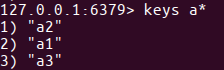

- 判断键是否存在，如果存在返回`1`，不存在返回`0`

  > exists key1

- 例3：判断键`a1`是否存在

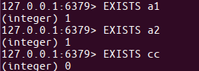

- 查看键对应的`value`的类型

  > type key

- 例4：查看键`a1`的值类型，为redis⽀持的五种类型中的⼀种

  > type a1


- 删除键及对应的值

  > del key1 key2 ...

- 例5：删除键`a2、a3`

  > del a2 a3


- 设置过期时间，以秒为单位

- 如果没有指定过期时间则⼀直存在，直到使⽤`DEL`移除

  > expire key seconds

- 例6：设置键`a1`的过期时间为3秒

  > expire a1 3


- 

- 查看有效时间，以秒为单位

  > ttl key

- 例7：查看键`bb`的有效时间

  > ttl bb


# hash类型

- **hash**⽤于存储对象，对象的结构为属性、值
- **值**的类型为**string**

## 增加、修改

- 设置单个属性

  > hset key field value

- 例1：设置键 `user`的属性`name`为`itheima`

  > hset user name itheima

- 设置多个属性

  > hmset key field1 value1 field2 value2 ...

- 例2：设置键`u2`的属性`name`为`itcast`、属性`age`为`11`

  > hmset u2 name itcast age 11

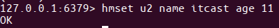

## 获取

- 获取指定键所有的属性

  > hkeys key

- 例3：获取键u2的所有属性

  > hkeys u2

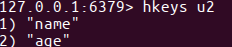

- 获取⼀个属性的值

  > hget key field

- 例4：获取键`u2`属性`name`的值

  > hget u2 name


- 获取多个属性的值

  > hmget key field1 field2 ...

- 例5：获取键`u2`属性`name`、`age`的值

  > hmget u2 name age

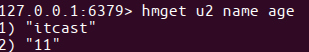

- 获取所有属性的值

  > hvals key

- 例6：获取键`u2`所有属性的值

  > hvals u2

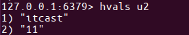

## 删除

- **删除整个hash键及值，使⽤del命令**

- 删除属性，属性对应的值会被⼀起删除

  > hdel key field1 field2 ...

- 例7：删除键`u2`的属性`age`

  > hdel u2 age


## 可能出现的错误


> MISCONF Redis is configured to save RDB snapshots, but is currently not able to persist on disk. Commands that may modify the data set are disabled. Please check Redis logs for details about the error.
>
> Redis被配置为保存数据库快照，但它目前不能持久化到硬盘。用来修改集合数据的命令不能用

- 原因：
  - 强制关闭Redis快照导致不能持久化。
- 解决方案：
  - 运行config set stop-writes-on-bgsave-error no　命令后，关闭配置项stop-writes-on-bgsave-error解决该问题。

# set类型

- ⽆序集合
- 元素为string类型
- 元素具有唯⼀性，不重复
- 说明：对于集合没有修改操作

## 增加

- 添加元素

  > sadd key member1 member2 ...

- 例1：向键`a3`的集合中添加元素`zhangsan`、`lisi`、`wangwu`

  > sadd a3 zhangsan sili wangwu

  

## 获取

- 返回所有的元素

  > smembers key

- 例2：获取键`a3`的集合中所有元素

  > smembers a3

  

## 删除

- 删除指定元素

  > srem key

- 例3：删除键`a3`的集合中元素`wangwu`

  > srem a3 wangwu

  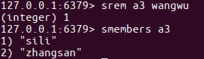

# zset类型

- sorted set，有序集合
- 元素为string类型
- 元素具有唯⼀性，不重复
- 每个元素都会关联⼀个double类型的score，表示权重，通过权重将元素从⼩到⼤排序
- 说明：没有修改操作

## 增加

- 添加

  > zadd key score1 member1 score2 member2 ...

- 例1：向键`a4`的集合中添加元素`lisi`、`wangwu`、`zhaoliu`、`zhangsan`，权重分别为`4、5、6、3`

  > zadd a4 4 lisi 5 wangwu 6 zhaoliu 3 zhangsan

## 获取

- 返回指定范围内的元素

- start、stop为元素的下标索引

- 索引从左侧开始，第⼀个元素为0

- 索引可以是负数，表示从尾部开始计数，如`-1`表示最后⼀个元素

  > zrange key start stop

- 例2：获取键`a4`的集合中所有元素

  > zrange a4 0 -1

  

- 返回`score`值在`min`和`max`之间的成员

  > zrangebyscore key min max

- 例3：获取键`a4`的集合中权限值在`5和6之间`的成员

  > zrangebyscore a4 5 6

  

- 返回成员`member`的`score`值

  > zscore key member

- 例4：获取键`a4`的集合中元素`zhangsan`的权重

  > zscore a4 zhangsan

  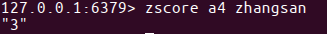

## 删除

- 删除指定元素

  > zrem key member1 member2 ...

- 例5：删除集合`a4`中元素`zhangsan`

  > zrem a4 zhangsan

  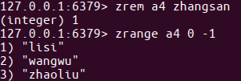

- 删除权重在指定范围的元素

  > zremrangebyscore key min max

- 例6：删除集合`a4`中权限在`5、6之间`的元素

  > zremrangebyscore a4 5 6

  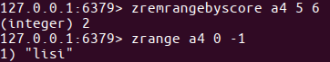

### 安装python-redis

安装Redis的有3种方式https://github.com/andymccurdy/redis-py

- 第一种：进⼊虚拟环境，联⽹安装包redis

  > pip install redis

- 第二种：进⼊虚拟环境，联⽹安装包redis

  > easy_install redis

- 第三种：到中⽂官⽹-客户端下载redis包的源码，使⽤源码安装

  > 一步步执行 wget https://github.com/andymccurdy/redis-py/archive/master.zip
  > unzip master.zip
  > cd redis-py-master
  > sudo python setup.py install

# StrictRedis对象⽅法

- 通过init创建对象，指定参数host、port与指定的服务器和端⼝连接，host默认为localhost，port默认为6379，db默认为0

```
sr = StrictRedis(host='localhost', port=6379, db=0)

简写
sr=StrictRedis()
```

- 根据不同的类型，拥有不同的实例⽅法可以调⽤，与前⾯学的redis命令对应，⽅法需要的参数与命令的参数⼀致

## string

- set
- setex
- mset
- append
- get
- mget
- key

## keys

- exists
- type
- delete
- expire
- getrange
- ttl

## hash

- hset
- hmset
- hkeys
- hget
- hmget
- hvals
- hdel

## list

- lpush
- rpush
- linsert
- lrange
- lset
- lrem

## set

- sadd
- smembers
- srem

## zset

- zadd
- zrange
- zrangebyscore
- zscore
- zrem
- zremrangebyscore

- 在桌面上创建redis目录
- 使用pycharm打开 redis目录
- 创建redis_string.py文件

```python
from redis import *
if __name__=="__main__":
    try:
        #创建StrictRedis对象，与redis服务器建⽴连接
        sr=StrictRedis()

    except Exception as e:
        print(e)
```

# string-增加

- ⽅法set，添加键、值，如果添加成功则返回True，如果添加失败则返回False
- 编写代码如下

```python
from redis import *
if __name__=="__main__":
    try:
        #创建StrictRedis对象，与redis服务器建⽴连接
        sr=StrictRedis()
        #添加键name，值为itheima
        result=sr.set('name','itheima')
        #输出响应结果，如果添加成功则返回True，否则返回False
        print(result)
    except Exception as e:
        print(e)
```

# string-获取

- ⽅法get，添加键对应的值，如果键存在则返回对应的值，如果键不存在则返回None
- 编写代码如下

```python
from redis import *
if __name__=="__main__":
    try:
        #创建StrictRedis对象，与redis服务器建⽴连接
        sr=StrictRedis()
        #获取键name的值
        result = sr.get('name')
        #输出键的值，如果键不存在则返回None
        print(result)
    except Exception as e:
        print(e)
```

# string-修改

- ⽅法set，如果键已经存在则进⾏修改，如果键不存在则进⾏添加
- 编写代码如下

```python
from redis import *
if __name__=="__main__":
    try:
        #创建StrictRedis对象，与redis服务器建⽴连接
        sr=StrictRedis()
        #设置键name的值，如果键已经存在则进⾏修改，如果键不存在则进⾏添加
        result = sr.set('name','itcast')
        #输出响应结果，如果操作成功则返回True，否则返回False
        print(result)
    except Exception as e:
        print(e)
```

# string-删除

- ⽅法delete，删除键及对应的值，如果删除成功则返回受影响的键数，否则则返 回0
- 编写代码如下

```python
from redis import *
if __name__=="__main__":
    try:
        #创建StrictRedis对象，与redis服务器建⽴连接
        sr=StrictRedis()
        #设置键name的值，如果键已经存在则进⾏修改，如果键不存在则进⾏添加
        result = sr.delete('name')
        #输出响应结果，如果删除成功则返回受影响的键数，否则则返回0
        print(result)
    except Exception as e:
        print(e)
```

# 获取键

- ⽅法keys，根据正则表达式获取键
- 编写代码如下

```python
from redis import *
if __name__=="__main__":
    try:
        #创建StrictRedis对象，与redis服务器建⽴连接
        sr=StrictRedis()
        #获取所有的键
        result=sr.keys()
        #输出响应结果，所有的键构成⼀个列表，如果没有键则返回空列表
        print(result)
    except Exception as e:
        print(e)
```

### 主从概念

- ⼀个master可以拥有多个slave，⼀个slave⼜可以拥有多个slave，如此下去，形成了强⼤的多级服务器集群架构

- master用来写数据，slave用来读数据，经统计：网站的读写比率是10:1

- 通过主从配置可以实现读写分离

  

- master和slave都是一个redis实例(redis服务)

### 主从配置

### 配置主

- 查看当前主机的ip地址

  > ifconfig

  

- 修改`/etc/redis/redis.conf`文件

  > sudo vi redis.conf
  > bind 192.168.26.128

- 重启redis服务

  > sudo service redis stop
  > sudo redis-server redis.conf

## 配置从

- 复制`/etc/redis/redis.conf`文件

  > sudo cp redis.conf ./slave.conf

- 修改`redis/slave.conf`文件

  > sudo vi slave.conf

- 编辑内容

  > bind 192.168.26.128
  > slaveof 192.168.26.128 6379
  > port 6378

- redis服务

  > sudo redis-server slave.conf

- 查看主从关系

  > redis-cli -h 192.168.26.128 info Replication

  

## 数据操作

- 在master和slave分别执⾏info命令，查看输出信息 进入主客户端

  > redis-cli -h 192.168.26.128 -p 6379

- 进入从的客户端

  > redis-cli -h 192.168.26.128 -p 6378

- 在master上写数据

  > set aa aa

  

- 在slave上读数据

  > get aa

- 之前我们已经讲了主从的概念，一主可以多从，如果同时的访问量过大(1000w),主服务肯定就会挂掉，数据服务就挂掉了或者发生自然灾难
- 大公司都会有很多的服务器(华东地区、华南地区、华中地区、华北地区、西北地区、西南地区、东北地区、台港澳地区机房)

# 集群的概念

- 集群是一组相互独立的、通过高速网络互联的计算机，它们构成了一个组，并以单一系统的模式加以管理。一个客户与集群相互作用时，集群像是一个独立的服务器。集群配置是用于提高可用性和可缩放性。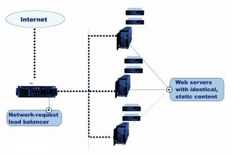

当请求到来首先由负载均衡服务器处理，把请求转发到另外的一台服务器上。

# redis集群

- 分类
  - 软件层面
  - 硬件层面
- 软件层面：只有一台电脑，在这一台电脑上启动了多个redis服务。


- 硬件层面：存在多台实体的电脑，每台电脑上都启动了一个redis或者多个redis服务。

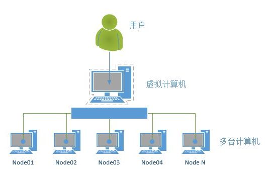

# 搭建集群

- 当前拥有两台主机172.16.179.130、172.16.179.131，这⾥的IP在使⽤时要改为实际值

# 参考阅读

- redis集群搭建 http://www.cnblogs.com/wuxl360/p/5920330.html
- [Python]搭建redis集群 http://blog.5ibc.net/p/51020.html

- 在演示中，172.16.179.130为当前ubuntu机器的ip

- 在172.16.179.130上进⼊Desktop⽬录，创建conf⽬录

- 在conf⽬录下创建⽂件7000.conf，编辑内容如下

  ```
  port 7000
  bind 172.16.179.130
  daemonize yes
  pidfile 7000.pid
  cluster-enabled yes
  cluster-config-file 7000_node.conf
  cluster-node-timeout 15000
  appendonly yes
  ```

- 在conf⽬录下创建⽂件7001.conf，编辑内容如下

  ```
  port 7001
  bind 172.16.179.130
  daemonize yes
  pidfile 7001.pid
  cluster-enabled yes
  cluster-config-file 7001_node.conf
  cluster-node-timeout 15000
  appendonly yes
  ```

- 在conf⽬录下创建⽂件7002.conf，编辑内容如下

  ```
  port 7002
  bind 172.16.179.130
  daemonize yes
  pidfile 7002.pid
  cluster-enabled yes
  cluster-config-file 7002_node.conf
  cluster-node-timeout 15000
  appendonly yes
  ```

- 总结：三个⽂件的配置区别在port、pidfile、cluster-config-file三项

- 使⽤配置⽂件启动redis服务

  ```
  redis-server 7000.conf
  redis-server 7001.conf
  redis-server 7002.conf
  ```

- 查看进程如下图 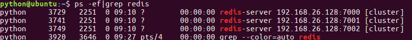

- 在演示中，172.16.179.131为当前ubuntu机器的ip

- 在172.16.179.131上进⼊Desktop⽬录，创建conf⽬录

- 在conf⽬录下创建⽂件7003.conf，编辑内容如下

  ```
  port 7003
  bind 172.16.179.131
  daemonize yes
  pidfile 7003.pid
  cluster-enabled yes
  cluster-config-file 7003_node.conf
  cluster-node-timeout 15000
  appendonly yes
  ```

- 在conf⽬录下创建⽂件7004.conf，编辑内容如下

  ```
  port 7004
  bind 172.16.179.131
  daemonize yes
  pidfile 7004.pid
  cluster-enabled yes
  cluster-config-file 7004_node.conf
  cluster-node-timeout 15000
  appendonly yes
  ```

- 在conf⽬录下创建⽂件7005.conf，编辑内容如下

  ```
  port 7005
  bind 172.16.179.131
  daemonize yes
  pidfile 7005.pid
  cluster-enabled yes
  cluster-config-file 7005_node.conf
  cluster-node-timeout 15000
  appendonly yes
  ```

- 总结：三个⽂件的配置区别在port、pidfile、cluster-config-file三项

- 使⽤配置⽂件启动redis服务

  ```
  redis-server 7003.conf
  redis-server 7004.conf
  redis-server 7005.conf
  ```

- 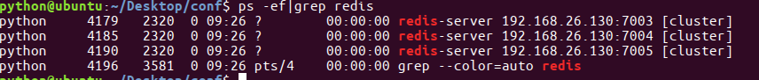

# 创建集群

[文档连接](http://doc.redisfans.com/topic/cluster-tutorial.html)

- redis的安装包中包含了redis-trib.rb，⽤于创建集群

- 接下来的操作在172.16.179.130机器上进⾏

- 将命令复制，这样可以在任何⽬录下调⽤此命令

  ```
  sudo cp /usr/share/doc/redis-tools/examples/redis-trib.rb /usr/local/bin/
  ```

- 安装ruby环境，因为redis-trib.rb是⽤ruby开发的

  > sudo apt-get install ruby

- 在提示信息处输⼊y，然后回⻋继续安装
  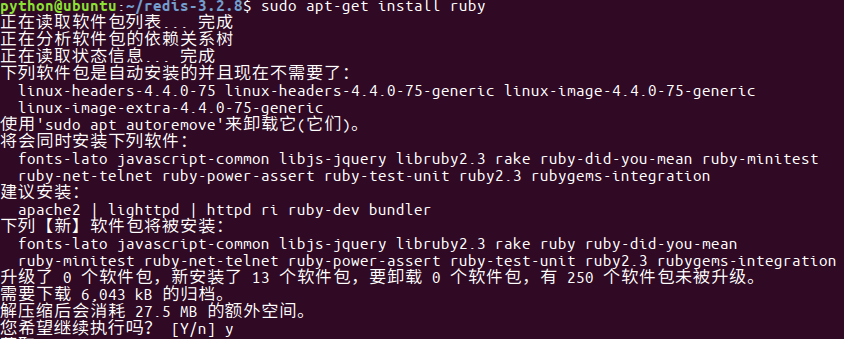

- 运⾏如下命令创建集群

  ```
  redis-trib.rb create --replicas 1 172.16.179.130:7000 172.16.179.130:7001 172.16.179.130:7002 172.16.179.131:7003 172.16.179.131:7004 172.16.179.131:7005
  ```

- 执⾏上⾯这个指令在某些机器上可能会报错,主要原因是由于安装的 ruby 不是最 新版本!

- 天朝的防⽕墙导致⽆法下载最新版本,所以需要设置 gem 的源

- 解决办法如下

  ```
  -- 先查看⾃⼰的 gem 源是什么地址
  gem source -l -- 如果是https://rubygems.org/ 就需要更换
  
  -- 更换指令为
  gem sources --add https://gems.ruby-china.com/ --remove https://rubygems.org/
  
  -- 通过 gem 安装 redis 的相关依赖
  sudo gem install redis
  
  -- 然后重新执⾏指令
  ```

  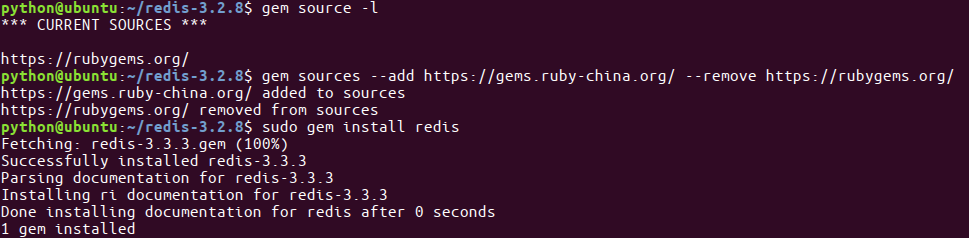

  ```
  redis-trib.rb create --replicas 1 172.16.179.130:7000 172.16.179.130:7001 172.16.179.130:7002 172.16.179.131:7003 172.16.179.131:7004 172.16.179.131:7005
  ```

- 提示如下主从信息，输⼊yes后回⻋
  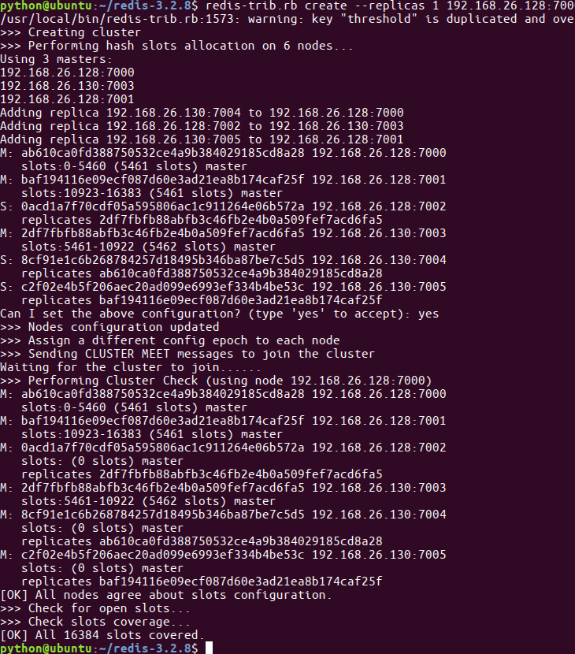

- 提示完成，集群搭建成功

# 数据验证

- 根据上图可以看出，当前搭建的主服务器为7000、7001、7003，对应的从服务器是7004、7005、7002

- 在172.16.179.131机器上连接7002，加参数-c表示连接到集群

  > redis-cli -h 172.16.179.131 -c -p 7002

- 写⼊数据

  > set name itheima

- ⾃动跳到了7003服务器，并写⼊数据成功
  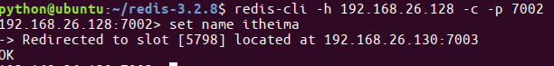

- 在7003可以获取数据，如果写入数据又重定向到7000(负载均衡)
  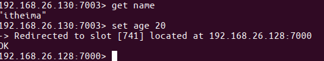

# 在哪个服务器上写数据：CRC16

- redis cluster在设计的时候，就考虑到了去中⼼化，去中间件，也就是说，集群中 的每个节点都是平等的关系，都是对等的，每个节点都保存各⾃的数据和整个集 群的状态。每个节点都和其他所有节点连接，⽽且这些连接保持活跃，这样就保 证了我们只需要连接集群中的任意⼀个节点，就可以获取到其他节点的数据
- Redis集群没有并使⽤传统的⼀致性哈希来分配数据，⽽是采⽤另外⼀种叫做哈希 槽 (hash slot)的⽅式来分配的。redis cluster 默认分配了 16384 个slot，当我们 set⼀个key 时，会⽤CRC16算法来取模得到所属的slot，然后将这个key 分到哈 希槽区间的节点上，具体算法就是：CRC16(key) % 16384。所以我们在测试的 时候看到set 和 get 的时候，直接跳转到了7000端⼝的节点
- Redis 集群会把数据存在⼀个 master 节点，然后在这个 master 和其对应的salve 之间进⾏数据同步。当读取数据时，也根据⼀致性哈希算法到对应的 master 节 点获取数据。只有当⼀个master 挂掉之后，才会启动⼀个对应的 salve 节点，充 当 master
- 需要注意的是：必须要3个或以上的主节点，否则在创建集群时会失败，并且当存 活的主节点数⼩于总节点数的⼀半时，整个集群就⽆法提供服务了

# Python交互

- 安装包如下

  > pip install redis-py-cluster

- redis-py-cluster源码地址https://github.com/Grokzen/redis-py-cluster

- 创建⽂件redis_cluster.py，示例码如下

```python
from rediscluster import *
if __name__ == '__main__':
  try:
    # 构建所有的节点，Redis会使⽤CRC16算法，将键和值写到某个节点上
    startup_nodes = [
        {'host': '192.168.26.128', 'port': '7000'},
        {'host': '192.168.26.130', 'port': '7003'},
        {'host': '192.168.26.128', 'port': '7001'},
    ]
    # 构建StrictRedisCluster对象
    src=StrictRedisCluster(startup_nodes=startup_nodes,decode_responses=True)
    # 设置键为name、值为itheima的数据
    result=src.set('name','itheima')
    print(result)
    # 获取键为name
    name = src.get('name')
    print(name)
  except Exception as e:
    print(e)
```